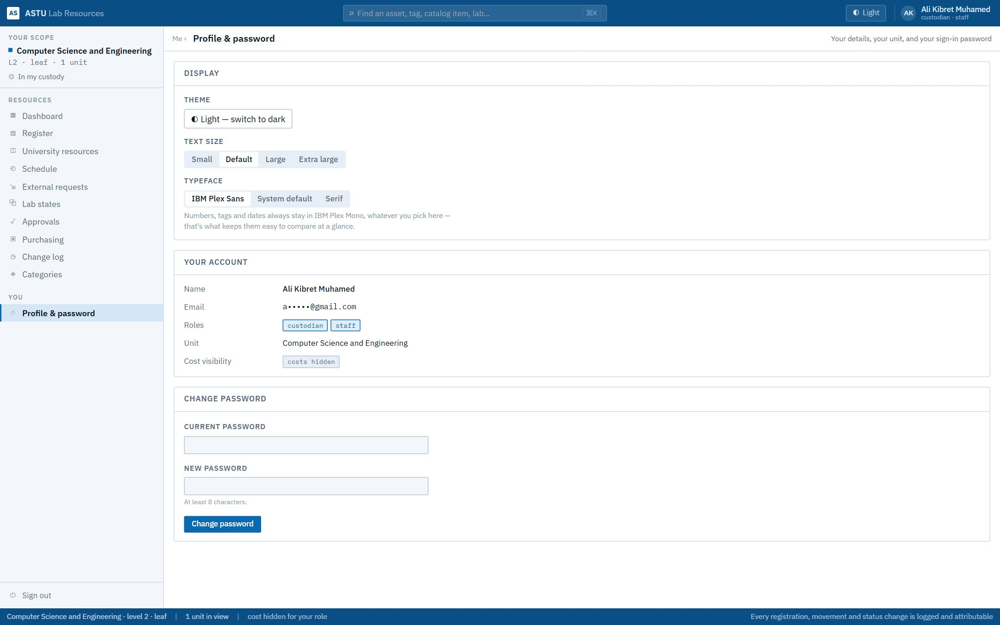
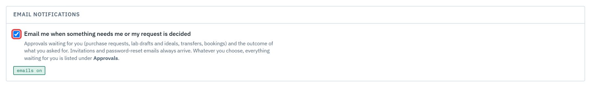

# Getting started

*For everyone.* This chapter covers how to get into LRMS, find your way around, and look after your own account.

| Task | Section |
|---|---|
| Set up your account from the invitation email | [1. Accept your invitation](#1-accept-your-invitation) |
| Sign in | [2. Sign in](#2-sign-in) |
| You forgot your password | [3. Reset a forgotten password](#3-reset-a-forgotten-password) |
| An administrator gave you a temporary password | [4. Change a temporary password](#4-change-a-temporary-password) |
| Learn the screen | [5. Find your way around](#5-find-your-way-around) |
| Find something quickly | [6. Search from anywhere](#6-search-from-anywhere) |
| Change the theme, text size or your password | [7. Your profile](#7-your-profile) |
| Know which emails LRMS sends you | [8. Emails you'll get](#8-emails-youll-get) |

---

## 1. Accept your invitation

Access is by invitation only. You can't sign up yourself. When an administrator or your department head adds you, you get an email titled **"You're invited to ASTU Lab Resources"**.

1. Open the link in the email.
2. Enter your **full name**, optionally a **phone number**, and choose a **password**, twice. Use at least 8 characters.
3. Click **Create your account**. You are signed in.

> **Good to know**
> - The link works **once**. If it's used or expired, ask whoever invited you to send a new one (in **People & roles → Manage → Copy invite link**). Each new link replaces the old one.
> - If the email never arrives, the person who invited you can copy the link and send it to you another way.
> - Using **Forgot password** before you have set up your account sends you a fresh invitation.

## 2. Sign in

1. Go to the LRMS address and enter your **email** (1) and **password** (2).
2. Click **Sign in** (4).

You land on your **Dashboard**. Use **Forgot password?** (3) if you can't remember your password.

## 3. Reset a forgotten password

1. On the sign-in page, click **Forgot password?**
2. Enter your email address and click **Send reset link**.

   

3. The page always says a link is on its way. For privacy, it doesn't reveal whether the address has an account. The link is valid for **2 hours**.

   

4. Open the link in the email, choose a new password, and confirm it.

   

> **Good to know:** Only a few reset emails are sent per address per hour. If you asked several times, use the newest email.

## 4. Change a temporary password

If you are locked out, an administrator (or your department head) can set a **temporary password** and give it to you directly. The next time you sign in with it, LRMS asks you to choose your own before anything else works.

1. Sign in with the temporary password.
2. Enter the **temporary password**, then your **new password** twice.
3. Click **Set password and continue**.

> **Good to know:** Setting a temporary password signs you out on every device, and the notification email never contains the password itself.

## 5. Find your way around

Every screen has the same frame:

1. **Your scope**: the unit you belong to and how much of the register you see (for example *In my custody*, *My unit and below*, or *University-wide*). If an administrator has given you an **access view**, a picker below this lets you switch between your views.
2. **The menu**: only the screens your role uses. A head, a custodian and a student see different menus. Two people with the same menu can still see different rows, because what you see is decided by your scope.
3. **Search** the register from any page (see below).
4. **Theme**: switch between light and dark.
5. **You**: your name and roles.
6. **The status bar**: your unit, how much is in view, and a reminder that every change is logged under your name.

**Help is one click away.** The **? Help** button in the top bar, beside the theme switch, opens the guide at the part that explains the screen you're on, for your role. **Help & guides** at the bottom of the menu opens all your guides, with a search box.

The menu items you may see:

| Menu item | What it is for |
|---|---|
| **Dashboard** | The condition of everything in your scope at a glance |
| **Register** | The resources themselves: browse, search, filter and, if you are a custodian, update |
| **University resources** | Every unit's resources, to find something and request it into your lab |
| **Schedule** | Lab calendars: weekly classes and bookings |
| **External requests** | Workshops and trainings that outside institutions asked the university to host |
| **Lab states** | Each lab as it is (Current), as updated (Draft) and as it should be (Ideal) |
| **Approvals** | What is waiting for your decision, and what you asked for |
| **Purchasing** | Needs, purchase requests, and what has arrived |
| **Change log** | Every applied change: who, what and when |
| **Categories** | The kinds of resources and the details each one records |
| **Help & guides** | This guide, inside the app: the general chapters, and the ones for your role |

## 6. Search from anywhere

1. Click the search box at the top, or press **Ctrl + K** (**⌘ K** on a Mac).
2. Type a name or a word, and press **Enter**.

   

3. The **Register** opens its search list with everything that matches.

   

Search can also look inside a resource's details. Put `@` before a field name:

| You type | It finds |
|---|---|
| `monitor` | anything with "monitor" in its name or details |
| `@category:monitor` | resources whose category is Monitor |
| `@serial` | resources that have a serial number filled in |
| `@serial:EXN` | serial numbers containing "EXN" |
| `@brand:"HP Inc"` | a value with spaces, in quotes |

As you type `@`, LRMS suggests the fields available. Press **Esc** to clear the box.

## 7. Your profile

Open **Profile & password** at the bottom of the menu.

- **Display**: the **theme** (light or dark), the **text size** (Small to Extra large; go larger if the screens feel small) and the **typeface**. These are saved on this computer.
- **Your account**: your name, email, roles, unit, and whether your role can see costs. An administrator changes these for you.
- **Email notifications**: tick or untick **Email me when something needs me or my request is decided**. It saves at once and applies wherever you sign in. See [8. Emails you'll get](#8-emails-youll-get).
- **Change password**: enter your current password, then the new one (at least 8 characters).

Sign out with **Sign out** at the bottom of the menu, especially on a shared computer.

## 8. Emails you'll get

LRMS emails you when something is **waiting for you**, and when something **you asked for** is decided. Every email has a button that opens the right screen. You get no email about your own actions.

| When | Who gets it |
|---|---|
| A purchase request reaches your step | Each approver in turn: dean, AVP, College Managing Director, Procurement |
| Your purchase request is approved, rejected, sent back, or cancelled by procurement, and at each order stage (buyer found, on delivery, arrived) | The head who raised it |
| An order arrives at the main store | The store keeper |
| Your need is declined | The person who raised it |
| A lab's draft or ideal is submitted | The department head |
| Your draft or ideal is approved, sent back, or couldn't be applied | The custodian who submitted it |
| A transfer or handover reaches your step (including "confirm receipt") | Whoever that step waits on |
| Your transfer is done, rejected or couldn't be applied | The person who asked for it |
| Someone asks to book your lab, or withdraws their request | The lab's custodian |
| Your booking is approved, declined or cancelled | The person who booked |
| Invitations, password resets, and outside institutions' requests | As described in their own sections |

Emails are a reminder, not the only way in: everything that waits for you is also listed under **Approvals → Routed to me**.

**Turning them off.** Untick **Email notifications** on your **Profile** to stop the emails in this table.

An administrator, or your department head, can also switch them for you in **People & roles → Manage**. Invitations, password resets and emails about outside institutions' requests to the requester always go out. The CSE lab custodians (ARAs) start with notification emails **off**; turn them on in Profile if you want them.
