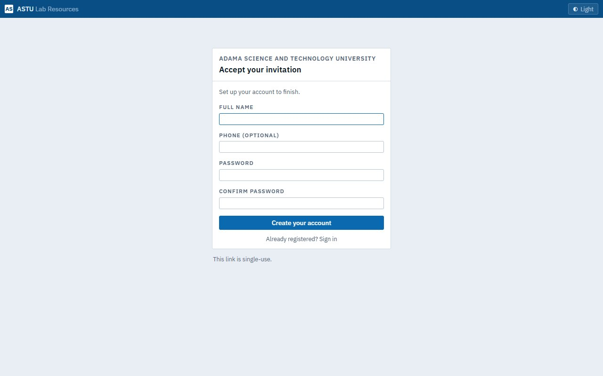
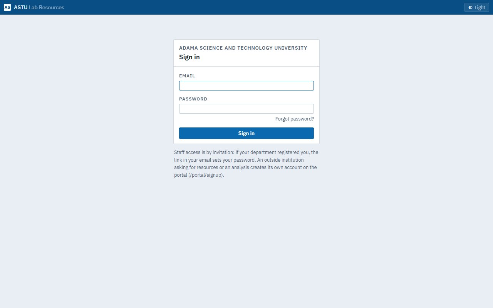
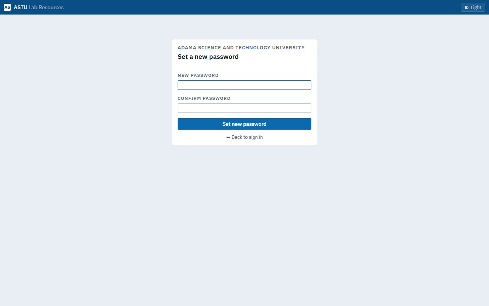
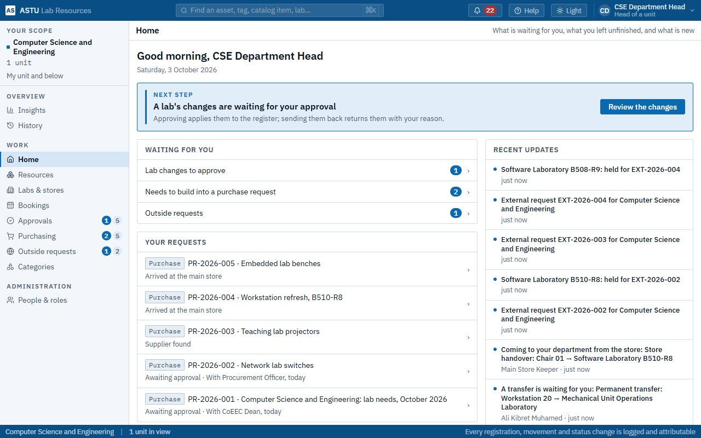
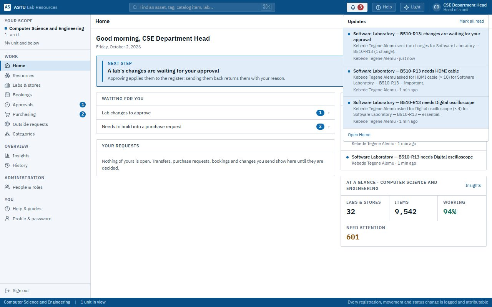
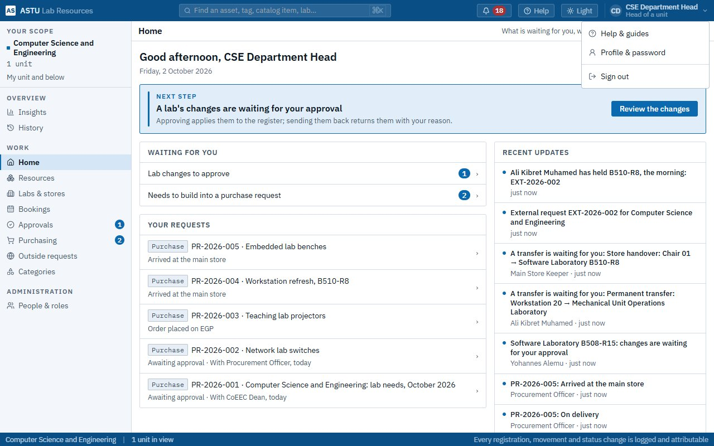

# Getting started

*For everyone.* This chapter covers how to get into LRMS, what **Home** tells you, and how to look after your own account.

| Task | Section |
|---|---|
| Set up your account from the invitation email | [1. Accept your invitation](#1-accept-your-invitation) |
| Sign in | [2. Sign in](#2-sign-in) |
| You forgot your password | [3. Reset a forgotten password](#3-reset-a-forgotten-password) |
| An administrator gave you a temporary password | [4. Change a temporary password](#4-change-a-temporary-password) |
| Know what's waiting for you | [5. Home](#5-home) |
| See what's new | [6. The bell](#6-the-bell) |
| Learn the screen | [7. Find your way around](#7-find-your-way-around) |
| Find something quickly | [8. Search from anywhere](#8-search-from-anywhere) |
| Change the theme, text size or your password | [9. Your profile](#9-your-profile) |
| Know which emails LRMS sends you | [10. Emails and updates](#10-emails-and-updates) |

---

## 1. Accept your invitation

Access is by invitation only. You can't sign up yourself. When an administrator or your department head adds you, you get an email titled **"You're invited to ASTU Lab Resources"**.

1. Open the link in the email.
2. Enter your **full name**, optionally a **phone number**, and choose a **password**, twice. Use at least 8 characters.
3. Click **Create your account**. You are signed in.

> **Good to know**
> - The link works **once**. If it's used or expired, ask whoever invited you to send a new one (in **People & roles → Manage → Copy invite link**). Each new link replaces the old one.
> - Using **Forgot password** before you have set up your account sends you a fresh invitation.

## 2. Sign in

1. Go to the LRMS address and enter your **email** and **password**.
2. Click **Sign in**.

You land on **Home**. If you opened a link from an email or a bookmark before signing in, LRMS takes you **straight back to that page** after you sign in.

## 3. Reset a forgotten password

1. On the sign-in page, click **Forgot password?**
2. Enter your email address and click **Send reset link**.
3. The page always says a link is on its way. For privacy, it doesn't reveal whether the address has an account. The link is valid for **2 hours**.
4. Open the link in the email, choose a new password, and confirm it.

> **Good to know:** only a few reset emails are sent per address per hour. If you asked several times, use the newest email.

## 4. Change a temporary password

If you are locked out, an administrator (or your department head) can set a **temporary password** and give it to you directly. The next time you sign in with it, LRMS asks you to choose your own before anything else works.

1. Sign in with the temporary password.
2. Enter the **temporary password**, then your **new password** twice.
3. Click **Set password and continue**.

> **Good to know:** setting a temporary password signs you out on every device, and the notification email never contains the password itself.

## 5. Home

**Home** is the first page after you sign in. It answers one question: *what should I do now?*

1. **Next step**: the single most useful thing you can do now, with one button that takes you there. For example *"A lab's changes are waiting for your approval"* or *"Send your changes for Software Laboratory B510-R8"*. When nothing needs you, it says **You're all caught up**.
2. **Waiting for you**: everything others are waiting on you for, counted by kind (transfers, lab changes, purchase requests, bookings, category changes, needs to build into a request, arrivals to record or load, outside requests). Each line opens exactly that list.
3. **Unfinished**: changes you made in a lab and haven't sent yet.
4. **Your requests**: everything you asked for that is still open, and where it is now (*"With CoEEC Dean, 2 days"*).
5. **Due soon**: calibration or expiry dates falling due in the next 30 days on what you look after.
6. **Recent updates**: the latest things that happened to you (the same list as the bell).
7. **At a glance** (heads, deans, the ADAA, the AVP): how many labs and items your unit has, how many work, and how many need attention. **Insights** opens the full picture.

The menu badges say the same thing in short: the number beside **Approvals**, **Purchasing**, **Labs & stores** or **Outside requests** is how much waits for you there.

## 6. The bell

The bell in the top bar shows how many updates you haven't read.

Click it to see your latest updates: a request decided, something sent to you, a lab assigned to you. Click one to open **exactly that item**, for example the purchase request itself, scrolled into view and marked. **Mark all read** clears the count. Updates are kept for 90 days.

## 7. Find your way around

Every screen has the same frame:

1. **Your scope** (top left): the unit you work in, and how much of the university you see from it.
2. **The menu**: only the screens you use. A custodian, a head and the store keeper each see a different menu.
3. **Search** the register from any page (see below).
4. The **bell**, **Help** and the **theme** (light or dark).
5. **You** (your initials, top right): your name and roles. Click it for **Help & guides**, **Profile & password** and **Sign out**.

**Help is one click away.** The **Help** button in the top bar opens the guide at the part that explains the screen you're on, for your role.

The menu items you may see:

| Menu item | What it is for |
|---|---|
| **Insights** | The condition of everything in your scope, in charts |
| **History** | Every applied change: who, what and when |
| **Home** | What waits for you, what you left unfinished, what is new |
| **Resources** | Everything recorded: your own (**Mine**) or the whole university's, to find something and ask for it |
| **Labs & stores** | The labs and stores you run or manage: what is in them, and their changes |
| **Bookings** | Lab calendars: weekly classes and bookings |
| **Approvals** | What is waiting for your decision, and what you sent |
| **Purchasing** | The labs' needs, purchase requests, and what has arrived |
| **Outside requests** | Analyses, workshops and trainings outside institutions asked for |
| **Categories** | The kinds of things we record, and the details each one keeps |

Opening a link in a new tab works anywhere in the menu.

## 8. Search from anywhere

1. Click the search box at the top, or press **Ctrl + K** (**⌘ K** on a Mac).
2. Type a name or a word, and press **Enter**.
3. **Resources** opens its search list with everything that matches.

Search can also look inside a resource's details. Put `@` before a detail's name:

| You type | It finds |
|---|---|
| `monitor` | anything with "monitor" in its name or details |
| `@category:monitor` | resources whose category is Monitor |
| `@serial` | resources that have a serial number filled in |
| `@serial:EXN` | serial numbers containing "EXN" |
| `@brand:"HP Inc"` | a value with spaces, in quotes |

## 9. Your profile

Click your initials at the top right, then **Profile & password**.

- **Display**: the **theme** (light or dark), the **text size** (Small to Extra large; **Large** is the default, go up or down to suit you) and the **typeface**. These are saved on this computer.
- **Your account**: your name, email, roles and unit. An administrator changes these for you.
- **Email notifications**: tick or untick **Email me when something needs me or my request is decided**. See [10. Emails and updates](#10-emails-and-updates).
- **Change password**: enter your current password, then the new one (at least 8 characters).

Sign out from the same place (your initials, then **Sign out**), especially on a shared computer.

## 10. Emails and updates

Whenever something **waits for you**, or something **you asked for** moves on, LRMS tells you in two places: an update under the **bell** (always), and an **email** (if you have email notifications on). Both open the exact item. You are never told about your own actions.

| When | Who is told |
|---|---|
| Changes to a lab are sent for approval | The department head |
| Your lab's changes are approved, sent back, or couldn't be applied | The custodian who sent them |
| You are made the custodian of a lab or store (or another custodian takes over) | The new and the old custodian |
| A category is added or changed in your department, or a change to one waits for you | The department head, then whoever decides next |
| A need is asked for, or declined | The head; the custodian who asked |
| A purchase request reaches your step, or yours is decided, sent back, or moves on to the next order stage | Each approver in turn; the head who raised it |
| An order arrives at the main store, or an arrival is recorded | Property Administration; the store keeper |
| A transfer reaches your step (including "confirm receipt"), or yours is done or refused | Whoever the step waits on; the person who asked |
| Someone asks to book your lab, or your booking is decided | The lab's custodian; the person who booked |
| Invitations, password resets, and outside institutions' requests | As described in their own sections |

**Turning emails off.** Untick **Email notifications** on your **Profile**. The bell keeps your updates either way.
