# Lab custodian

*You are the person accountable for one or more labs or stores: an ARA, SARA or lab responsible.* You keep their records true, report what breaks, plan what each lab should hold, and accept what is delivered to you.

Read [Getting started](00-getting-started.md) and [How LRMS thinks](01-concepts.md) first. Most custodians are also **staff**, so the [Staff chapter](04-staff.md) applies to you too.

| Task | Section |
|---|---|
| See your labs' condition at a glance | [1. Your dashboard](#1-your-dashboard) |
| Browse a lab and open an item | [2. The register](#2-the-register) |
| Find things: filters, `@` search, summaries | [3. Finding things](#3-finding-things) |
| Report that something broke, or was mended | [4. Change a resource's status](#4-change-a-resources-status) |
| Record new resources | [5. Add resources](#5-add-resources) |
| Change several at once | [6. Change several at once](#6-change-several-at-once) |
| Update a lab when your department uses drafts | [7. Updates in a drafts department](#7-updates-in-a-drafts-department) |
| Say what a lab *should* hold | [8. Propose the lab's Ideal](#8-propose-the-labs-ideal) |
| The head sent your draft back | [9. When a draft is sent back](#9-when-a-draft-is-sent-back) |
| Approve or decline bookings of your labs | [10. Bookings of your labs](#10-bookings-of-your-labs) |
| Put a weekly class on a lab's calendar | [11. Weekly classes](#11-weekly-classes) |
| Ask for something to be bought | [12. Raise a need](#12-raise-a-need) |
| Find another unit's resource and request it | [13. University resources and transfers](#13-university-resources-and-transfers) |
| Accept items handed over to you | [14. Accept a handover](#14-accept-a-handover) |
| Hold your lab for an outside request | [15. Hold a slot for an outside request](#15-hold-a-slot-for-an-outside-request) |

---

## 1. Your dashboard

**Dashboard** opens when you sign in. It covers everything in your scope. For a custodian that is what's **in your custody**.

1. **Needs attention**: how many of your items are broken, impaired, under maintenance or lost.
2. **Where the problems are**: which of your labs has most of them.

Click any number, bar or legend entry to filter the dashboard to exactly those items. The **Register** keeps the same filter when you open it.

## 2. The register

Open **Register**. It shows your labs as a tree.

1. **+ Add resources** records new items (section 5).
2. The **view** buttons:
   - **Grouped**: gathered by unit, category or custodian;
   - **Hierarchy**: the tree, as shown here;
   - **Inventory summary**: counts per category;
   - **Search list**: a flat list.
3. The **search box** and filters (section 3).
4. **▸** opens a row to show what's inside it.

Opening a lab shows its contents. Identical items are grouped, for example **Workstation Setup ×20**, and a group's status shows how many are in each state (**16 Working · 4 Impaired**). Open a group to see each item.

Click an item's **name** to open its details:

1. **+ Add photo** attaches pictures of the item.
2. **Contains** lists its parts. Parts marked **CRITICAL** impair the item when they fail. Here the computer is impaired, so the workstation is too.
3. **Change this…** changes its status, custody, ownership, current unit or position, or deletes it.

The details also show its quantity, custodian, owning and current unit, its properties (brand, size…) and its **history**. You can fill in properties right in the panel.

## 3. Finding things

**Filters.** Pick values in **Category**, **Status**, **Owning unit**, **Current holding unit** or **Custodian**. Type in any of them to narrow the list. Each filter becomes a chip under **Filtered by**, with its own **×**. **ALL / ANY** decides whether every filter must match or any one of them. **Clear all** removes them all.

A summary says what matched and breaks it down by department, custodian, status and lab. In the tree, each lab shows how many matches it holds (*4 Computer*):

**Search inside details** with `@field:value`, for example `@category:monitor`, `@serial:EXN` or `@brand:"HP Inc"`. See [Getting started → Search](00-getting-started.md#6-search-from-anywhere).

**Inventory summary** rolls a lab up by category: *Chair ×21 — 13 Broken · 8 Working*, *Monitor ×20 — 19 Working · 1 Broken*. It's the quickest way to count.

## 4. Change a resource's status

*This is how it works in a department in **direct mode**, such as Chemical Engineering. In a drafts department, see section 7.*

1. Open the item (click its name), then click **Change this…**
2. On **Status** (1), choose the **New status** (2), such as *Maintenance*, and optionally a **reason**.
3. Click **Confirm & apply** (3).

The change applies at once. The item's **History** shows it, with your name and the time:

When it comes back from repair, do the same with **Working**.

> **Good to know**
> - **Custody, Ownership** and **Current unit** hand a resource to another person or unit. Those are **transfers**, which need approval.
> - **Position** moves an item inside your lab, for example a RAM stick into another computer's motherboard.
> - **Delete** removes the item *and everything inside it*. It asks you to confirm.

## 5. Add resources

1. In **Register**, click **+ Add resources**.
2. Choose the **Category** (1). Type to find it.
3. Choose where it goes: **Into** (2), a lab or something inside a lab.
4. The **Name** (3) starts as the category name. Change it if you like.
5. Enter **How many** (4), then click **Preview…** (5).

6. The preview shows the new rows **highlighted among what's already there**, numbered after the existing ones (*Chair 02, 03, 04*). **Back** changes nothing, and **Apply** creates them.

> **Good to know**
> - Numbering continues where the lab left off. It fills any gaps first and never restarts at 01.
> - Names must be unique **among siblings**, ignoring case and trailing spaces. Two chairs in the same workstation can't share a name, but the same name in a different lab is fine.
> - A category with a template (a Workstation Setup, say) creates its parts too: computer, table, chair, and so on.

## 6. Change several at once

1. Tick the rows you want. Ticking a lab or a group ticks everything inside it.
2. A bar appears (**3 selected**) with **Set status…**, **Set custodian…**, **Set owning unit…**, **Set current unit…**, **Move to…**, **Rename to…** and **Delete selected**.

3. Pick an action. The confirmation says exactly what will happen, for example **Status change to "Broken" for 3 selected resources**. Click **Confirm**.

## 7. Updates in a drafts department

In a department that uses **drafts**, such as Computer Science and Engineering, your edits don't change the register straight away. They go into the lab's **Draft**. You submit the draft, and the **department head** approves it. Then everything applies at once, credited to you.

### Stage a change from the register

1. Open the item and click **Change this…**, just as in section 4.
2. A note says your department uses drafts, and the button reads **Stage in the lab's draft**. Click it.

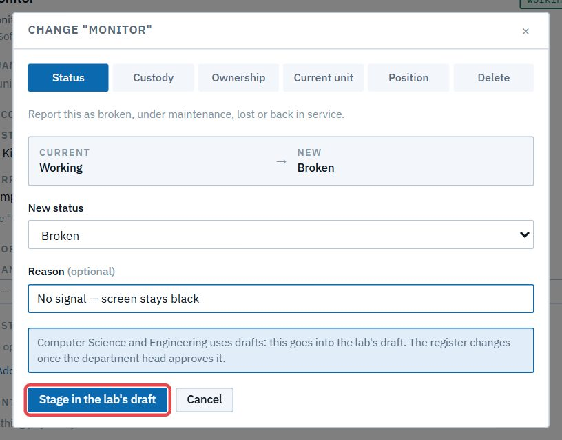

3. The item's details confirm: **Staged in … 's draft**. Its status still shows the old value, because the register hasn't changed yet. **Review & submit →** takes you to the draft.

In the register, a staged item shows a `*`. Hover over it to see what's pending, or click it to open the draft.

### Review and edit the Draft

1. Open **Lab states**. Your labs are listed on the left. A lab with a pending update shows **draft · N**.

2. Choose the lab and open **Draft**. It shows the whole lab as it will be, and **What it changes** (1) lists every entry.

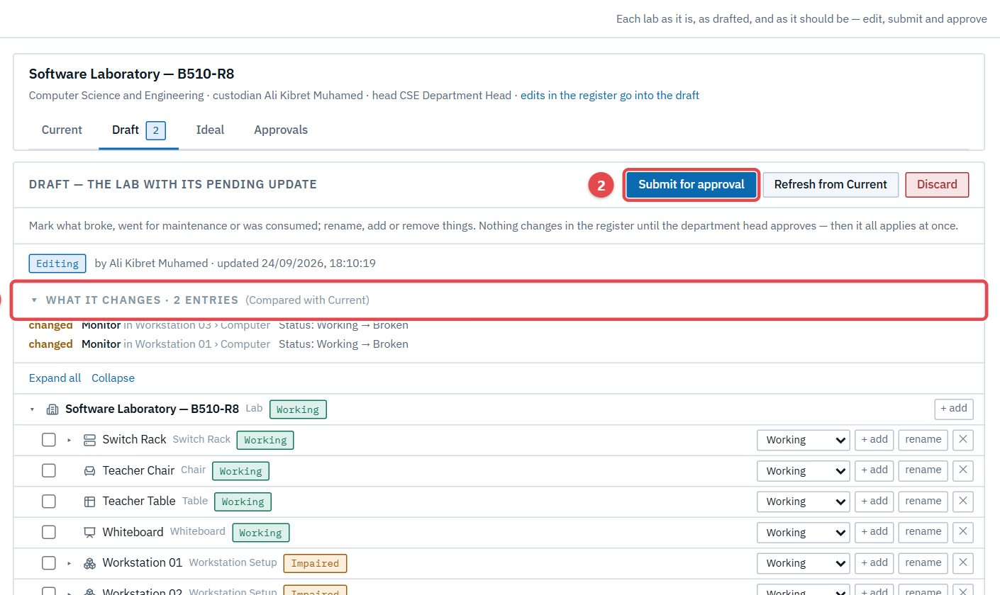

3. You can edit **in the draft tree** directly: set a status with the drop-down (1), **rename** (2), **+ add** inside something, or **✕** remove it. Press **Enter** to confirm a rename.

4. Check **What it changes**. Each entry says what, where, and from what to what: *Monitor in Workstation 03 › Computer · Status: Working → Broken*. Undoing an edit removes its entry.

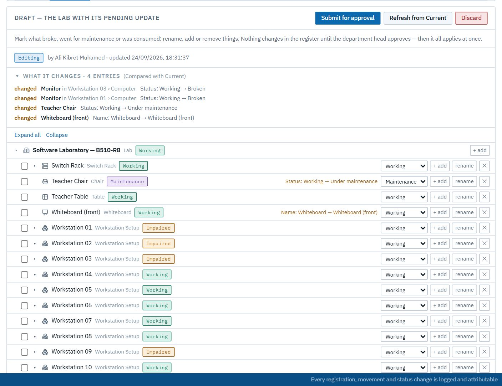

5. Click **Submit for approval**. The lab now shows **draft submitted**, and the draft waits for the head. **Withdraw to edit** takes it back if you need to change something first.

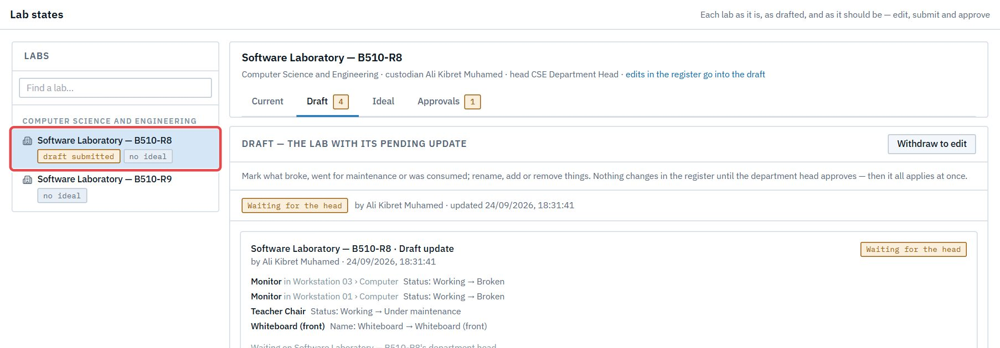

> **Good to know**
> - **Refresh from Current** replaces the draft with a fresh copy of the lab as it is now. **Changes made in the draft so far are lost.** **Discard** throws the draft away. Neither changes the register.
> - Custody, ownership and moves **out of the lab** can't be staged. They go through a transfer.
> - If someone else changes an item in the register while your draft waits, approving it is refused as **stale**, and nothing half-applies. Start the draft again from Current (**Refresh from Current**) and redo your edits.
> - When the head approves, the change log shows the edits under **your** name.

## 8. Propose the lab's Ideal

The **Ideal** is what the lab *should* hold, such as 25 workstations and 25 network outlets. It never changes the register. Purchasing measures the lab against it, so the gap is what the department buys.

1. **Lab states** → your lab → **Ideal** → **Proposal** → **Start a proposal**. It starts as a copy of the lab as it is now.

2. Click **+ add** on the lab, or on anything inside it. Choose the **category**, a **name** and **how many**.

3. **Preview…** shows the names they'll get, continuing the lab's own numbering (*Workstation 21 … 25*). Click **Add 5**.

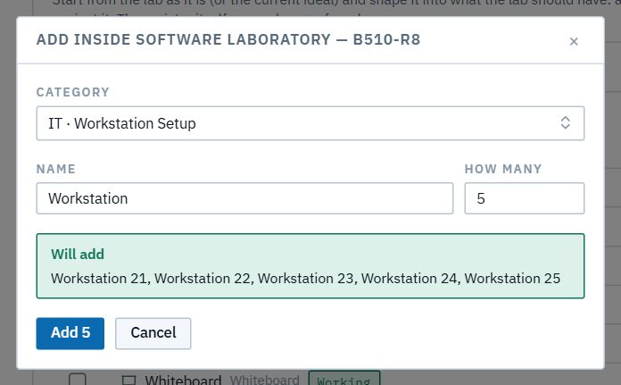

4. **Proposal vs Current** compares the two for each category:
   - **Ideal**: what the proposal says the lab should hold;
   - **Current**: what the lab holds now;
   - **Gap**: what is missing;
   - **Needs attention**: current items that are broken, impaired or in maintenance;
   - **Missing (to acquire)**: the missing items by name.

   Adding 5 workstations adds their parts too, which is why Computer, Monitor, Chair and the rest each show a gap of 5.

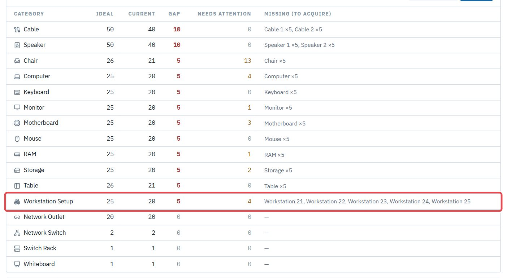

5. Click **Submit for approval**. Once the head approves, the lab's badge reads **ideal set**.

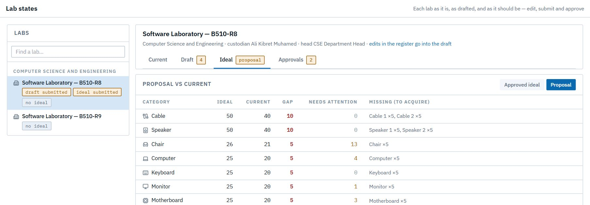

## 9. When a draft is sent back

If the head sends your draft back, **Lab states → Draft** shows their reason at the top ("Sent back: …"), and the draft is editable again. Change what they asked for (undoing an edit removes its entry), then **Submit for approval** again.

Once approved, everything applies at once, and the **Change log** shows each change under your name, with the reason you gave when you staged it.

## 10. Bookings of your labs

Staff book your labs, or machines in them, and **you** decide. Your department head doesn't.

1. Open **Schedule**. **My labs** shows your lab's calendar (pick the lab under **Calendar** if you hold several) and **Waiting on you** with every request (2).

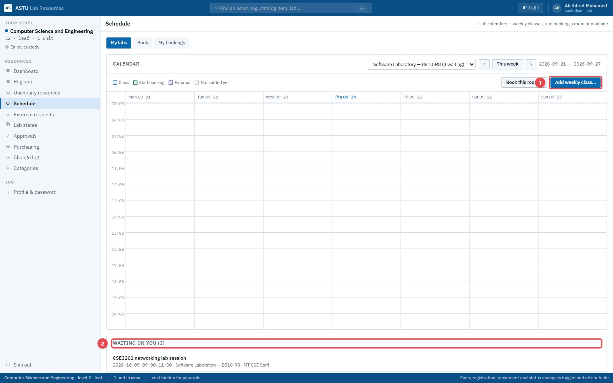

2. Click a request to see who asked, when, for what and for how many.
3. **Approve**, or **Decline** with a note. The requester sees your note. **Cancel booking** also releases a confirmed booking.

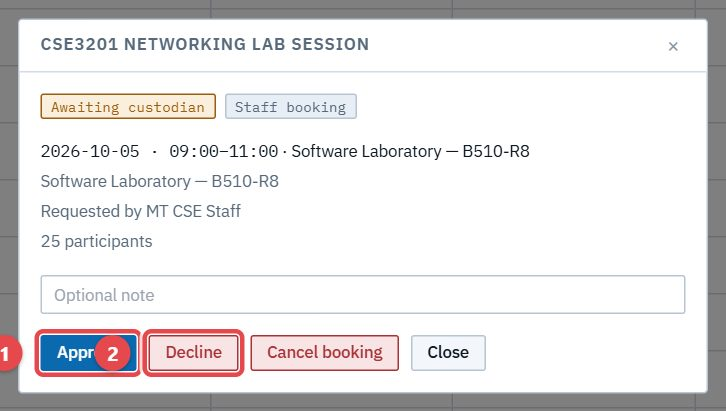

4. Confirmed bookings appear on the calendar. Use **‹ ›** to move between weeks.

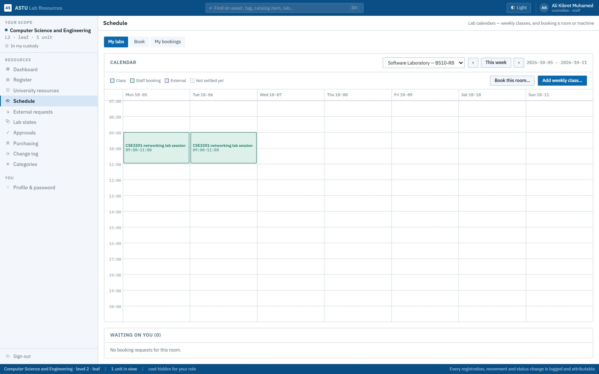

> **Good to know**
> - **Book this room…** books your own lab. A custodian's booking of their own lab is confirmed at once.
> - Other departments' calendars show when a lab is busy, but not the private notes on those bookings.

## 11. Weekly classes

1. In **Schedule → My labs**, click **Add weekly class…**
2. Enter the **Course**, **Section**, **Instructor** and number of **Students**, tick the weekdays (**Every**), and set **From** and **To**, and the **First date** and **Last date**.
3. Optionally tick machines the class also claims. Each is named by its place, such as *Workstation 01 › Computer*. The room already covers everything in it.

4. Save. **Weekly classes** lists the series with its number of upcoming sessions. A staff booking that overlaps a class session is refused. You can cancel one session, such as a holiday, and restore it later, without touching the rest of the series.

## 12. Raise a need

Custodians raise needs the same way staff do: **Purchasing → Raise a need**. See [the Staff chapter](04-staff.md#5-raise-a-need). Your head carries the need into a purchase request or declines it with a reason.

Much of what a lab needs is worked out for the head automatically: the gap between your lab's **approved Ideal** and **Current**, plus replacements for broken parts (section 8).

## 13. University resources and transfers

**University resources** shows every unit's resources, read-only, grouped by owning unit (university → college → department → lab). Use it to find something your lab needs that another unit holds.

1. Search for it and open its details. Another unit's item offers **Request to my lab…**

2. Choose **Into**, the place in your lab it should go, and say **Why**.
3. The dialog shows who has to agree, in order. For example: **the current custodian → their department's head → your department's head → you confirm receipt**.
4. Click **Request transfer**. Follow it in **Approvals → Transfers → Raised by me**.

When everyone has agreed, the item moves into your lab and into your custody.

## 14. Accept a handover

When the store keeper hands new stock over to your lab and your head approves, it comes to you to accept. Open **Approvals → Transfers** and click **Accept into my custody** (or **Reject**).

The items then sit in your lab, owned by your department and in your custody. Here five new workstations join Workstation Setup (now ×25), and the projector arrives.

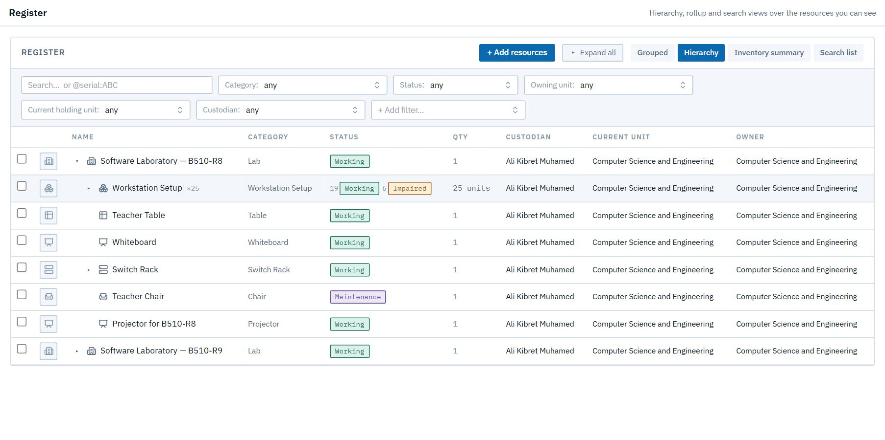

Your lab's **Ideal vs Current** gap closes accordingly.

## 15. Hold a slot for an outside request

When the AVP forwards an outside institution's request to your department, it appears in **External requests**. Hold your lab so nobody else books those dates:

1. Open the request and click **Hold a slot…**
2. Choose the **Room**, optionally only some machines, and the **Requested window**.
3. Click **Hold slot**. Repeat for each day you can host.

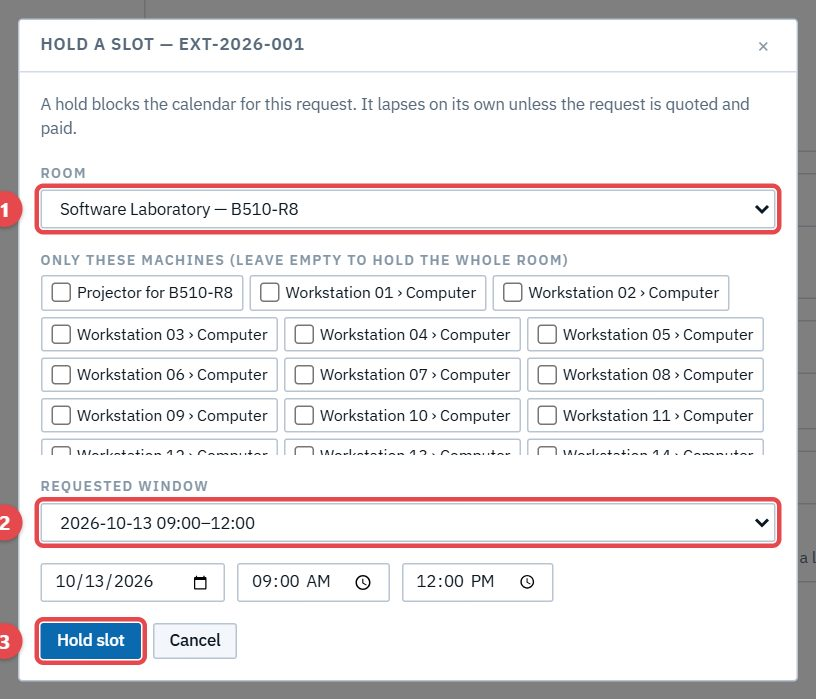

A hold blocks the calendar. Staff trying to book that time are refused. It lapses on its own unless the request is quoted and paid by the deadline. Once it's paid, the hold becomes a confirmed booking on your calendar. You can only hold the dates the request asked for.
