# Lab custodian

*You are the person accountable for one or more labs or stores: an ARA, SARA or lab responsible.* Your department head assigns you to them. You keep their records true, send their changes to your head, ask for what they need, and decide who may book your rooms.

Read [Getting started](00-getting-started.md) and [How LRMS thinks](01-concepts.md) first.

| Task | Section |
|---|---|
| See what's waiting for you | [1. Your Home](#1-your-home) |
| Open one of your labs | [2. Your labs](#2-your-labs) |
| Browse and find things | [3. Resources](#3-resources) |
| Record that something broke, was mended, added or removed | [4. Change something in your lab](#4-change-something-in-your-lab) |
| Send the lab's changes to your head | [5. Send your changes](#5-send-your-changes) |
| The head sent them back | [6. When your changes come back](#6-when-your-changes-come-back) |
| Ask for something to be bought | [7. Ask for something](#7-ask-for-something) |
| Approve or decline bookings of your rooms; book them yourself | [8. Bookings of your labs](#8-bookings-of-your-labs) |
| Put a weekly class on a lab's calendar | [9. Weekly classes](#9-weekly-classes) |
| Get something from another lab or the store, or give it back | [10. Moving things](#10-moving-things) |
| Hold your lab or a machine for an outside request | [11. Outside requests](#11-outside-requests) |
| Add or change a kind of resource | [12. Categories](#12-categories) |

---

## 1. Your Home

**Home** opens when you sign in. As a custodian you'll usually see:

- **Unfinished**: changes you made in a lab and haven't sent yet, with a button to send them;
- **Waiting for you**: booking requests for your rooms, and anything handed over to you to accept;
- **Your requests**: what you asked for (a need, a move, a booking) and where it is now;
- **Due soon**: calibration or expiry dates falling due on what you look after.

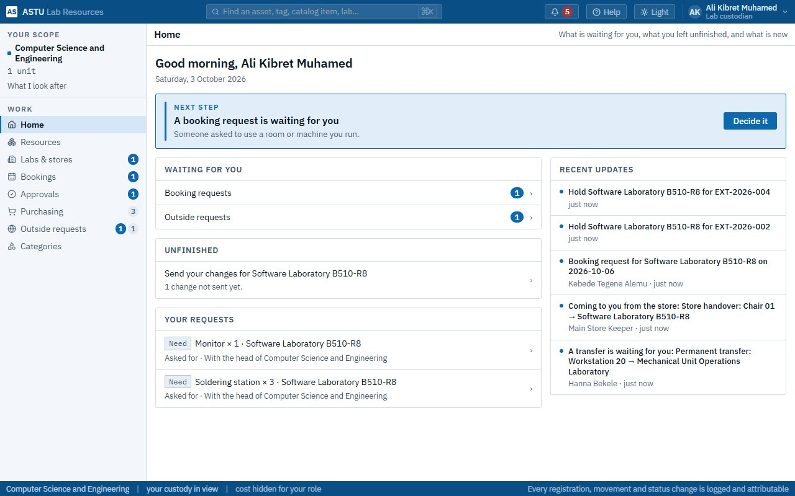

## 2. Your labs

**Labs & stores** lists **You run**: every lab and store you are the custodian of, with its block and room, how many items it holds and how many need attention. A lab with changes you haven't sent shows **Changes not sent yet**.

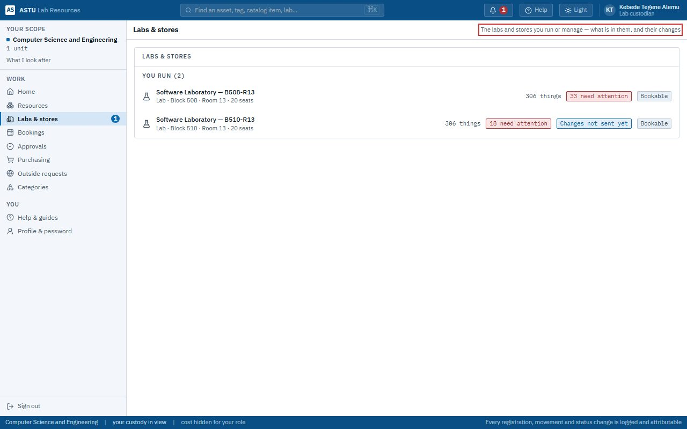

Click a lab to open it. Its page has the lab's details (block, room, seats, what it's for) and three tabs:

- **In the lab**: everything in it, as the register has it now;
- **My changes**: the lab with what you've changed and not sent yet (section 5);
- **Approvals**: your changes waiting for the head, and what they decided.

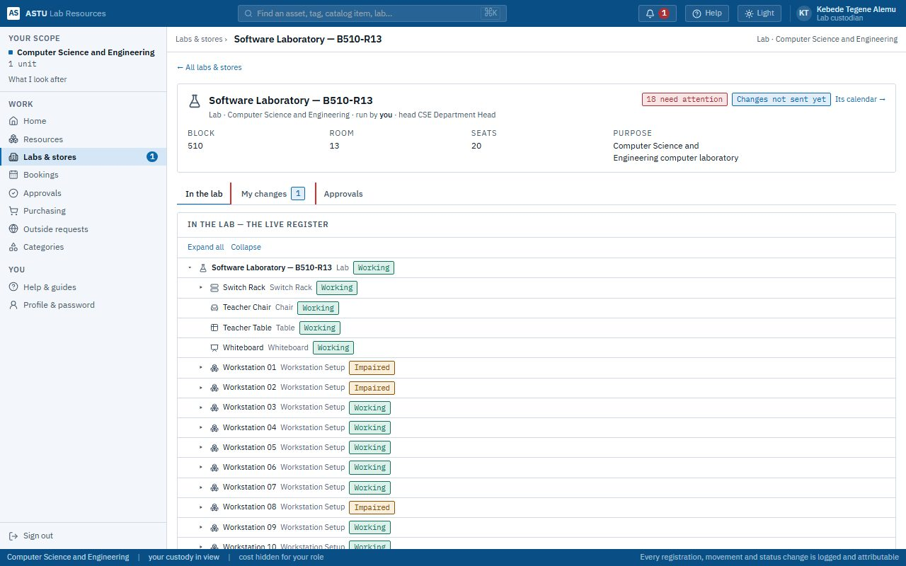

> **Good to know:** a lab's own details (its name, block, room, seats) and who runs it are kept by your department head (a college store's by the college's ADAA; the Main Store's by Property Administration). Ask them if something there is wrong.

## 3. Resources

**Resources** shows everything you look after (**Mine**), as a tree, or the whole university's (**Whole university**, read-only) when you're looking for something.

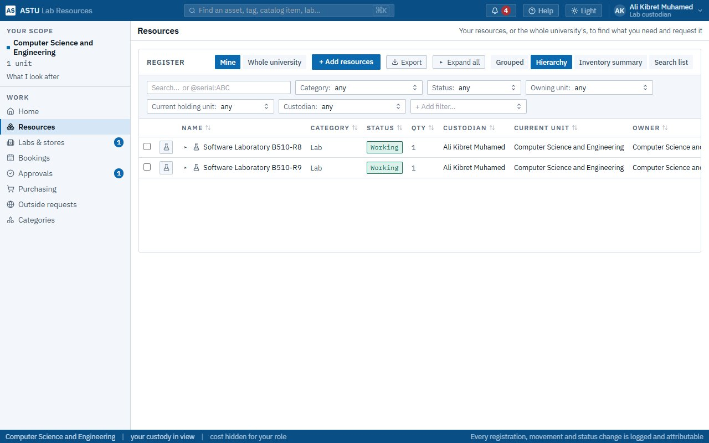

- The **view** buttons: **Grouped** (by unit, category or custodian), **Hierarchy** (the tree), **Inventory summary** (counts per category) and **Search list** (a flat list).
- **Filters**: pick values in **Category**, **Status**, **Owning unit**, **Current holding unit** or **Custodian**; search inside details with `@field:value` (see [Search](00-getting-started.md#8-search-from-anywhere)).
- **Sort**: click a column heading (**Name**, **Category**, **Status**…). Click again for the other way, a third time to go back.
- **Export** saves what is shown as a spreadsheet (.xlsx), one row per item with a column for each detail.

Click an item's **name** to open its details: its parts (**Contains**), its status, custodian and units, its details, its photos and its history.

## 4. Change something in your lab

1. Open the item in **Resources** (click its name). Its name, quantity and details are edited right there. **Change this…** offers the rest that is yours: **Status**, **Position** (somewhere else inside your lab) and **Delete**. Or tick several rows and use the bar that appears: **Set status…**, **Edit details…**, **Put inside…**, and more under **More…**
2. Choose what changes, such as the **Status** (*Broken*, say), add a reason, and confirm.

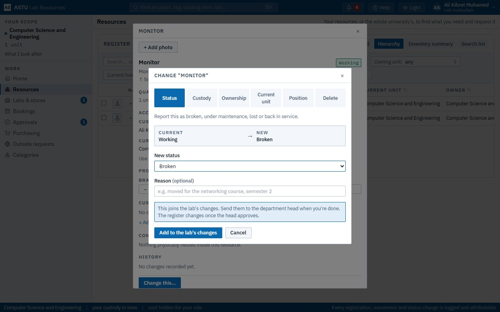

3. A note confirms it went into the lab's changes: **Added to Software Laboratory B510-R8's changes (not sent yet)**. The item still shows its old status, because the register changes only once your head approves. In **Resources**, the item now shows a `*`; hover over it to see what's waiting.

**Adding things.** **+ Add resources** in **Resources**: choose the **Category**, where it goes (**Into**), the **Name** and **How many**, then **Preview…** and **Apply**. A category that *comes with* parts (a Workstation Setup) creates them too. New names continue the lab's own numbering (*Chair 21, 22…*).

**Calibration.** For machines that are calibrated on a cycle, set **Last calibrated** in the item's details after each calibration (in your lab's changes, like any detail). In **Resources**, **+ Add filter… → Calibration** shows what is **overdue**, **due soon** or **never calibrated**; **Calibration due in (days)** with "at most 30" lists what falls due this month. Home's **Due soon** lists them too.

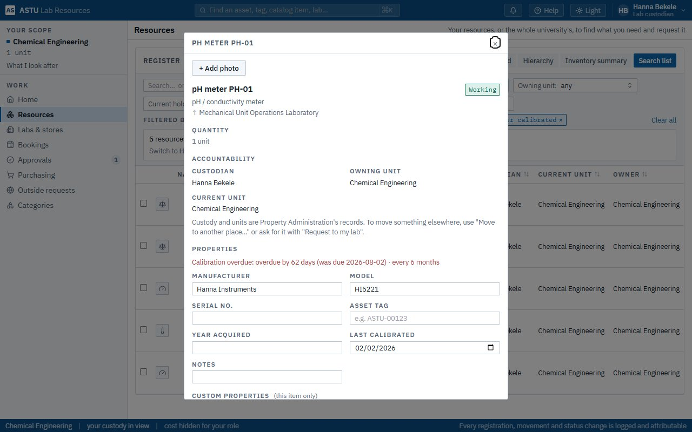

**Working in the lab itself.** You can also edit directly on **My changes**: set a status from the drop-down, **rename**, **+ add** inside something, or **✕** remove it.

> **Good to know**
> - **Custody, the owning unit and the current unit** are Property Administration's records, and moves **out of the lab** are moves (section 10). Neither is a lab change.
> - A detail the category requires must be filled in when you add something. Items the system creates for you (from the store, for example) are never refused for a missing detail.

## 5. Send your changes

1. Open the lab (**Labs & stores** → your lab), or click **Send your changes for …** on **Home**.
2. On **My changes**, check **What it changes**: every entry says what, where, and from what to what, e.g. *Monitor in Workstation 03 › Computer · Status: Working → Broken*.

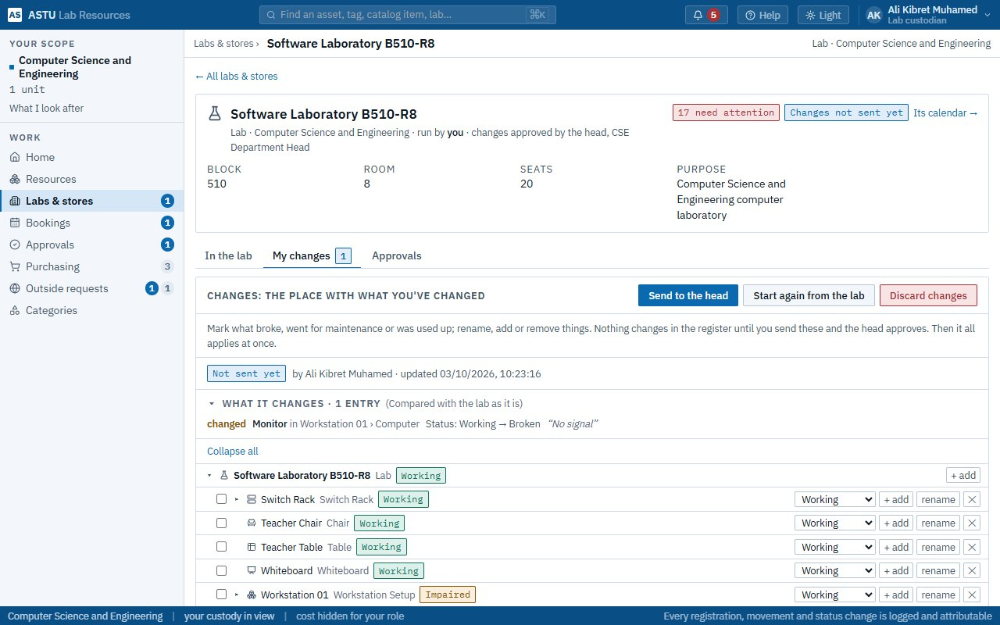

3. Click **Send to the head**. The lab now shows **Waiting for the head**, and your head is told. (A store's changes go to **Property Administration** instead: the button reads **Send to Property Administration**.)

**Take back to edit** brings them back if you need to change something first. **Discard changes** throws them away. **Start again from the lab** replaces them with a fresh copy of the lab as it is now. Neither changes the register.

> **Good to know**
> - When the head approves, every change applies at once, and **History** shows them under **your** name, with your reasons.
> - If someone else changed an item in the register while yours waited, approving is refused as **couldn't be applied**, and nothing half-applies. Use **Start again from the lab** and redo your changes.

## 6. When your changes come back

If your head sends them back, you're told, and **My changes** shows their reason at the top (*Sent back: …*). Change what they asked for, then **Send to the head** again.

## 7. Ask for something

Your head buys for the department; you tell them what your labs need.

1. Open **Purchasing → Lab needs**. Under **Ask for something**:
   - **For which lab**;
   - **What is needed** and **How many** (with its **Unit**);
   - optionally the **Kind of resource**, if the register knows it;
   - **How much it matters**: **Essential** (classes or research can't run without it), **Important**, or **Nice to have**;
   - **Why the lab needs it**, and an optional **Specification** (a model, a size, a supplier's quote reference).
2. Click **Send to the head**.

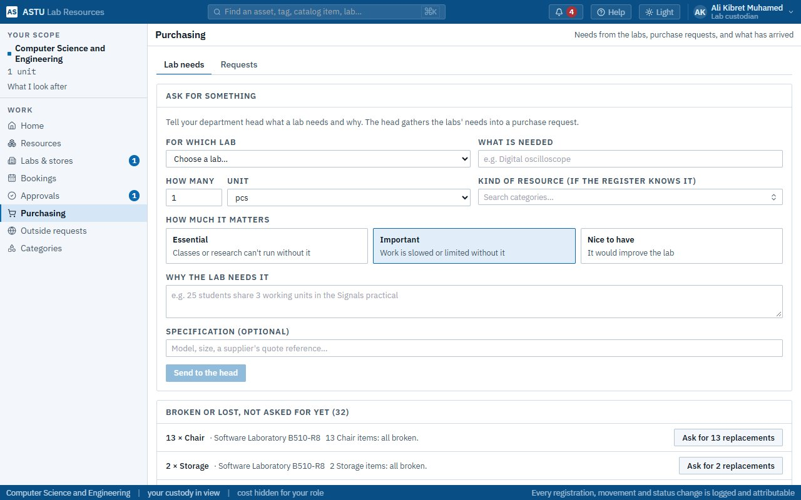

**Replacing what broke.** **Broken or lost, not asked for yet** lists things in your labs that are broken or lost and nobody has asked to replace, grouped by kind (*8 × Monitor · Software Laboratory B508-R13*). **Ask for 8 replacements** fills the form for you.

**What you've asked for** shows each need and where it stands: waiting for the head, carried into a purchase request (and that request's stage), or declined with the head's reason. **Withdraw** takes one back while it waits.

## 8. Bookings of your labs

People book your rooms, or machines in them, and **you** decide.

1. Open **Bookings**. **My labs** shows your lab's **Calendar** and **Waiting on you**, every request.
2. Click a request to see who asked, when, for what and for how many.
3. **Approve**, or **Decline** with a note. The requester sees your note.

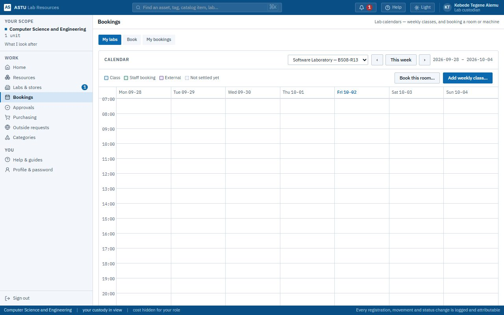

Booking requests also appear in **Approvals** and on **Home**.

**Booking your own room.** **Book this room…** (or click a free time on the calendar) books your lab or a machine in it. Say **who it is for** (a name, a class, a group) and why. Your booking of your own lab is confirmed at once.

## 9. Weekly classes

1. In **Bookings → My labs**, click **Add weekly class…**
2. Enter the **Course**, **Section**, **Instructor** and number of **Students**, tick the weekdays (**Every**), set **From** and **To**, and the **First date** and **Last date**.
3. Save. **Weekly classes** lists the series. A booking that overlaps a class session is refused. You can cancel one session, such as a holiday, without touching the rest.

## 10. Moving things

**Get something from another lab or the Main Store.**

1. In **Resources**, switch to **Whole university** and find it.
2. Tick it, or open its details, and click **Request to my lab…**
3. Choose **Into** (the place in your lab it should go) and **How**:
   - **Loan**: you borrow it; it stays the other unit's;
   - **Permanent transfer**: it becomes your unit's, in your custody. The College Managing Director approves it too, and Property Administration when it comes from another college.
   Something from the Main Store is always given, not lent.
4. Say why, and click **Request transfer**. The dialog shows who must agree, in order. Follow it on **Home** or **Approvals → Sent by me**. When everyone has agreed, you **confirm receipt** and it moves into your lab.

**Accepting a handover.** When the store keeper sends new stock to your lab, you're told it's coming. Once Property Administration approves, it waits for you on **Home** and in **Approvals**: click **Accept into my custody** when it's in your hands.

**Giving something back.** Tick it in **Resources** and click **Return to store…** Your head and Property Administration approve, and the store keeper accepts it.

**Returning a loan.** Something you borrowed sits in your lab but stays the other unit's. Open it and click **Return to owner…**: the place it came from is offered first. Nobody else on your side needs to agree; the owner's custodian confirms it arrived. The lender can also **Ask for it back…**; then it waits for you to let it go.

## 11. Outside requests

When an outside institution asks for labs or a sample analysis, your head books the places it needs. If one of them is yours, you're told, and the request appears in **Outside requests** with **Places held** listing each date your place was asked for, marked **Asked to hold**.

For each one:

- **Hold it**: the place is held on that date for the request. The line then shows **Held** and can't be held twice.
  - Your lab must have what every lab in the request must have (working). If it doesn't, **Hold it** is greyed out and the line says what is missing: "short of 1 × Projector". Borrow it first (next point), and hold once it is in your lab.
  - Once everything asked for on that date is held by other labs, yours isn't needed: the line reads **Not needed**. It opens again if a held lab is released.
- **Waiting for a loan…**: your lab is short of something the requester needs (they listed what each lab must have under **Labs to build up**). Ask another department for it from **Resources → Whole university → Request to my lab**, and say here what you are borrowing. Your head sees the note. Hold the place once the things are in your lab.
- **Can't hold it…**: say why (a class, maintenance, too few working machines). Your head is told and books another place.

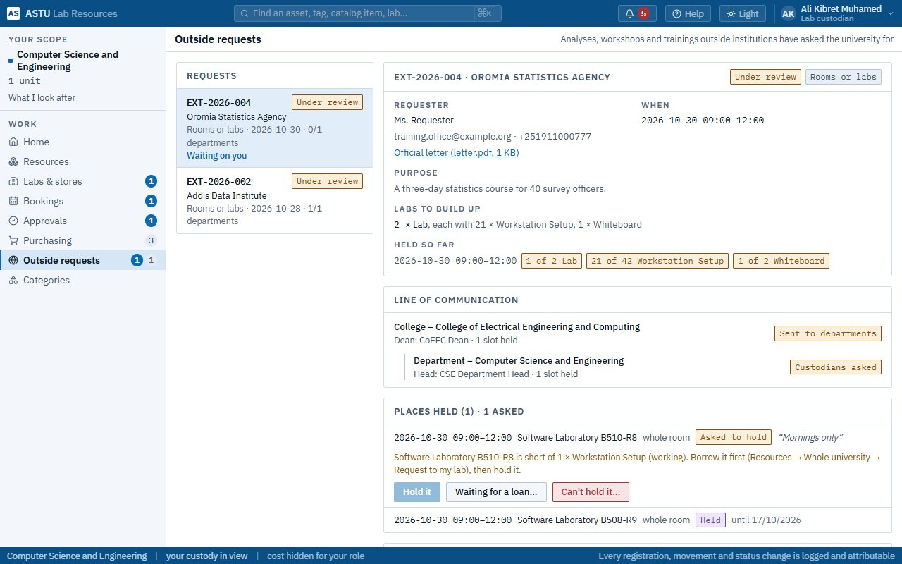

A hold blocks the calendar. It lapses on its own unless the request is paid by the deadline; once paid, it becomes a booking on your calendar. You are one of the **contact persons** the requester calls once they have paid, so keep a phone number on **Profile & password** (your head can also set it for you).

For a sample analysis your head may still ask you directly: open the request, click **Hold a slot…**, choose the room or only the machines in it and the window, and click **Hold slot** (it reads **Held** if that room and time is already held), then report **Done…** or **Can't…** on your line.

## 12. Categories

You know your machines best, so you can add and adjust the **categories** your department uses. Open **Categories**.

- **+ Add a category**: a name, an icon, what it is for, how it is **Counted as** (one by one, or a quantity in a unit), the **Details to record** (each with its kind: Text, Number, Choice, Yes / no, or Date), and what it **Comes with**. **+ A common detail…** adds the usual ones in one pick (Manufacturer, Model, Serial no., Expiry…). A new category applies at once; your head is told.
- **Calibration** (under **More options**): "Needs calibrating every __ months". Each item of the kind then records **Last calibrated**, and its panel says whether it is calibrated, due soon (within 30 days), overdue or never calibrated.
- **Changing one**: edit it, then **Review changes**. The review says what happens to the items it reaches before anything is saved:
  - adding a detail or an option applies at once;
  - changing a detail's kind **converts** the values; anything that can't convert is listed, and is kept on its item rather than lost;
  - renaming a detail that holds values asks whether it is **the same detail, renamed**, or **a new detail**;
  - a change to what items already hold is **sent for approval** to your head.
- A category another department or the university looks after can be added to the same way. A change that would alter **their** items goes to them for approval (their head, the administrator and Property Administration), and the review suggests the simpler path: **Make a copy for my department**, then change the copy.

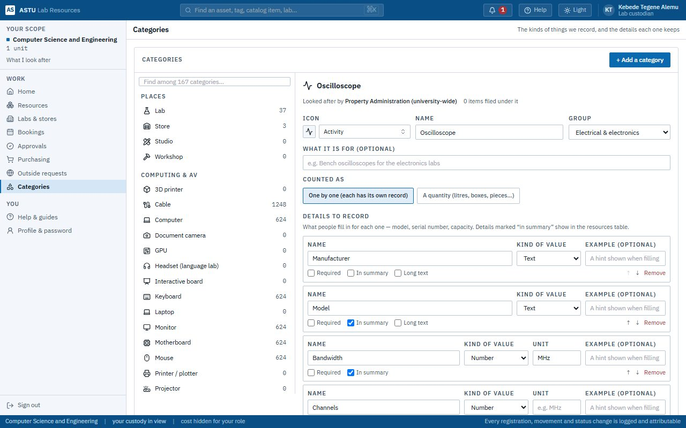
