# Department head

*You head a department. You don't edit resources yourself: your custodians do. You **approve** what they propose, turn the department's needs into **purchase requests**, and look after your **people**.* Most heads are also staff, so the [Staff chapter](04-staff.md) applies too.

Read [Getting started](00-getting-started.md) and [How LRMS thinks](01-concepts.md) first.

| Task | Section |
|---|---|
| See your department at a glance | [1. Your dashboard and register](#1-your-dashboard-and-register) |
| Approve or send back a lab's update or ideal | [2. Decide lab updates and ideals](#2-decide-lab-updates-and-ideals) |
| See who changed what | [3. The change log](#3-the-change-log) |
| Answer the department's needs | [4. Open needs](#4-open-needs) |
| Compile a purchase request | [5. Compile a purchase request](#5-compile-a-purchase-request) |
| Withdraw a request | [6. Withdraw a request](#6-withdraw-a-request) |
| Invite someone, or help them sign in | [7. Your people](#7-your-people) |
| Revise a request that was sent back | [8. When a request is sent back](#8-when-a-request-is-sent-back) |
| Approve new stock for your labs | [9. Approve a handover](#9-approve-a-handover) |
| Answer an outside institution's request | [10. External requests](#10-external-requests) |

---

## 1. Your dashboard and register

**Dashboard** shows your whole department: every lab, its condition and where the problems are. The scope panel (1) reads **My unit and below**.

**Register** shows every lab in your department, read-only for you: there is no **Add resources**, no **Change this…** and no bulk bar. Your custodians keep the records, and you approve them.

## 2. Decide lab updates and ideals

When a custodian submits a lab's **Draft** (an update of what broke, was renamed, added or removed) or an **Ideal** proposal (what the lab should hold), it comes to you.

1. Open **Lab states**. Each lab shows what is waiting: **draft submitted**, **ideal submitted**, **ideal set**, **no ideal**.

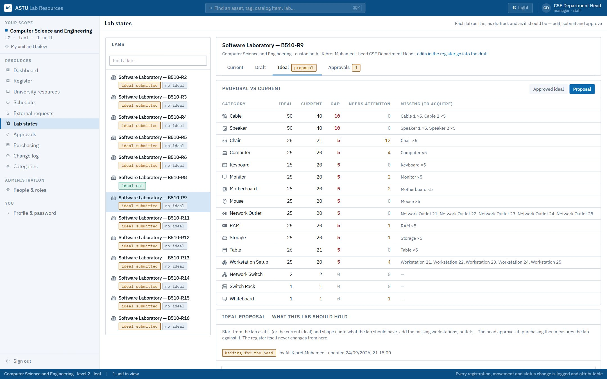

2. Or open **Approvals → Lab commits** to see everything waiting on you in one place. Each card lists exactly what it changes: *Monitor in Workstation 03 › Computer · Status: Working → Broken*, with the custodian's reason in quotes.

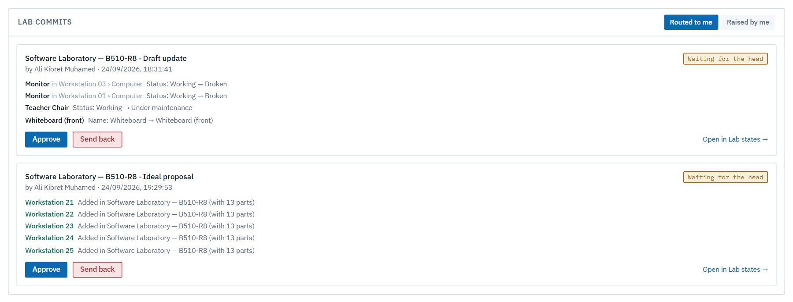

### Send it back

If something isn't right, click **Send back** and give a reason. The custodian sees it on the draft, revises and resubmits. Nothing in the register changes.

### Approve

1. Click **Approve** on the card.

   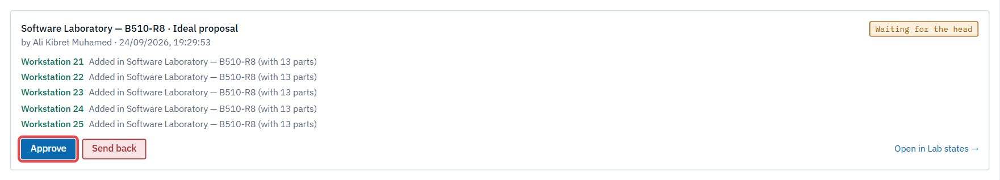

2. Confirm. You can add an optional note.

   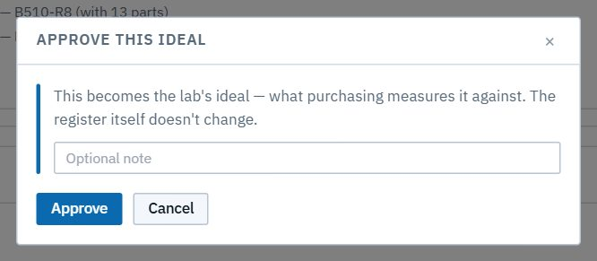

- **An approved Draft** applies to the live register in one step, **credited to the custodian**. If anything in the register changed since the draft was copied, nothing is applied, and it goes back to the custodian as **stale**.
- **An approved Ideal** becomes the lab's target. The lab's badge reads **ideal set**, and purchasing now measures the lab against it. The register itself doesn't change.

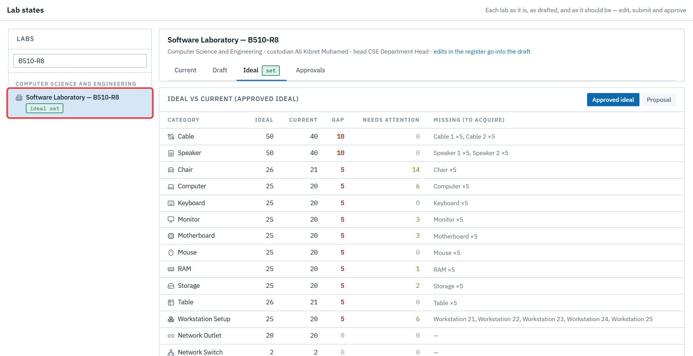

> **Good to know:** only a lab's own department head decides its drafts and ideals. Another manager can't, and neither can the dean.

## 3. The change log

**Change log** lists every applied change in your department: when, which item, what changed from and to, **by whom** and **why**. Edits from an approved draft appear under the **custodian's** name, with the reason they gave.

## 4. Open needs

Anyone in your department (staff, custodians) can **raise a need**: "a projector for B510-R8". Needs aren't purchases. They wait for you.

1. Open **Purchasing**. Under **Compile a purchase request**, **Open needs in this unit** lists each need with who raised it, when and why.

2. For each one:
   - **Add to request** carries it into the request you're compiling (section 5). The person who raised it can then follow the request.
   - **Decline…** asks for a reason, which the person who raised it sees, then **Decline need**.

## 5. Compile a purchase request

1. In **Purchasing → Compile a purchase request**, give it a **Title**.
2. Click **Compute from labs' ideal vs current**. For every category your labs' approved ideals include, you see:
   - **Ideal** and **Current**;
   - **Gap**;
   - **Not working**;
   - **To buy**: exactly what the next step will order. It never counts a part twice: a missing workstation is one *Workstation Setup*, and its computer, monitor and parts come with it. Replacements are for items that failed themselves (broken or lost). An impaired computer is mended by replacing its broken part.
   - **By lab**: open it to see which labs are short.

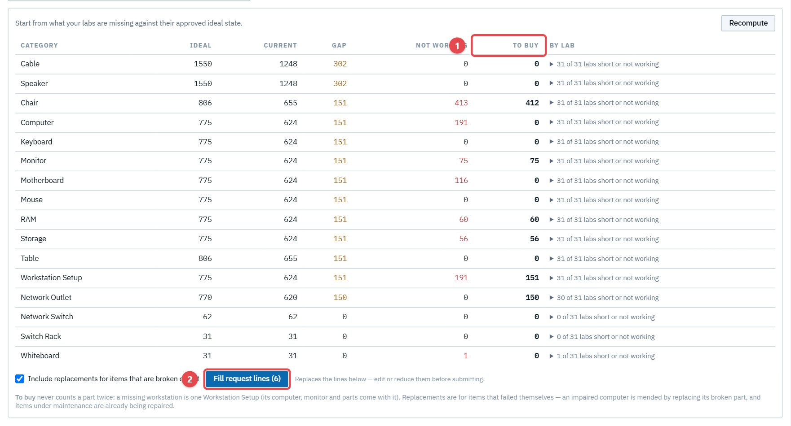

3. Leave **Include replacements for items that are broken or lost** ticked (or untick it), then click **Fill request lines**.
4. Check and edit the lines: name, quantity, unit, category, an estimated unit cost, and justification. Each line's justification already explains itself: ideal vs current, and which labs need it (all of them by name when there are a few, the largest three when there are many). Use **+ Add line** for anything else, and **Add to request** for open needs.

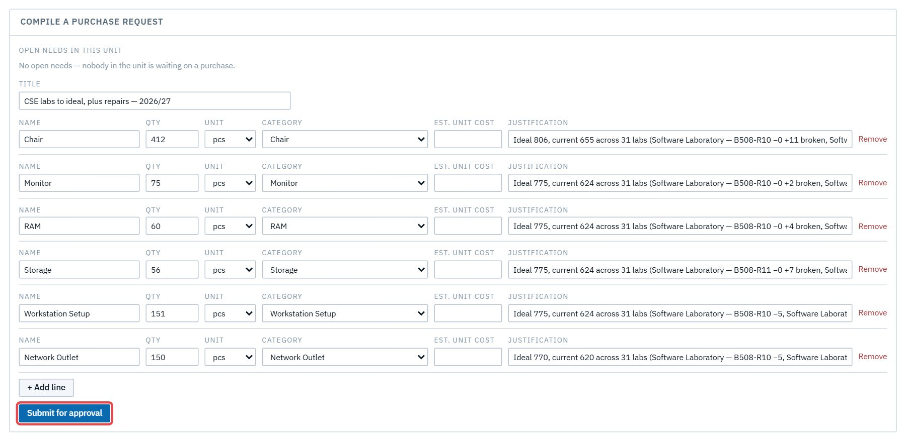

5. Click **Submit for approval**. The request gets a reference (**PR-2026-…**) and starts its chain: **your step is already done** (you raised it) → **dean** → **AVP** → **College Managing Director** → **Procurement Office**. Each card shows who it's waiting on.

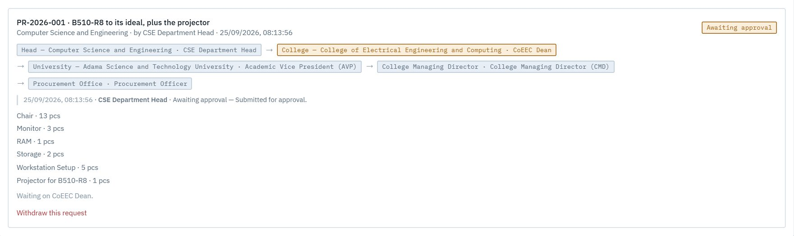

> **Good to know**
> - Serialized items (computers, chairs…) are ordered in whole units. A quantity like 2.5 is refused.
> - Anyone in your department can follow the request's stage. Only roles that may see costs see the estimated costs.

## 6. Withdraw a request

While a request is still being approved, **Withdraw this request** stops it. It asks you to confirm first, and any needs carried into it reopen, so they can go into another request. Once procurement has placed the order, only procurement can cancel it, with a note.

## 7. Your people

**People & roles** lists your department's people.

- **Add personnel** invites someone into your department as a **custodian** or **staff**. They get an email with a registration link, and you get a copyable invite link in case the email doesn't arrive.

  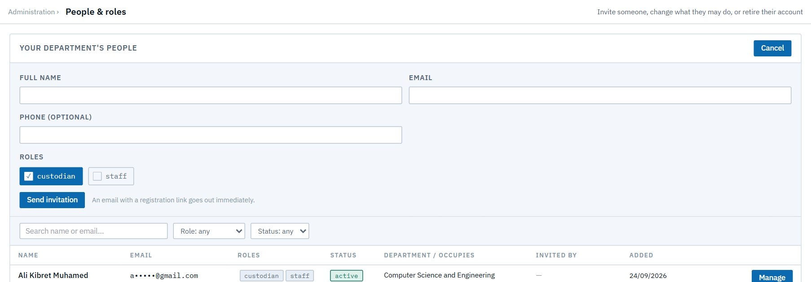

- **Manage** on a person lets you switch their **email notifications** on or off (the CSE ARAs start with them off), for your department's people only.
- **Manage** on a person offers **sign-in help**, for your department's people only:
  - **Email reset link** sends them a password reset;
  - **Set temporary password** shows a one-time password to give them directly, which they must change at their next sign-in;
  - **Copy invite link** is for someone who hasn't accepted yet.

Roles beyond custodian and staff, such as another head, the store keeper or procurement, are set by the system administrator.

## 8. When a request is sent back

If an approver (the dean, say) sends your request back, it shows **Sent back for revision**, with their note, in **Purchasing → My requests**.

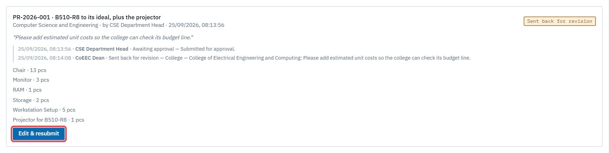

Click **Edit & resubmit**, change what was asked (lines, quantities, justifications), then **Resubmit**. The chain starts again at the dean, and the history keeps the note and your revision.

## 9. Approve a handover

When the store keeper hands stock over to one of your labs (after a purchase arrives, for example), you approve it first. Then the lab's custodian accepts it. Open **Approvals → Transfers**. The card names the items and the destination lab.

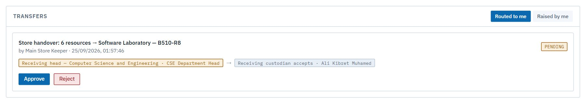

**Approve**, or **Reject** with a reason. Nothing moves until you and the custodian have both said yes.

Bookings of your labs are decided by each lab's **custodian**, not by you. You can see them, but they don't wait on you.

## 10. External requests

When the AVP forwards an outside institution's request to your department, it appears in **External requests** as **Waiting for the head**. Your custodians can already hold lab slots for it.

1. Open it and click **Accept…**
2. Enter a link to your **pricing breakdown** (a spreadsheet), **your department's amount** in ETB, and an optional note.
3. Click **Accept**. Or **Decline…**, with a note, if you can't host it.

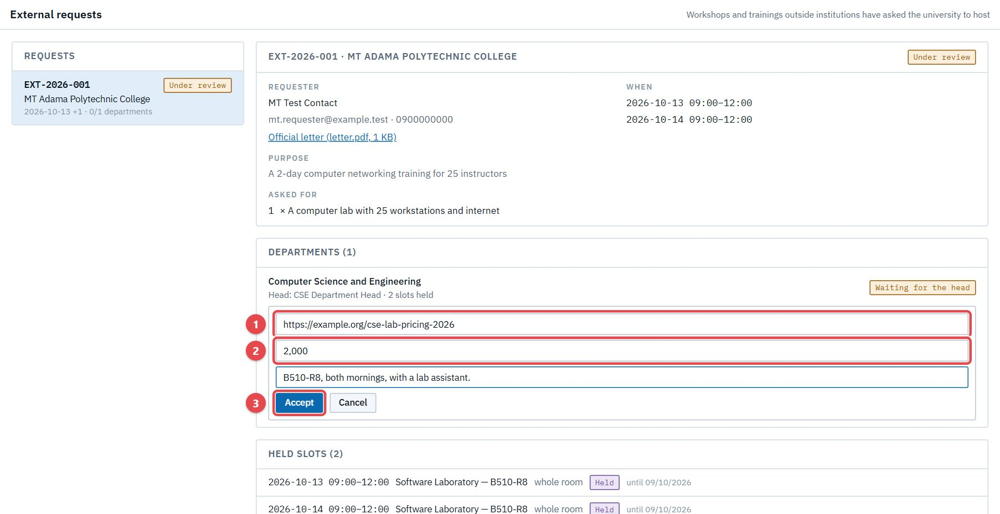

The AVP adds up the departments' amounts into one quote for the requester. Once it's paid, the held slots become bookings.
