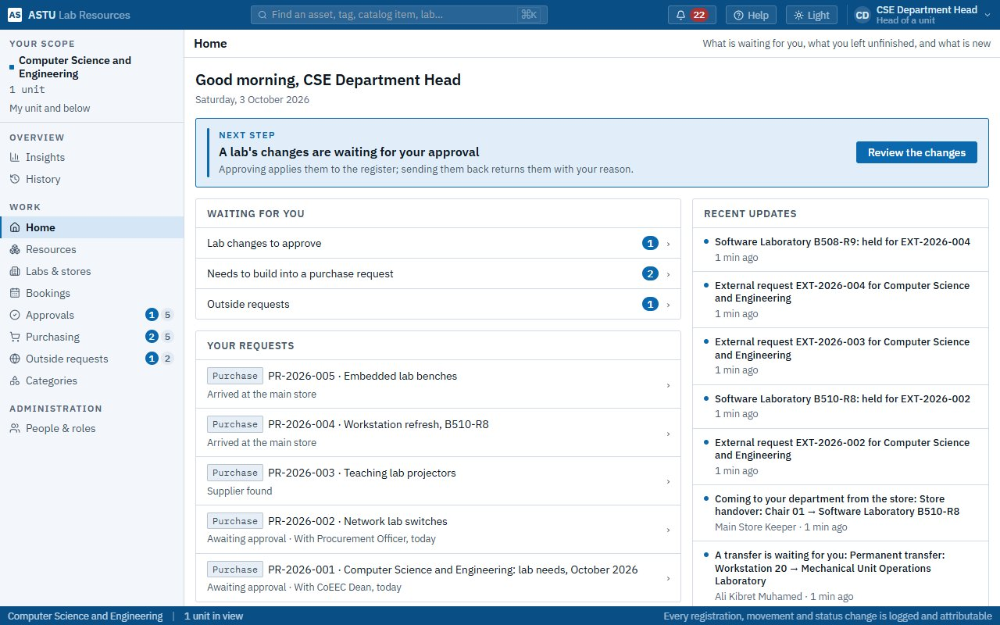
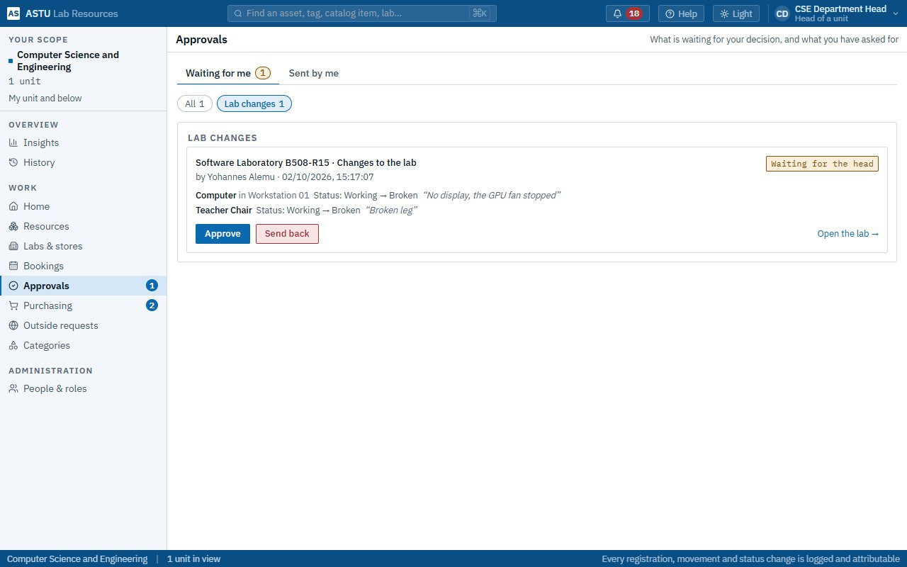
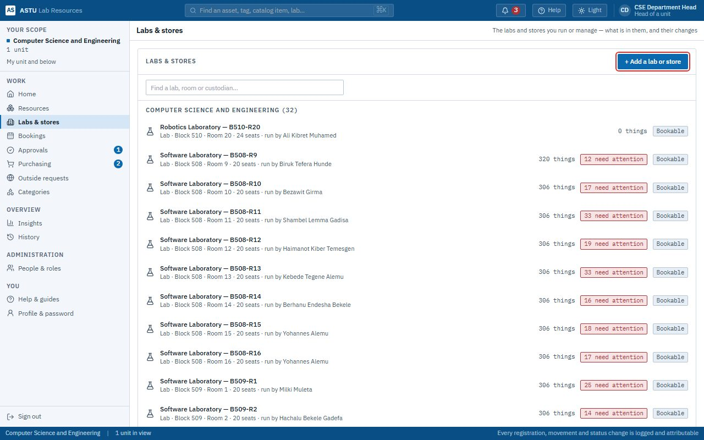
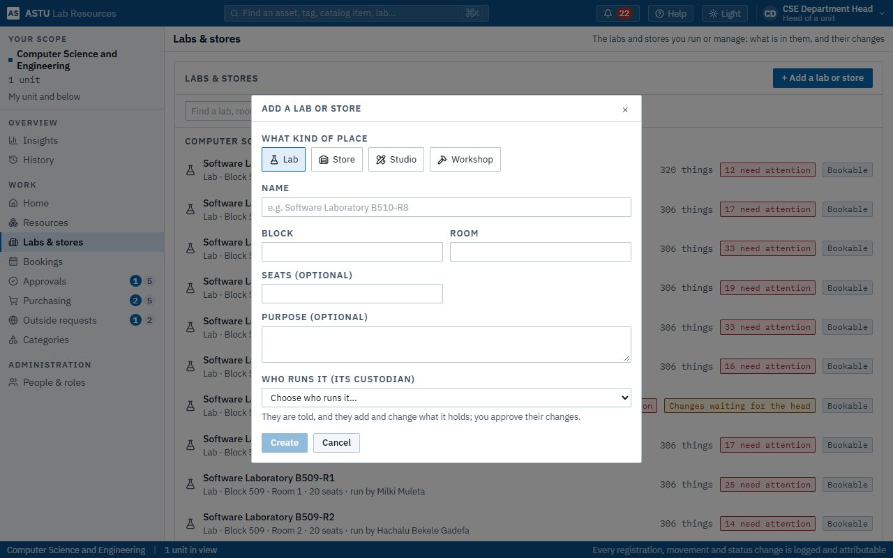
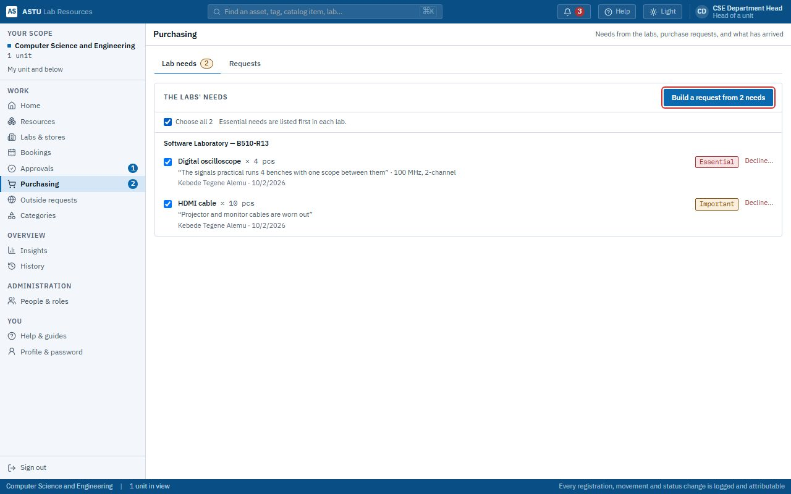
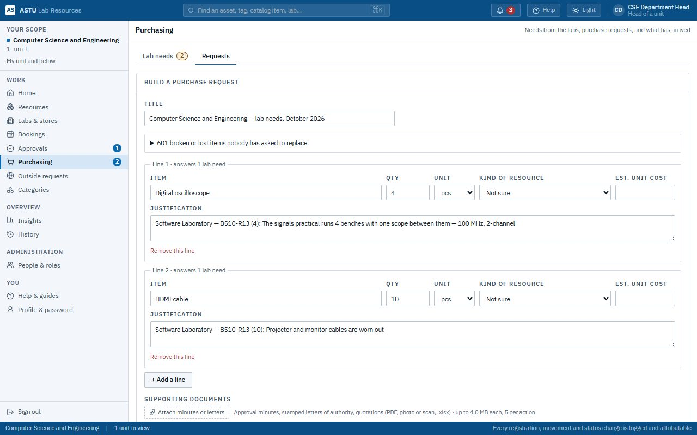

# Department head

*You head a department. Your custodians keep the labs' records; you **approve** their changes, decide **which labs exist and who runs them**, turn the labs' needs into **purchase requests**, look after your department's **categories**, and your **people**.*

Read [Getting started](00-getting-started.md) and [How LRMS thinks](01-concepts.md) first.

| Task | Section |
|---|---|
| See what's waiting for you | [1. Your Home](#1-your-home) |
| Approve or send back a lab's changes | [2. Decide lab changes](#2-decide-lab-changes) |
| Add a lab, change who runs it | [3. Labs & stores](#3-labs--stores) |
| Answer the labs' needs | [4. The labs' needs](#4-the-labs-needs) |
| Build a purchase request | [5. Build a purchase request](#5-build-a-purchase-request) |
| A request was sent back | [6. When a request is sent back](#6-when-a-request-is-sent-back) |
| Decide moves into or out of your department | [7. Moves and handovers](#7-moves-and-handovers) |
| Approve changes to your department's categories | [8. Categories](#8-categories) |
| Invite someone, or help them sign in | [9. Your people](#9-your-people) |
| See who changed what; your department in charts | [10. History and Insights](#10-history-and-insights) |
| Answer an outside institution's request | [11. Outside requests](#11-outside-requests) |

---

## 1. Your Home

**Home** puts what waits for you first: labs' changes to approve, transfers, purchase requests, category changes, and **needs to build into a purchase request**. The **Next step** banner points at the one that has waited longest. **At a glance** shows your department: how many labs and items, how many work, and how many need attention.

## 2. Decide lab changes

When a custodian sends a lab's changes, you're told, and they appear in **Approvals → Waiting for me** (and on **Home**). The card lists exactly what they change: *Monitor in Workstation 03 › Computer · Status: Working → Broken*, with the custodian's reasons.

- **Approve** applies every change at once, credited to the custodian. If anything in the register changed since they started, nothing is applied, and it goes back to them as **couldn't be applied**.
- **Send back**, with a reason. The custodian sees it on the lab, changes what you asked, and sends again. Nothing in the register changes.

> **Good to know:** only a lab's own department head decides its changes. Use the kind chips (**Lab changes**, **Transfers**, **Purchases**…) at the top of **Approvals** to see one kind at a time.

## 3. Labs & stores

Your department's labs are yours to manage. Open **Labs & stores**: every lab and store your department owns, with its custodian, block and room, seats, whether it can be booked, how many items it holds and how many need attention.

**Add a lab.**

1. Click **+ Add a lab or store**.
2. Choose **What kind of place** (Lab, Workshop, Studio, Store) and who it **Belongs to** (your department).
3. Give its **Name** and details: **Block**, **Room**, **Seats**, **Purpose**.
4. Choose **Who runs it (its custodian)** from your department's custodians.
5. Save. The custodian is told, and records what it holds.

**On a lab's page:**

- **Edit name and details** changes its name, block, room, seats or purpose;
- **Change who runs it** hands the lab, and everything in it, to another custodian. Both of them are told; add a reason if you like. A lab with changes waiting for you must be decided first;
- **Remove** is offered only for an empty lab.

## 4. The labs' needs

Your custodians ask for what their labs need (**Ask for something**). Needs aren't purchases: they wait for you. Open **Purchasing → Lab needs**. **The labs' needs** lists them **by lab**, essential needs first, each with who asked, how many, how much it matters, the specification and why. When you open a need from its notice (email or bell), that need is marked and scrolled into view.

- Tick the needs to buy, then **Build a request from N needs** (section 5).
- **Decline**, with a reason (*not this budget year*). The custodian is told why.

**Broken or lost, not asked for yet** shows what is broken or lost in your labs that nobody has asked to replace, so nothing gets forgotten.

## 5. Build a purchase request

1. From the needs (section 4), or **Purchasing → Requests → Build a purchase request**.
2. The request opens already filled: a **Title**, and one line per kind of item, with quantities added up across the needs you chose and a justification naming the labs (*Chair × 13: Software Laboratory B508-R13 (13): 13 Chair items: all broken*). Edit anything; **+ Add a line** for something else.
3. Under **Supporting documents**, attach the scanned approval minutes, letters of authority or quotations (PDF, a photo or scan, or .xlsx; up to 4 MB each).
4. Click **Send for approval**. The request gets a reference (**PR-2026-…**) and starts its chain: **dean → College Managing Director → AVP → Procurement Office**. Your own step is done by sending it.

**Your requests** shows where each one is (*Awaiting approval · With CoEEC Dean, today*), and the order stages after approval. The custodians whose needs you carried can follow it too.

> **Good to know**
> - Items counted one by one (computers, chairs…) are ordered in whole units.
> - While a request is being approved, **Withdraw this request** stops it, and its needs reopen. Once the order is placed, only procurement can cancel it.
> - Every file sent with a request stays on its record, visible to everyone who can follow the request.

## 6. When a request is sent back

If an approver sends your request back, you're told, and it shows **Sent back for revision** with their note under **Purchasing → Requests**. Click **Edit & resubmit**, change what was asked, and **Resubmit**. The chain starts again at the dean.

## 7. Moves and handovers

Moves into or out of your department come to you in **Approvals**:

- **another unit asks for one of your resources** (a loan or a permanent transfer): you approve as the owning head;
- **one of your custodians asks for something**: you approve as the receiving head;
- **the store keeper hands new stock to one of your labs**: you approve first, then Property Administration, then the custodian accepts it;
- **a custodian returns something to the store**: you approve, then Property Administration, then the store keeper accepts it.

A **permanent transfer** goes on to the College Managing Director after the heads (and to Property Administration when it crosses colleges); a **loan** ends with you.

Before you decide, open **What is moving, from where, to whom** on the card (it's open when it's your turn): where it is and where it goes, who owns it and answers for it now and after, and each resource with its kind, status, recorded details and the parts that travel with it ([what the card shows](06-dean-avp.md#2-permanent-transfers-cmd)).

Bookings of your labs are decided by each lab's **custodian**, not by you.

## 8. Categories

Categories belong to the department that made them, and you are their head.

- When a custodian **adds a category**, or adds to one, it applies at once, and you're told, with a link. Open it to adjust it, or remove it if it isn't needed.
- A change that **alters what items already hold** waits for you: **Categories** shows **Waiting for your approval** at the top, and it's in **Approvals** too. The card says what it changes and how many items it reaches. **Approve**, or **Not approved** with a note.
- Your own changes of that kind apply after the same review.
- A change that would alter **another department's** items goes on from you to the administrator and Property Administration. Usually a separate category for your department is better: the editor offers **Make a copy for my department**.

## 9. Your people

**People & roles** lists your department's people.

- **Add personnel** invites someone into your department as a **custodian**. They get an email with a registration link, and you get a copyable link in case the email doesn't arrive.
- **Manage** on a person lets you switch their **email notifications** on or off, and offers **sign-in help**: **Email reset link**, **Set temporary password** (shown once, to give them directly), or **Copy invite link** for someone who hasn't accepted yet.

Other roles (another head, the store keeper, procurement, the ADAA) are set by the system administrator.

## 10. History and Insights

**History** lists every applied change in your department: when, which item, what changed from and to, **by whom** and **why**. Changes you approved appear under the **custodian's** name, with their reasons.

**Insights** shows the condition of everything in your department, in charts: what works, what doesn't, and where the problems are.

## 11. Outside requests

When your dean sends an outside institution's request to your department, you're told, and it appears in **Outside requests**, with what they asked for (rooms, or a sample analysis on a machine) and on which dates.

1. Click **Ask custodians…** on your department's line. Say what each custodian should hold: "B510-R8, mornings", "the XRD".
2. Each custodian holds slots and reports back (**Held** or **Can't**, with a reason).
3. When everyone has answered, click **Send to the dean…** with a link to your **cost breakdown**, **your department's amount** in ETB, and the **contact persons** the requester should call once they have paid.
4. Or **Decline…**, with a reason, if your department can't host it; anything held for it is released.

The dean approves your answer or sends it back with a note. Once the payment is confirmed, the held slots become bookings and you're told.
