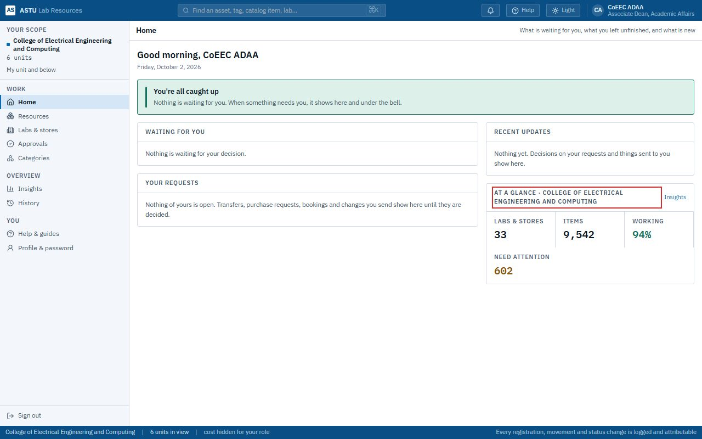
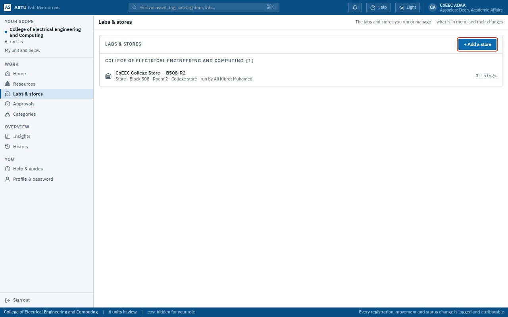

# ADAA (Associate Dean of Academic Affairs)

*You are your college's Associate Dean of Academic Affairs.* You see the whole college: every department's labs and what is in them. You **add the college's own stores** and **choose each one's store keeper**. Labs are added by each department's head. You also look after the college's categories with its departments.

Read [Getting started](00-getting-started.md) and [How LRMS thinks](01-concepts.md) first.

| Task | Section |
|---|---|
| See the college at a glance | [1. Your Home](#1-your-home) |
| Add the college's store, choose its keeper | [2. The college's stores](#2-the-colleges-stores) |
| Find anything in the college, or the university | [3. Resources, Insights and History](#3-resources-insights-and-history) |
| Kinds of resources | [4. Categories](#4-categories) |

---

## 1. Your Home

**Home** shows **At a glance** for your college: how many labs and stores, how many items, how many work, and how many need attention. Anything waiting for you appears above it. **Insights** opens the full picture.

## 2. The college's stores

**Labs & stores** lists the college's own stores: each one's keeper, block and room, how many items it holds, and how many need attention.

**Add a store.**

1. Click **+ Add a store**.
2. Give its **Name** (e.g. "CoEEC College Store — B508-R2") and details: its **Level** (**College store**), **Block** and **Room**.
3. Choose **Its store keeper**. The list offers everyone who works in the college or its departments. Someone marked **becomes a custodian** isn't one yet: choosing them makes them one, so they can hold what the store keeps. You don't need People & roles for this.
4. Save. The keeper is told ("You now keep …"), and records what the store holds. Changes in a store apply at once; they don't wait for a head.

**On the store's page:** **Edit name and details**; **Change its store keeper** (both people are told; everything the store keeps goes with it); **Remove**, for an empty one.

> **Good to know:** you don't add labs, and you don't manage a department's places. Each department's head adds that department's labs (and any department store) and chooses who runs them. The ASTU Main Store is Property Administration's.

## 3. Resources, Insights and History

- **Resources → Mine** shows everything in your college; **Whole university** everything else, read-only. Sort, filter and **Export** work as for everyone ([Lab custodian → Resources](02-custodian.md#3-resources)).
- **Insights** charts the condition of everything in the college: what works, what doesn't, where the problems are.
- **History** lists every applied change in the college: who, what, when and why.

## 4. Categories

You can add and adjust categories for the college, as heads and custodians do for their departments. See [Department head → Categories](03-department-head.md#8-categories) for how adding, changing and approving work.
