# Staff / lecturer

*You teach or work in a department. You look resources up, **book** a lab or a machine for your classes and research, and **raise a need** when something is missing.* You don't change resource records: the lab's custodian does.

Read [Getting started](00-getting-started.md) and [How LRMS thinks](01-concepts.md) first.

| Task | Section |
|---|---|
| Look up what your department has | [1. Look things up](#1-look-things-up) |
| Book a lab | [2. Book a lab](#2-book-a-lab) |
| Book one or more machines | [3. Book specific machines](#3-book-specific-machines) |
| See, change or cancel your bookings | [4. Your bookings](#4-your-bookings) |
| Ask for something to be bought | [5. Raise a need](#5-raise-a-need) |
| Follow a purchase | [6. Follow a purchase request](#6-follow-a-purchase-request) |

---

## 1. Look things up

**Dashboard** shows your department's resources and their condition. **Register** lists them, and you can search, filter and group them exactly as described in [the custodian chapter's Finding things](02-custodian.md#3-finding-things).

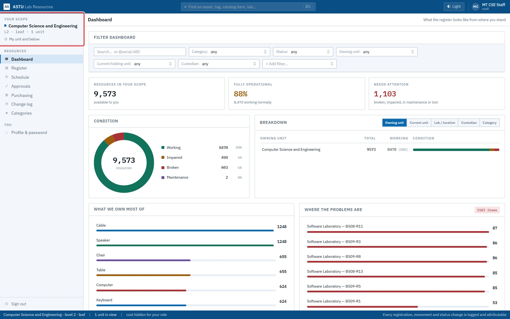

For you the register is **read-only**: there is no **Add resources**, no **Change this…**, no bulk bar.

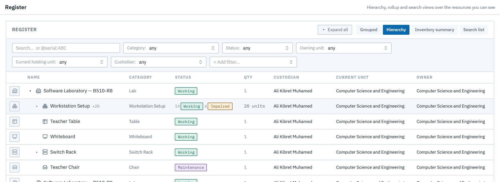

An item's details show where it is, its condition, its parts and its history. If something is broken, tell the lab's custodian, whose name is on the item.

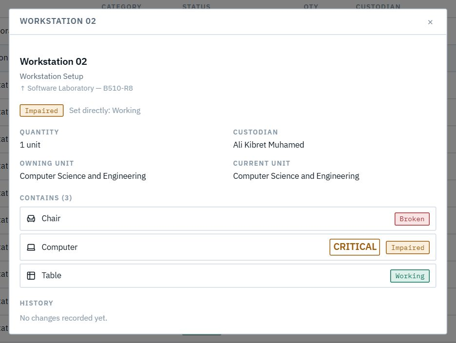

## 2. Book a lab

1. Open **Schedule → Book** and type part of the lab's name. Pick it from the list. Each entry shows its department and custodian.

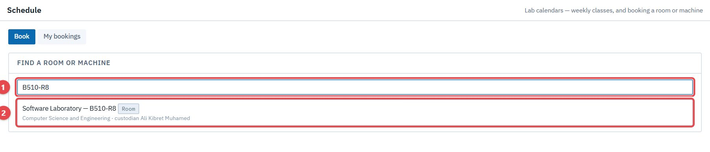

2. The lab's calendar appears, showing classes, staff bookings, external bookings and requests not settled yet. Below it is **Your booking**:
   - **What**: **The whole room** (1), or specific machines (section 3);
   - **Date**, **From** and **To** (2); the calendar moves to the week you pick;
   - **For**: what it's for, e.g. *CSE3201 networking lab session*;
   - **People**, and **On behalf of students** if you're booking for your advisees.
3. Before you send it, the form checks the calendar and tells you **who decides** (3). The lab's custodian approves staff bookings; a custodian booking their own lab is confirmed at once.
4. Click **Request booking** (4).

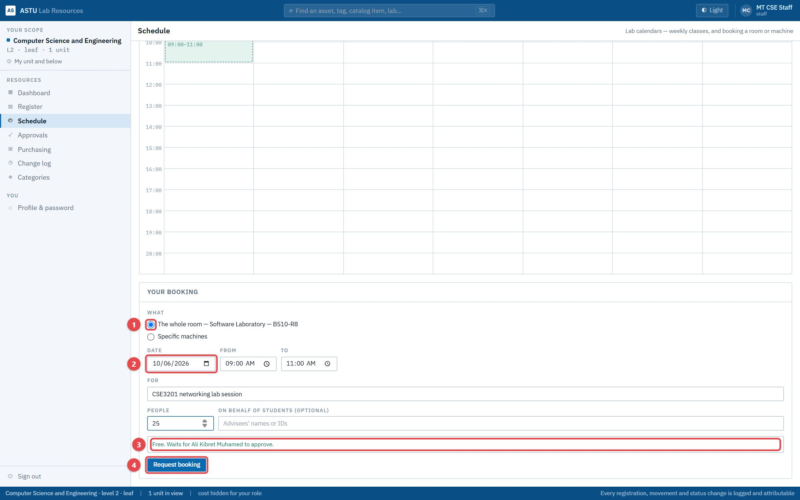

If the time is **already taken** by a confirmed booking or a class, the form says so before you ask, and you can pick another time:

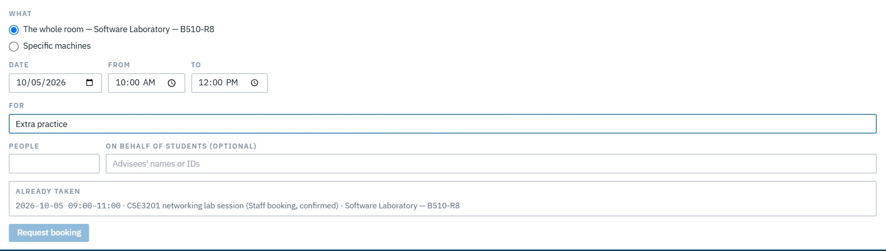

> **Good to know**
> - Asking for the same time as someone else's *unconfirmed* request is allowed: the form lists it under "others have also asked for this time", and the custodian decides between you.
> - Back-to-back is fine: 09:00–11:00 and 11:00–12:00 don't clash.
> - Refused, with a clear message: a time in the past, a booking longer than 16 hours, or one more than a year ahead.
> - An outside institution's **hold** on a lab blocks it just like a booking.

## 3. Book specific machines

Choose **Specific machines** instead of the whole room and tick the machines you need. Each is named by where it sits (*Workstation 01 › Computer*). Several people can book different machines in the same lab at the same time. A whole-room booking at that time is then refused, because it would claim the machines too.

> **Good to know**
> - Only **working** machines are offered, so a broken computer can't be booked.
> - Book one room at a time: machines in two different labs need two bookings.

## 4. Your bookings

**Schedule → My bookings** lists everything you've booked and its state: **Awaiting custodian**, **Confirmed**, **Declined**, **Cancelled**.

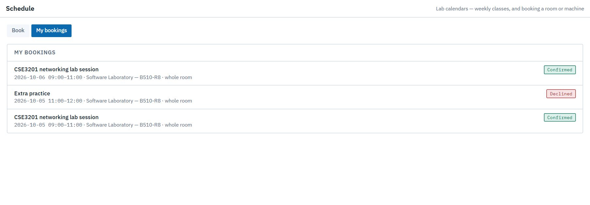

Click one for details. A declined booking shows the custodian's note. **Cancel booking** releases the slot so someone else can book it.

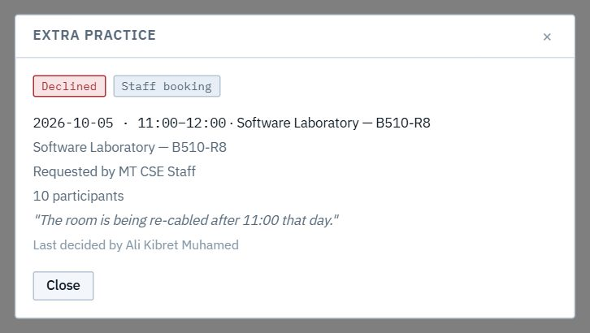

## 5. Raise a need

When something is missing (a projector, a digital balance), raise a **need**. It goes to your department head, who either carries it into a purchase request or declines it with a reason.

1. Open **Purchasing**. In **Raise a need**, enter **What**, **Qty** and **Unit**, the **Category** if you know it, and **Why**.
2. Click **Raise this need**.

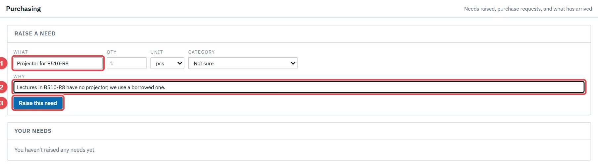

**Your needs** shows what happened to each one:
- **Open**: waiting for the head;
- **Carried**: in a purchase request, with its reference;
- **Declined**: with the head's reason.

If a request is withdrawn, its needs come back ("Returned from PR-…") and can be carried again.

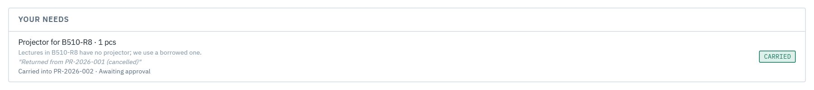

## 6. Follow a purchase request

**Purchase request status** lists every request involving your department. For each one it shows:
- its chain (head → dean → AVP → College Managing Director → Procurement Office), with the current step highlighted;
- its history;
- its lines;
- **Waiting on …**, the person it's with now.

Your role doesn't see costs.

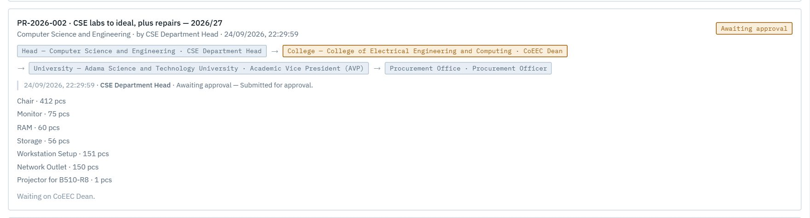

After approval, procurement moves it through **Order placed on EGP → Buyer found → On delivery → Arrived at the main store**. The store keeper then hands the items over to the labs.
