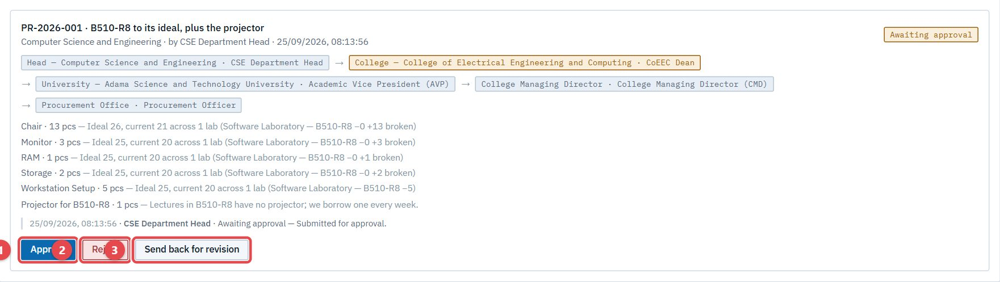
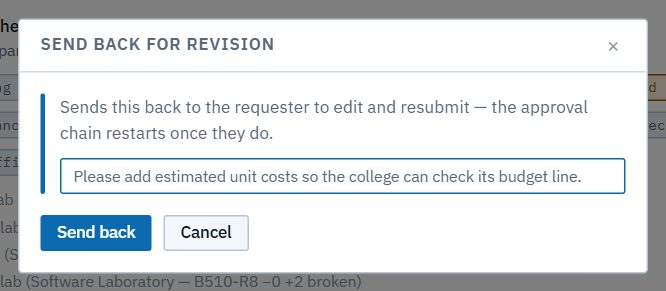
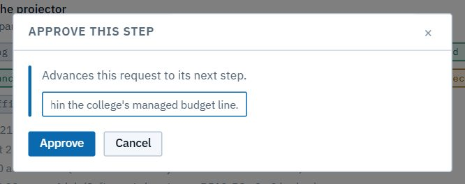
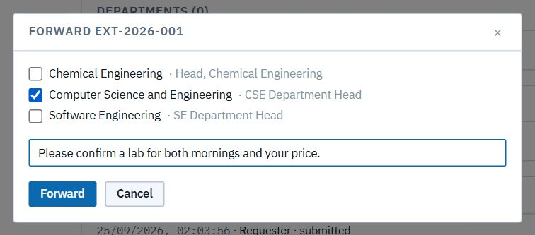
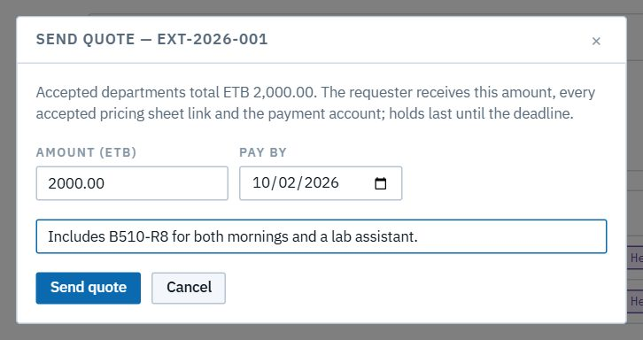

# Dean, AVP and CMD (approvers)

*You are a college dean, the Academic Vice President (AVP), or the College Managing Director (CMD).* Purchase requests pass through your step in their approval chain: a dean's for their college's departments, and the AVP's and CMD's for every department. The **AVP** also receives every request from **outside institutions** that want to hold a workshop or training at ASTU, and turns it into a quote.

Read [Getting started](00-getting-started.md) and [How LRMS thinks](01-concepts.md) first. Like everyone, you can browse the **Dashboard**, **Register** and **University resources** for your scope. The dean sees their college, the AVP the whole university. The CMD's office sits beside the AVP's and Procurement's on the org chart, so their work happens in **Approvals**.

| Task | Section |
|---|---|
| Approve, reject or send back a purchase request | [1. Purchase requests](#1-purchase-requests) |
| *(AVP)* Handle an outside institution's request | [2. External requests (AVP)](#2-external-requests-avp) |

---

## 1. Purchase requests

A department head compiles a request, and it climbs the chain: **head → dean → AVP → College Managing Director → Procurement Office**. When it reaches your step, you get an email ("PR-2026-… is waiting for your approval"), and it appears in **Approvals → Purchasing** under **Routed to me**. The CMD is the last approval before the order goes to Procurement.

The card shows:
- the reference and title, the department and who raised it;
- the **chain**, with your step highlighted;
- every **line**, with its quantity and justification. Long justifications open with **more**; ones compiled from many labs name the labs contributing most;
- the history so far.

You have three answers:

| Button | What happens |
|---|---|
| **Approve** (1) | Your step is done; the request moves to the next approver. Add a note if you like. |
| **Reject** (2) | The request stops, with your reason. Any needs carried into it reopen for the department. |
| **Send back for revision** (3) | The request goes back to the head with your note. They edit and resubmit, and the chain starts again at the dean's step. The history keeps your note. |

Sending back, with a note:

Approving, with a note that stays in the request's history:

> **Good to know**
> - Only the person holding the step decides it. If a post is vacant, the chain shows *(vacant)* until the administrator assigns someone.
> - After the last approval, the request goes to the Procurement Office as **Order placed on EGP**. From then on, only procurement can cancel it, with a note.

## 2. External requests (AVP)

Outside institutions ask through the public portal ([Public portal chapter](11-external-portal.md)). Each request lands in **External requests**, with the institution, contact, dates, purpose, what they need and their **official letter** (1).

### Forward it to the departments

1. Click **Forward…** (2), tick the departments that could host it, and add a note to their heads.

2. Each department's head **accepts** (with a price and a pricing-sheet link) or **declines**. Meanwhile their lab custodians **hold** slots on the lab calendars, so the dates are protected.
3. Or click **Decline…** (3) to refuse the whole request, with a reason. The requester sees it on their tracking page.

### Send the quote

When the departments have answered, **Send quote…** adds up their prices. Adjust the **Amount (ETB)** if needed, set **Pay by**, and add a note to the requester.

The requester gets an email with a new tracking link (the old one stops working) and pays through their tracking page. Payments are verified with the bank or telebirr directly. Once the request is paid in full, it becomes **Confirmed**: the held slots turn into bookings, and the requester, custodians and heads are told.

> **Good to know**
> - If no department accepted, there is nothing to quote. Decline the request with a reason instead.
> - A hold lapses on its own unless the request is quoted and paid by the deadline.
> - If the payment check can't reach the bank, the requester can ask for **manual review**. The AVP then confirms the payment by hand.
