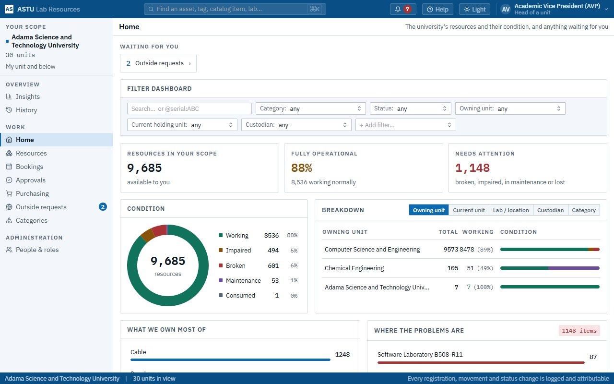
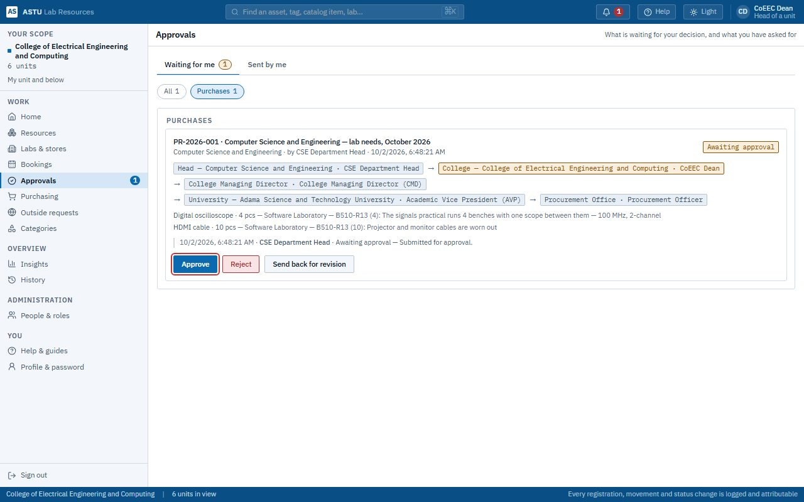
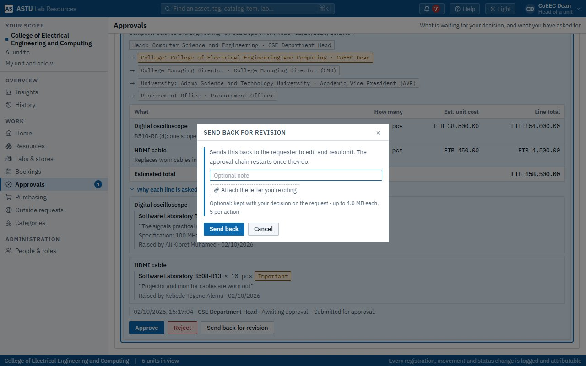
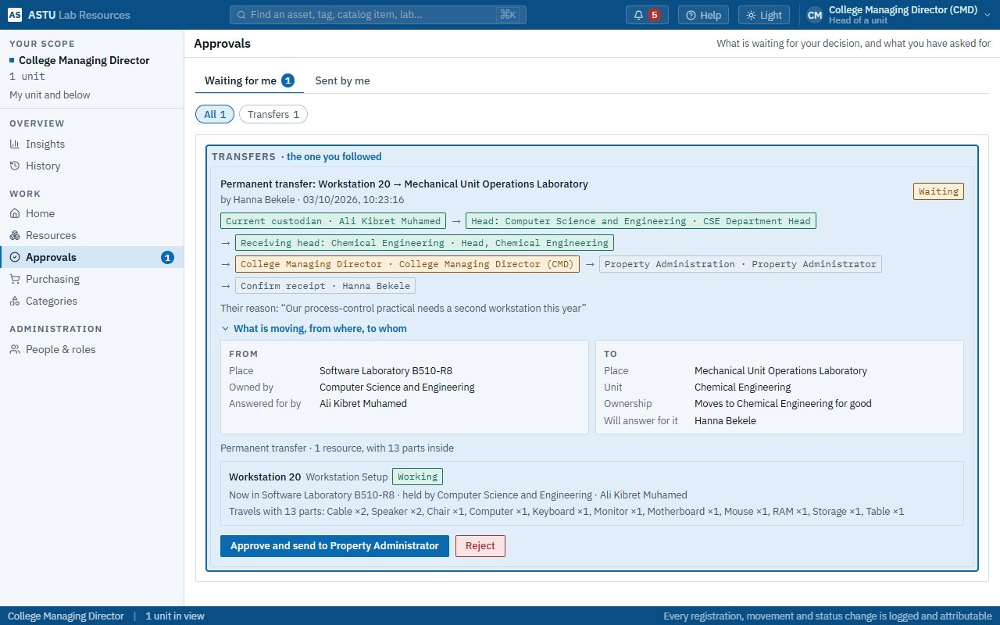
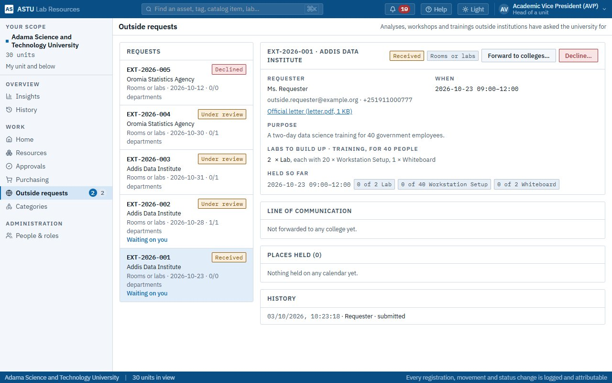
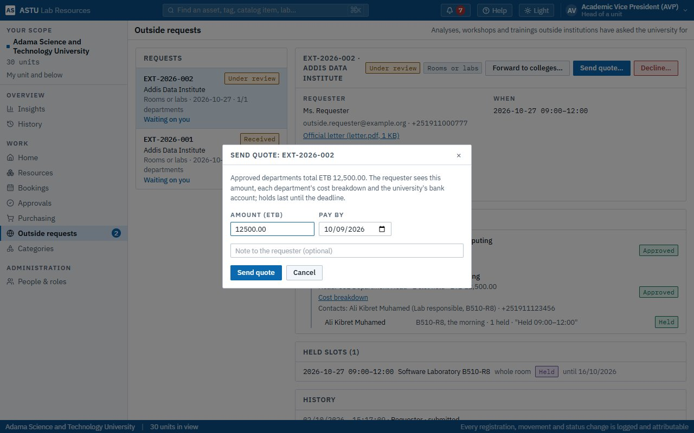

# Dean, AVP and CMD (approvers)

*You are a college dean, the Academic Vice President (AVP), or the College Managing Director (CMD).* Purchase requests pass through your step in their approval chain: a dean's for their college's departments, the CMD's and the AVP's for every department. The **CMD** also approves every **permanent transfer** of a resource from one unit to another. Requests from **outside institutions** come down the same line: the AVP sends them to colleges, each dean to departments, and the answers come back up the same way.

Read [Getting started](00-getting-started.md) and [How LRMS thinks](01-concepts.md) first. Like everyone, you can browse **Resources** (switch it to **Whole university** to look beyond your own units) and **Insights**. The dean sees their college, the AVP the whole university. The CMD's office sits beside the AVP's and Procurement's on the org chart, so their work happens in **Approvals**.

| Task | Section |
|---|---|
| Approve, reject or send back a purchase request | [1. Purchase requests](#1-purchase-requests) |
| *(CMD)* Approve a permanent transfer | [2. Permanent transfers (CMD)](#2-permanent-transfers-cmd) |
| Handle an outside institution's request | [3. Outside requests](#3-outside-requests) |

---

## The AVP's Home

The AVP's **Home** is **Insights** for the whole university: the filters, the condition of every resource, where the problems are, and the register below. Click any figure or bar to narrow everything to it; each filter shows as a chip with ×, and **Clear all** brings everything back.

Anything waiting for you sits above it as small cards (*2 Outside requests*, *1 Purchase request to approve*). Each opens the exact list. When nothing waits, there are no cards.

> Deans, the AVP and the CMD approve; they don't run labs, book rooms or manage people. Those belong to department heads, the ADAA and Property Administration.

## 1. Purchase requests

A department head compiles a request, and it climbs the chain: **head → dean → College Managing Director → AVP → Procurement Office**. When it reaches your step, you get an email ("PR-2026-… is waiting for your approval"), and it appears in **Approvals → Waiting for me**. The CMD decides after the dean and before the AVP; the AVP's approval is the last before the order goes to Procurement.

The card shows:
- the reference and title, the department and who raised it;
- the **chain**, with your step highlighted;
- every **line** in a table: what, how many, the estimated unit cost and the line total, with the head's justification under it, and the request's **estimated total**;
- **Why each line is asked for: the lab needs behind it** (open when it's your turn): for each line, the labs that asked for it, how many each needs, how urgent (**Essential**, **Important**, **Nice to have**), what it replaces, the specification, their reason, and who raised it. A line the head added without a lab need says so;
- **Documents**: the minutes, letters of authority or quotations the head attached, and any letter an earlier approver cited. Click one to open it;
- the history so far.

You have three answers:

| Button | What happens |
|---|---|
| **Approve and send to …** (1) | The button names the next approver ("Approve and send to the AVP"). Your step is done and the request moves on to them. Add a note if you like. |
| **Return to … to revise** (3) | The button names the head who raised it. The request goes back to them with your note. They edit and resubmit, and the chain starts again at the dean's step. The history keeps your note. |
| **Reject** (2) | The request stops, with your reason. Any needs carried into it reopen for the department. |

Each dialog says in one sentence what happens next, so you never have to guess what "approve" means at your step.

Sending back, with a note:

Each answer's dialog also has **Attach** (minutes or a letter). Use it to send the document you're relying on with your decision: approving minutes, say, or when rejecting, the letter or circular that sets the constraint the request doesn't meet. It stays on the request's **Documents** with your name and decision, and the head's email lists it. Files follow the same rules as the head's ([Attaching documents](03-department-head.md#5-build-a-purchase-request)): PDF, photo or scan, or .xlsx, up to 4 MB each and 5 at a time.

> **Good to know**
> - Only the person holding the step decides it, and only in turn: the AVP can't approve before the CMD has. If a post is vacant, the chain shows *(vacant)* until the administrator assigns someone.
> - A department under two colleges needs both deans.
> - After the last approval, the request is **With procurement**, which starts the purchase (a procurement, often covering several requests) and moves it along: **Order placed on EGP → Supplier found → On delivery → Arrived at the main store → In the store**. From then on, only procurement can cancel it, with a note.

## 2. Permanent transfers (CMD)

A custodian who asks for another unit's resource chooses **Loan** (it stays the other unit's) or **Permanent transfer** (it becomes their unit's, in their custody). A permanent transfer always comes to you after both department heads; when it leaves its college, **Property Administration** approves after you. It appears in **Approvals**, titled *Permanent transfer: …*, with the whole chain on the card and the requester's reason.

Under **What is moving, from where, to whom** (open when it's your turn) you see exactly what you're agreeing to:

- **From**: the place it is in now, the unit that owns it, and who answers for it today;
- **To**: the place it's going, the receiving unit, whether **ownership moves** for good, and who will answer for it;
- each **resource**: its name, kind and status, its recorded details (serial number, model…), and what travels inside it (*Travels with 13 parts: Computer ×1, Monitor ×1, …*). Anything edited in the register since it was asked for is marked **Changed since it was asked for**: look again before you approve.

**Approve** moves it on; **Reject** ends it with your reason. Loans never come to you.

## 3. Outside requests

Outside institutions sign up on the portal and ask for **rooms or labs** (a workshop, a training) or a **sample analysis** on one of the university's machines ([Public portal chapter](11-external-portal.md)). Each request travels the university's line of communication and back. **Outside requests** shows the request (the institution, contact, dates, purpose, what they need, the samples, the **official letter**) and, under **Line of communication**, every college and department on it with its status and what it has answered.

### The AVP: send it to the colleges

1. Click **Forward to colleges…**, tick the colleges that could host it, and add a note to their deans.
2. Or click **Decline…** to refuse the whole request, with a reason. The requester sees it on their page.

### The dean: send it to the departments

The request reaches you by email. On the college's line, click **Forward to departments…** and tick your departments that could host it, or **Decline…** the college's part, with a reason (its departments' parts end too, and anything they held is released).

Each department's head then books places, their custodians hold them, and the head answers you with the **cost breakdown** (a sheet link and an amount) and the **contact persons** (the custodians holding the places) the requester calls once they have paid. **Held so far** shows how far the held places cover the labs the requester asked for. For each department's answer:

- **Approve…**: it goes into the college's answer;
- **Send back…**: it goes back to the head with your note, to answer again.

When every department has been decided (at least one approved), click **Send to the AVP…** on the college's line.

### The AVP: approve each college, quote

A college's answer reaches you by email. **Approve…** it, or **Send back…** to the dean with a note. When every college is decided, **Send quote…** starts from the approved departments' total. Adjust the **Amount (ETB)** if needed, set **Pay by**, and add a note.

The requester is emailed and sees, signed in: the total, each department's part with its breakdown, the university's **bank account**, and what is held for them and when.

### The AVP: confirm the payment

The requester enters their payment reference; it is checked with the bank or telebirr. When the whole amount is in, the request is **Paid: awaiting confirmation** and you are emailed. Check the receipts under **Payments** (open **Bank receipt** where the check returned one), then click **Confirm payment**. That:

- turns every held slot into a booking;
- shows the requester the departments' **contact persons**. From then on, arrival, samples and everything on the day are arranged with them directly;
- emails the requester, the custodians and the heads.

> **Good to know**
> - If no department can host it, decline the request with a reason instead of quoting. Say what would work ("any week after the exams"): the requester can **edit it and send it again**, and it comes back to you as a new request that says which one it replaces and why that one was closed.
> - A request built from an offer says so under **Labs to build up**: "Training, for 40 people".
> - A hold lapses on its own unless the request is quoted and paid by the deadline. The AVP, a dean or a head on the request can extend holds up to that deadline.
> - If the payment check can't reach the bank, the requester can ask for **manual review**; you accept or reject it under **Payments**, then confirm the payment as usual.
> - If a held slot was lost while a payment waited, **Confirm payment** says so and keeps the request paid; have a custodian hold a replacement, then confirm again.
