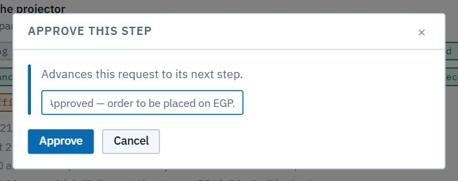
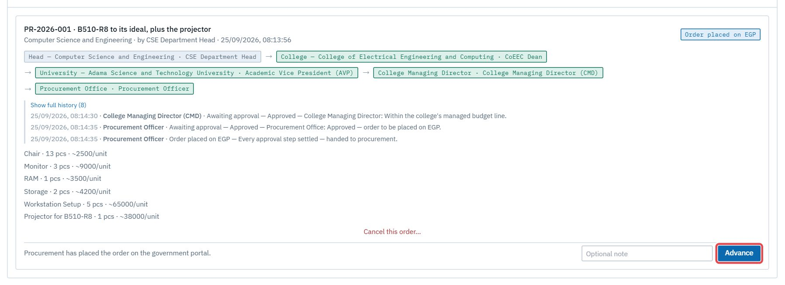
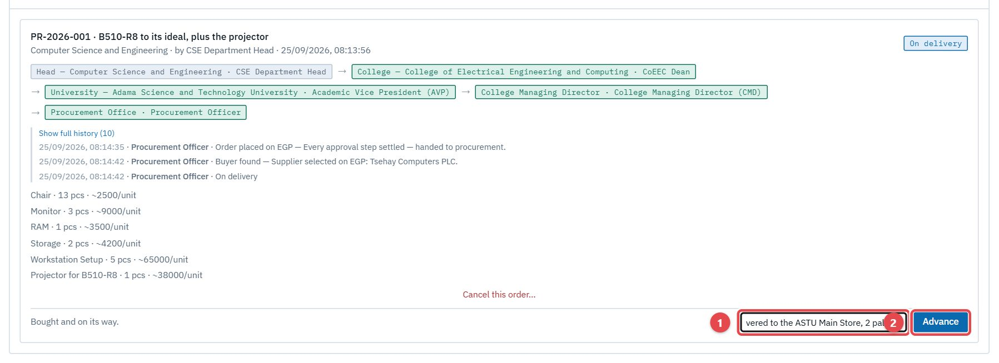

# Procurement officer

*You run the Procurement Office.* Every purchase request ends its approval chain with you. After your approval you own the order: you place it, find the supplier, and follow it until it reaches the Main Store.

Read [Getting started](00-getting-started.md) first. Your **scope is university-wide**, so the **Dashboard**, **Register** and **University resources** cover every unit.

| Task | Section |
|---|---|
| Give the final approval | [1. Approve a request](#1-approve-a-request) |
| Move the order along | [2. Your pipeline](#2-your-pipeline) |
| Cancel an order | [3. Cancel an order](#3-cancel-an-order) |
| See the whole university | [4. University-wide view](#4-university-wide-view) |

---

## 1. Approve a request

A request reaches you after the head, the dean, the AVP and the College Managing Director. It appears in **Approvals → Purchasing**, the same card the other approvers see ([Dean, AVP and CMD](06-dean-avp.md#1-purchase-requests)). **Approve** (with a note), **Reject** or **Send back for revision**.

Your approval completes the chain. The request moves to **Order placed on EGP** and appears in your **Pipeline**.

## 2. Your pipeline

**Purchasing → Pipeline** lists every approved order that hasn't reached the store yet.

Each card shows the current stage and what it means ("Procurement has placed the order on the government portal"). To move it to the next stage, add an optional note and click **Advance**:

| Stage | Meaning |
|---|---|
| **Order placed on EGP** | The order is on the government e-procurement portal |
| **Buyer found** | A supplier has been selected |
| **On delivery** | It's on its way |
| **Arrived at the main store** | It's physically at the ASTU Main Store; the store keeper takes over |

Every stage is timestamped in the request's history with your note: "Supplier selected on EGP: …", "Dispatched from Addis; expected in 5 days." The department and its staff follow along on their **Purchase request status**. They see stages, not costs.

## 3. Cancel an order

Once an order has been placed, only procurement can cancel it. Use **Cancel this order…** on the pipeline card, and give a note: it's required, because the department needs to know why. Any needs carried into the request reopen for the department.

## 4. University-wide view

Your dashboard covers every department, office and store: useful for seeing what's broken across campus before a purchasing round.

