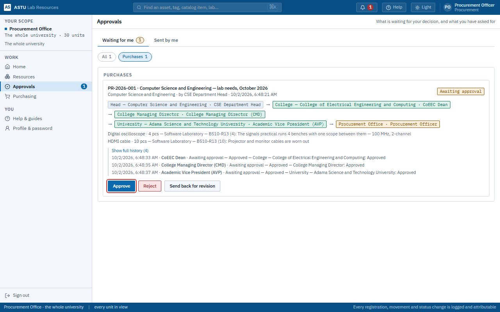
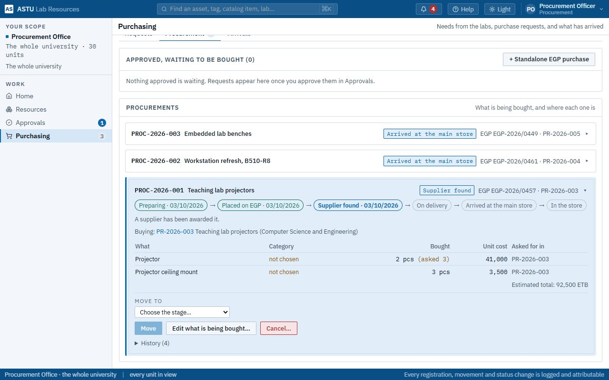
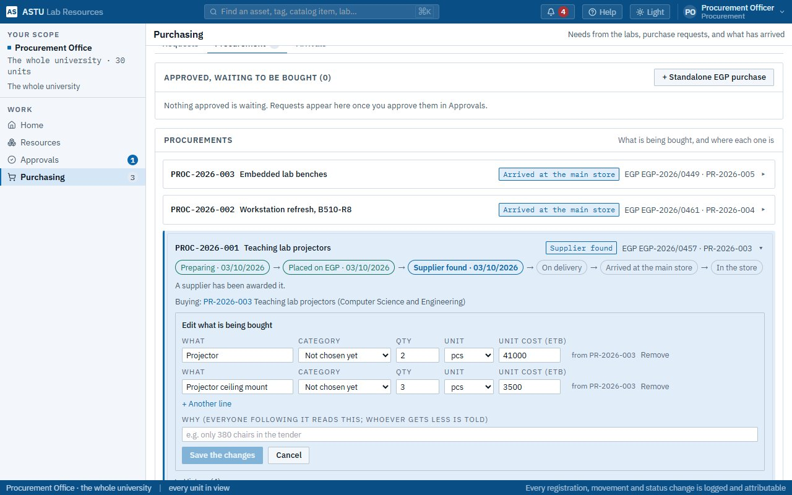

# Procurement officer

*You run the Procurement Office.* Every purchase request ends its approval chain with you, and your approval **starts the purchase**. From there you run a **procurement**: one EGP purchase that covers one or several approved requests (or none, for a purchase made outside LRMS). You decide what exactly is bought, move it along, and record what arrived at the Main Store.

Read [Getting started](00-getting-started.md) first. Your **scope is university-wide**, so **Resources** covers every unit.

| Task | Section |
|---|---|
| Start the purchase of an approved request | [1. Start the purchase](#1-start-the-purchase) |
| Move a procurement along, and record what arrived | [2. Your pipeline](#2-your-pipeline) |
| Change what is bought | [3. Edit what is being bought](#3-edit-what-is-being-bought) |
| Buy something that never went through LRMS | [4. A standalone EGP purchase](#4-a-standalone-egp-purchase) |
| Cancel | [5. Cancel a procurement](#5-cancel-a-procurement) |
| See the whole university | [6. University-wide view](#6-university-wide-view) |

---

## 1. Start the purchase

A request reaches you after the head, the dean, the College Managing Director and the AVP. It appears in **Approvals**, the same card the other approvers see ([Dean, AVP and CMD](06-dean-avp.md#1-purchase-requests)). Your three answers are **Approve: start the purchase**, **Return to … to revise** and **Reject**.

Approving asks **Buy it through**: **A new procurement**, or a procurement you are still preparing (so one EGP purchase covers several requests). The head who asked is told that procurement has started buying it.

You can also start from **Purchasing → Procurement → Approved, waiting to be bought**: tick the requests one EGP purchase will cover and click **Start buying**, or choose a procurement still being prepared and **Add** them to it.

## 2. Your pipeline

**Purchasing → Procurement** lists every procurement, the live ones first. Open one to see its **timeline**: Preparing → Placed on EGP → Supplier found → On delivery → Arrived at the main store → In the store, with the date each stage was reached.

To move it, choose the stage under **Move to** (the next one, or any later one: you can go straight from Placed on EGP to On delivery), give the **EGP number** (required from Placed on EGP on) and the supplier, add a note if you like, and click **Move**. Everyone whose request it covers is told at each stage, and their requests follow it.

**Arrived at the main store** asks **how many of each came**. Each count starts at what was bought; change the ones that came short. Property Administration is told, checks your counts and records the import; the store keeper loads it. When everything is loaded the procurement reaches **In the store** on its own, and so do the requests it covered.

## 3. Edit what is being bought

Until it arrives, **Edit what is being bought…** lets you change any line (quantity, unit cost, category), drop a line, or add one, and asks **why**. The history records each change in words (*Chair: 40 → 32*), and the head whose request gets less is told. A line shows what was asked for beside what is bought (*32 pcs (asked 40)*).

## 4. A standalone EGP purchase

**+ Standalone EGP purchase** is for goods bought through EGP that never had an LRMS request. Give the **EGP number**, a title and supplier if you like, and list what is bought. It then runs like any other procurement.

## 5. Cancel a procurement

Before it arrives, **Cancel…** stops it, with a required reason. The requests it covered go back to **Approved, waiting to be bought**, and their heads are told. A request that no procurement is buying can still be cancelled on its own card (with a note); one that a procurement is buying is cancelled or reduced on the procurement.

## 6. University-wide view

**Resources → Whole university**, filtered by **Status**, shows what is broken across campus before a purchasing round; **Export** saves it as a spreadsheet.
