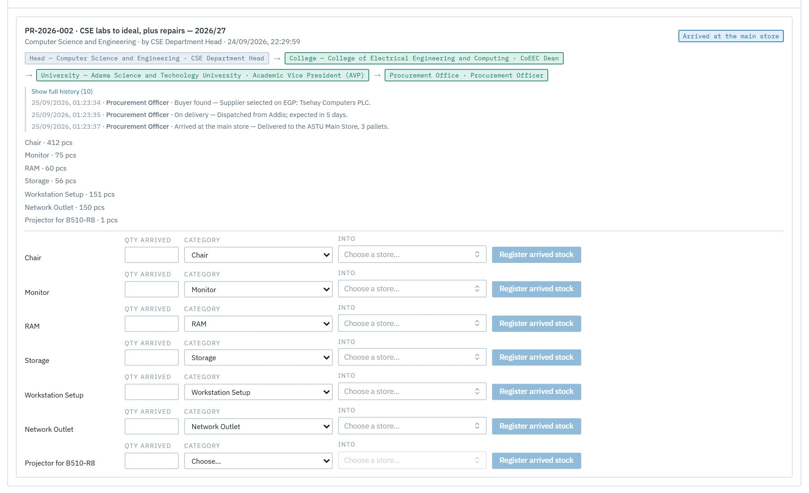
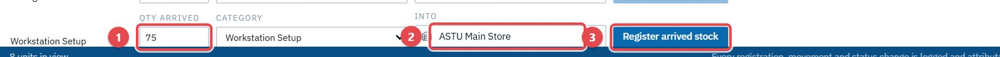
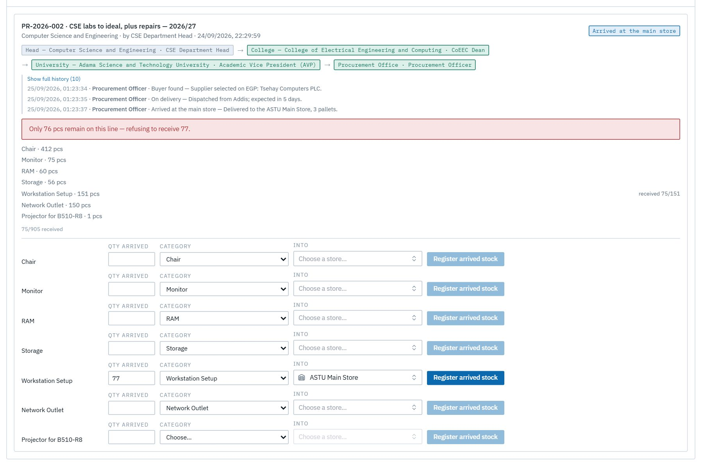
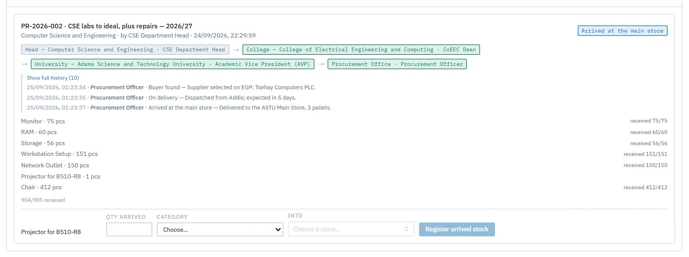
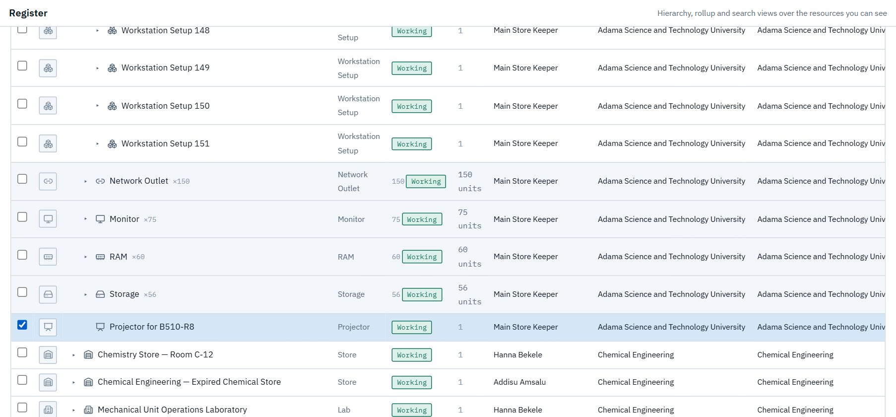
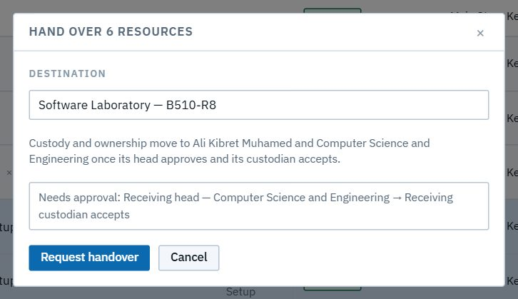
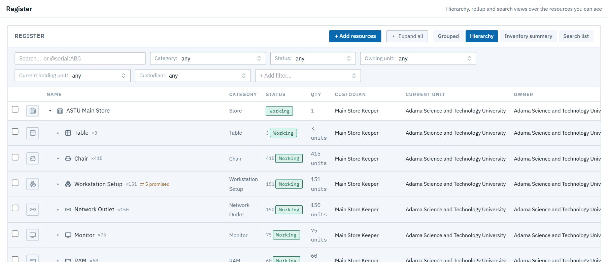
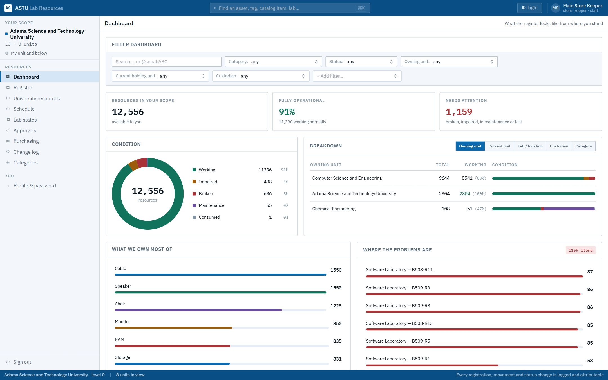

# Store keeper

*You run the ASTU Main Store.* When an order arrives, you **receive** it into the store's register, so every unit exists as a record in your custody. Then you **hand it over** to the labs it was bought for.

Read [Getting started](00-getting-started.md) first. You see the register university-wide, and you are custodian of everything in the Main Store.

| Task | Section |
|---|---|
| Register a delivery | [1. Receive arrived stock](#1-receive-arrived-stock) |
| Send stock to a lab | [2. Hand over to a lab](#2-hand-over-to-a-lab) |
| Keep an eye on the store | [3. Your dashboard](#3-your-dashboard) |

---

## 1. Receive arrived stock

When procurement marks an order **Arrived at the main store**, it appears under **Purchasing → Receive**, with one row per line of the request.

For each line:

1. Enter **Qty arrived** (1). You can receive part of a line now and the rest later.
2. Check the **Category**, which is filled in from the order.
3. Choose **Into** (2): the ASTU Main Store, or a shelf or cabinet inside it.
4. Click **Register arrived stock** (3).

Each unit becomes its own resource in the store, numbered after what's already there (*Workstation Setup 01 … 151*). A template category brings its parts too: every Workstation Setup arrives with its computer, monitor, keyboard, table and chair.

You can't receive **more than was ordered**. Here 75 were already in, and 77 more was refused ("Only 76 pcs remain on this line"):

The card counts what's in (*904/905 received*) and keeps each receipt in its history. Once every line is fully received, the request closes (**Registered and closed**).

> **Good to know:** if a line has no category (a need raised as "Not sure"), choose one before receiving. If no category fits, ask the system administrator to create it. For example, a projector needed a **Projector** category.

## 2. Hand over to a lab

1. In **Register**, open the **ASTU Main Store** and the group you need (e.g. **Workstation Setup ×151**).
2. Tick the items for one lab. Here that's five workstations and the projector. Then click **Hand over…**

3. Search for the **Destination** lab (or a place inside it, like its Switch Rack). The dialog says who will then hold the items and who must approve: **the receiving department's head**, then **the receiving custodian accepts**. If all the items are one kind and the lab numbers its own (*Workstation 01…*), **Name them there as** suggests the lab's naming.
4. Click **Request handover**.

Nothing moves until both have said yes. Meanwhile the items show **⇄** in the store (*⇄ 5 promised*), and they can't be promised to a second lab.

When the head approves and the custodian accepts, the items move into the lab, owned by that department and in the custodian's custody. The change log records every step.

## 3. Your dashboard

Your dashboard covers the store and everything else you can see. It's the quickest way to check what's waiting in the store.

