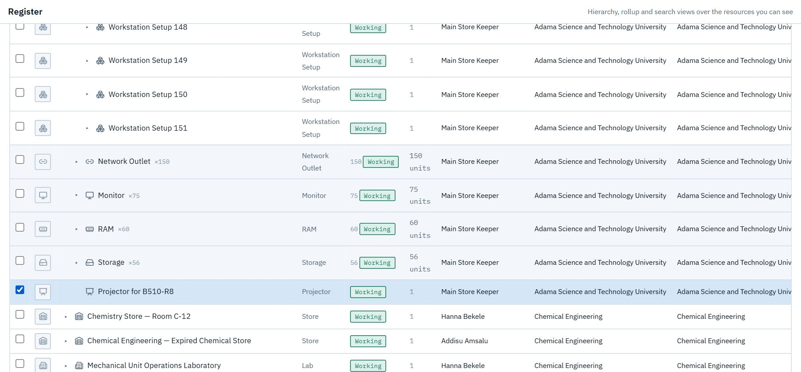
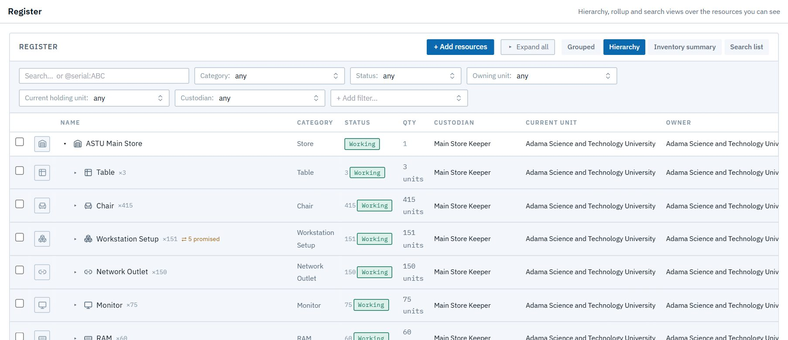
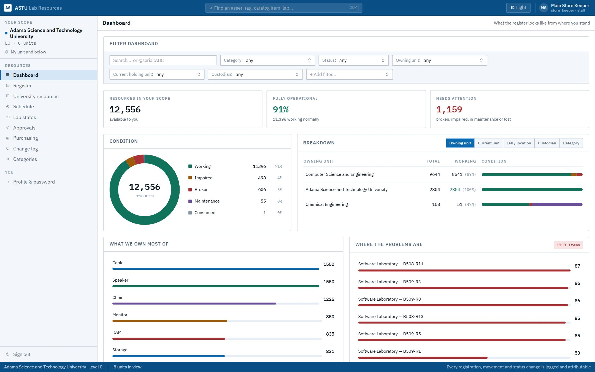

# Store keeper

*You run the ASTU Main Store.* When a purchase arrives, Property Administration records what came in as an **import record**; you **load** it into the store's register, so every unit exists as a record in your custody. Then you **hand it over** to the labs it was bought for, or **issue it** to a member of staff.

Read [Getting started](00-getting-started.md) first. You see the register university-wide, and you are custodian of everything in the Main Store.

| Task | Section |
|---|---|
| Load a delivery into the store | [1. Load an import record](#1-load-an-import-record) |
| Send stock to a lab | [2. Hand over to a lab](#2-hand-over-to-a-lab) |
| Issue something to a person | [3. Issue to a member of staff](#3-issue-to-a-member-of-staff) |
| Take something back into the store | [4. Returns to the store](#4-returns-to-the-store) |
| Keep an eye on the store | [5. Your dashboard](#5-your-dashboard) |

---

## 1. Load an import record

When Property Administration records a delivery, you get an email ("IMP-2026-… is ready to load into the store"), and it appears under **Purchasing → Import records** as **To load**. A record lists what actually arrived — from a purchase request, or from an EGP purchase that never went through LRMS — with the model or serial numbers where the delivery documents gave them.

For each line:

1. Enter the **Qty** you are loading now. You can load part of a line now and the rest later.
2. Choose **Into**: the ASTU Main Store, or a shelf or cabinet inside it.
3. Click **Load into store**.

Each unit becomes its own resource in the store, numbered after what's already there (*Workstation Setup 01 … 151*); its change-log entry names the import record and the model or serials. A template category brings its parts too: every Workstation Setup arrives with its computer, monitor, keyboard, table and chair.

You can't load **more than the record says arrived** ("Only 1 pcs of … are left to load"). Once every line is loaded, the record shows **Loaded**; when everything a purchase request ordered is in, the request closes (**Registered and closed**) and its department head is told.

> **Good to know:** only Property Administration records or corrects an import record. If what's on the shelf doesn't match the record, ask them — they can cancel a record nothing has been loaded from yet, and record it again.

## 2. Hand over to a lab

1. In **Register**, open the **ASTU Main Store** and the group you need (e.g. **Workstation Setup ×151**).
2. Tick the items for one lab. Then click **Hand over…** and keep **To a lab**.

3. Search for the **Destination** lab (or a place inside it, like its Switch Rack). The dialog shows who must approve: **the receiving department's head**, then **Property Administration**, then **the receiving custodian accepts**. If all the items are one kind and the lab numbers its own (*Workstation 01…*), **Name them there as** suggests the lab's naming.
4. Click **Request handover**. The receiving custodian is emailed that it's coming.

Nothing moves until all three have said yes. Meanwhile the items show **⇄** in the store (*⇄ 5 promised*), and they can't be promised to a second lab.

When the custodian accepts, the items move into the lab, owned by that department and in the custodian's custody. The change log records every step.

## 3. Issue to a member of staff

A laptop for a lecturer, a projector for an office: tick the items, click **Hand over…**, and choose **To a person**. Search the member of staff by name or email and click **Request handover**.

The items go to their department's **Staff holdings** — a place like a lab, created the first time something is issued to someone in that department, which the department head answers for. The chain is the same: **their head → Property Administration → the person accepts**. They are emailed when you ask, and again when it's their turn to accept. From then on they are its custodian; they can't edit its record (their head, or the store, can take it back).

## 4. Returns to the store

A custodian (or a head, for their Staff holdings) can send something back into the Main Store. It comes to you last, after their head and Property Administration: **accept** it in **Approvals → Transfers** once it's on your shelf. It then belongs to the university again, in your custody.

A lab can also ask for something that's in the store (from the Register's **Whole university** view). You are asked first — release it — then their head and Property Administration approve, and the requester confirms receipt. Stock from the store is always given, never lent.

## 5. Your dashboard

Your dashboard covers the store and everything else you can see. It's the quickest way to check what's waiting in the store.

