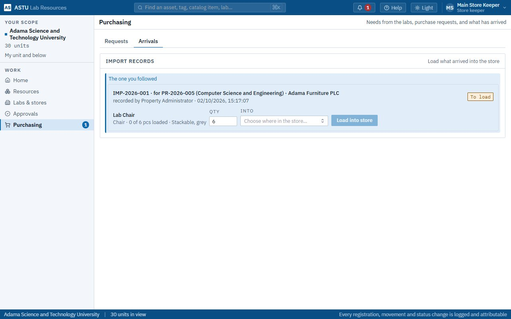
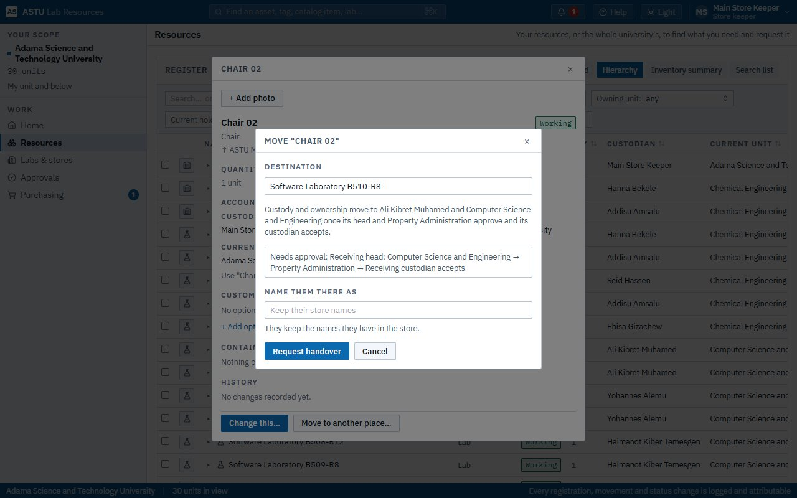

# Store keeper

*You run the ASTU Main Store.* When a purchase arrives, Property Administration records what came in as an **import record**; you **load** it into the store, so every unit exists as a record in your custody. Then you **move it** to the labs it was bought for.

Read [Getting started](00-getting-started.md) first. **Resources → Mine** shows the stores you keep and what is in them; **Whole university** shows everything. You are custodian of everything in the Main Store. Your changes to what the store holds (a status, a name, a detail) collect in the store's **Changes**, and **Property Administration** approves them, just as a head approves a lab's. Loading a delivery and moving stock out are their own approved steps and apply as they are approved.

| Task | Section |
|---|---|
| Load a delivery into the store | [1. Load an import record](#1-load-an-import-record) |
| Send stock to a lab | [2. Move stock to a lab](#2-move-stock-to-a-lab) |
| Take something back into the store, or release it to a lab | [3. Returns and requests](#3-returns-and-requests) |

---

## 1. Load an import record

When Property Administration records a delivery, you're told ("IMP-2026-… is ready to load into the store"), **Home** shows **Arrivals to load into the store**, and it appears under **Purchasing → Arrivals**; the notice's link opens Arrivals with that record marked. A record lists what actually arrived, from a purchase request or from an EGP purchase that never went through LRMS, with the model or serial numbers where the delivery documents gave them.

For each line:

1. Enter the **Qty** you are loading now. You can load part of a line now and the rest later.
2. Choose **Into**: the ASTU Main Store, or a shelf or cabinet inside it.
3. Click **Load into store**.

Each unit becomes its own resource in the store, numbered after what's already there (*Workstation Setup 01 … 151*). A category that *comes with* parts brings them too: every Workstation Setup arrives with its computer, monitor, keyboard, table and chair. Loading is never refused for a detail the category requires; it can be filled in afterwards.

You can't load **more than the record says arrived** ("Only 1 pcs of … are left to load"). Once every line is loaded, the record shows **Loaded**; when everything a purchase request ordered is in, the request closes (**Registered and closed**) and its department head is told.

> **Good to know:** only Property Administration records or corrects an import record. If what's on the shelf doesn't match, ask them: they can cancel a record nothing has been loaded from yet, and record it again.

## 2. Move stock to a lab

1. In **Resources**, open the **ASTU Main Store** and the group you need (e.g. **Workstation Setup ×151**).
2. Tick the items for one lab, then click **Move to another place…**
3. Search for the **Destination** lab (or a place inside it, like its Switch Rack). The dialog shows who must agree: **the receiving department's head**, then **Property Administration**, then **the receiving custodian accepts**. If the items are all one kind and the lab numbers its own (*Workstation 01…*), **Name them there as** suggests the lab's naming.
4. Confirm. The receiving custodian is told it's coming.

Nothing moves until all three have said yes. Meanwhile the items show **⇄** in the store (*⇄ 5 promised*), so they can't be promised to a second lab. When the custodian accepts, the items move into the lab, owned by that department and in the custodian's custody.

## 3. Returns and requests

- **A return.** A custodian can send something back to the Main Store. It comes to you last, after their head and Property Administration: **accept** it in **Approvals** once it's on your shelf. It then belongs to the university again, in your custody.
- **A request from a lab.** A custodian can ask for something in the store (from **Resources → Whole university**). You are asked first, to **release** it; then their head and Property Administration approve, and the custodian confirms receipt. Stock from the store is always given, never lent.
