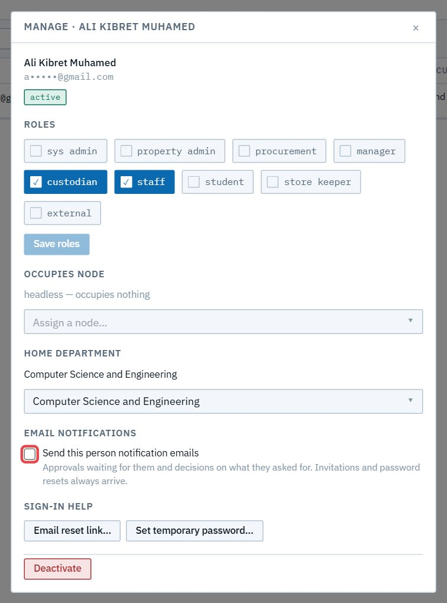
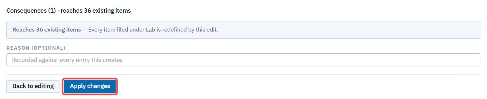
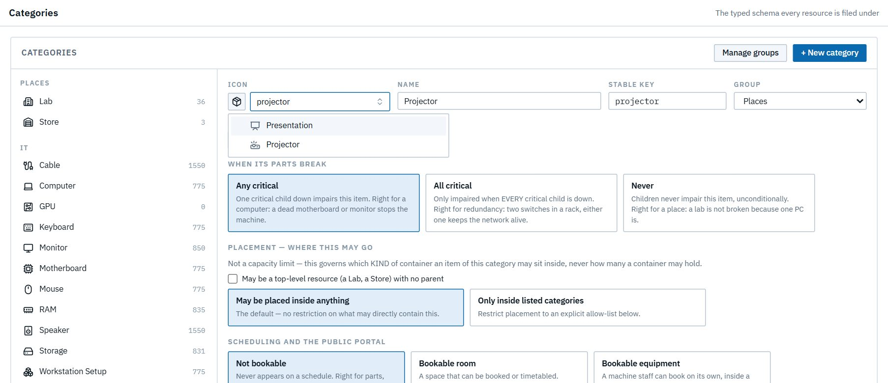
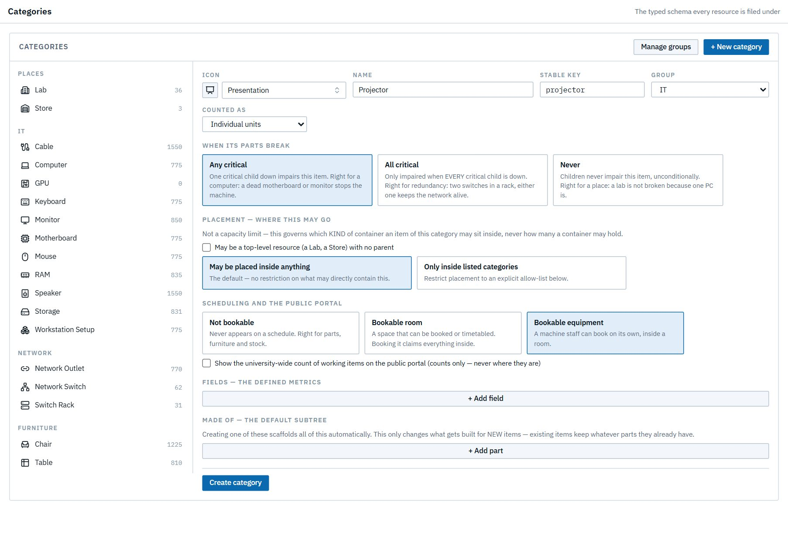

# System administrator

*You set LRMS up and keep it running: the org chart, the people and their roles, the categories resources are filed under, and who sees what.* You can also correct any record directly. Your edits apply straight away, even in departments that use drafts.

Read [Getting started](00-getting-started.md) and [How LRMS thinks](01-concepts.md) first.

| Task | Section |
|---|---|
| Where to start | [1. Overview](#1-overview) |
| Build the org chart | [2. Org structure](#2-org-structure) |
| Invite people, set roles, help them sign in | [3. People & roles](#3-people--roles) |
| Define kinds of resources | [4. Categories](#4-categories) |
| Decide who sees what | [5. Access views](#5-access-views) |
| Fix a record, audit a change | [6. Corrections and the change log](#6-corrections-and-the-change-log) |

---

## 1. Overview

**Administration → Overview** counts the org nodes, the vacant ones (no head assigned), the people, and those who haven't finished registering. **Get started** lists the four setup steps in the order they depend on each other.

## 2. Org structure

**Org structure** draws the reporting hierarchy: university → colleges → departments, and offices such as Procurement, the College Managing Director or ICT Maintenance. Use **Graph** for the map, or **Cards** (easier on a phone).

> **Two offices the purchase chain looks for.** Purchase requests are routed to the **Procurement Office** (code `PROC`) and, just before it, the **College Managing Director** (code `CMD`). Keep those codes when you rename either office. If the CMD office is **vacant**, requests wait at its step, shown as *(vacant)*, until you assign someone. If it's **deactivated**, new requests skip it and go from the AVP straight to Procurement. Requests already in the chain keep the steps they started with.

**Create a node.** Click **+ New node** and enter:
- **Name**;
- **Level**: 0 is the university, 1 a college or office, 2 a department;
- **Kind**: University, College, Department or Office;
- an optional **Code**;
- its **Parent(s)** on the level above. A department can belong to two colleges.

Then click **Create node**.

**Inspect a node.** Click it on the map. The panel lets you:
- rename it, change its kind or code;
- assign or change its **head** from existing people, or **invite someone new and assign them here** in one step;
- redraw its parents;
- turn **drafts** on or off: *"Custodians here draft changes for head approval before they go visible"*;
- **Deactivate** or **Delete** it.

> **Good to know:** changes with real consequences (a new or removed head, a change of kind, deactivating or deleting) ask you to confirm first. Assigning a head emails them. Two active departments can't share a name, whatever the capitalisation.

## 3. People & roles

**People & roles** lists everyone: roles, status (active, invited, disabled) and department. Search it, or filter by role or status. Personal email addresses are masked in these screenshots.

### Invite someone

1. Click **Add personnel**.
2. Enter their **full name** (1) and **email**, optionally a phone, and their **home department** (2).
3. Pick their **roles** (3). Roles stack: a lab custodian is usually *custodian + staff*, and a head *manager + staff*.
4. Click **Send invitation** (4).

They get an email with a registration link, and you get the link to copy, in case the email doesn't arrive.

| Role | What it's for |
|---|---|
| **sys admin** | This chapter: setup and corrections |
| **property admin** | University-wide categories and access views ([Property admin](10-property-admin.md)) |
| **procurement** | The Procurement Office ([Procurement](07-procurement.md)) |
| **manager** | Heads a node (a department head, a dean, the AVP, the College Managing Director) |
| **custodian** | Accountable for labs or stores ([Lab custodian](02-custodian.md)) |
| **staff** | Teaching and research staff ([Staff](04-staff.md)) |
| **student** | [Student](05-student.md) |
| **store keeper** | The Main Store ([Store keeper](08-store-keeper.md)) |
| **external** | Someone outside the university |

### Manage a person

**Manage** opens a person's record:
- **Roles**: tick or untick, then **Save roles** (1);
- **Occupies node** (2): make them a node's head;
- **Home department**;
- **Email notifications**: whether approval and outcome emails reach them (the same switch they have on their Profile). The CSE ARAs start with it off;
- **Sign-in help** (3);
- **Deactivate** (4): retire the account.

The **Email notifications** switch in Manage:

**Sign-in help:**
- **Copy invite link**, for someone who hasn't registered yet. It issues a fresh link and emails it too; the old link stops working.
- **Email reset link**: they get a reset email. You never see the link.
- **Set temporary password**: confirm first, then the password is shown **once**, for you to give them directly. They're signed out everywhere and must choose their own at the next sign-in.

Department heads get the same sign-in help for their own department's people.

## 4. Categories

A **category** is a kind of resource (Lab, Computer, Chair, Chemical…). It decides what details the resource records and how it behaves. **Categories** lists them, grouped, with how many resources each holds. Click one to edit it, or **+ New category**.

Each category sets:
- **Icon, Name, Stable key, Group**;
- **Counted as**: individual units (a computer) or a bulk quantity (a chemical in mL);
- **When its parts break**: how a broken part affects this item:
  - **Any critical**: one critical part down impairs it, e.g. a computer;
  - **All critical**: only when every critical part is down, e.g. redundant switches in a rack;
  - **Never**: e.g. a lab isn't broken because one PC is.

  

- **Placement**: whether it can be top-level (a Lab, a Store), and which categories it may sit inside.
- **Scheduling and the public portal**:
  - **Not bookable**;
  - **Bookable room**: booking it claims everything inside;
  - **Bookable equipment**: a machine booked on its own, inside a room.

  It also sets whether the portal shows the university-wide count of working items. The portal shows counts only, never where the items are.

  

- **Fields**: the details it records, such as brand, size or serial number, with their types and options. You can also set its **template**: the parts a new one comes with, such as a Workstation Setup's computer, table and chair.

**Review before saving.** **Review changes** lists the consequences, e.g. "reaches 36 existing items". Add a reason if you like, then **Apply changes**.

**A new category.** Type in the icon picker to find an icon ("projector").

## 5. Access views

By default everyone sees their own scope: custodians their custody, heads their unit and below. An **access view** gives a person or a role a different window:

| Setting | Options |
|---|---|
| **Which resources** | University-wide; My unit and below; In my custody; Selected units |
| **Assigned to** | Everyone; a role; named people. A person entry outranks a role entry |
| **Can edit** | Unticked = *look but do not touch* |

Views widen what someone *sees*, never what they may *change*: a view can't give write access a role doesn't already have.

**Example: the ICT Maintenance Office.** The ICT maintenance officer is Staff in their own office. To let them see every department's devices without being able to change anything:

1. Click **+ Add view** and name it "ICT maintenance — every department".
2. Set **Which resources** to **University-wide** (1).
3. Click **+ Person** and choose the officer (2).
4. Untick **Can edit** (3), then click **Save** (4).

The officer's sidebar then shows **◎ University-wide**, with the view in its **Access view** picker. See the [ICT maintenance chapter](12-ict-maintenance.md).

## 6. Corrections and the change log

You can change any resource directly: its status, custody, ownership, position or details. Your edits apply at once, even in a drafts department, and are logged under your name. Use this for setup and corrections. Day-to-day changes belong to the custodians, so the head's approval stays meaningful.

**Change log** shows every applied change across the university: when, which item, what changed from and to, who, and why. Filter it by kind, category or text to audit anything.
