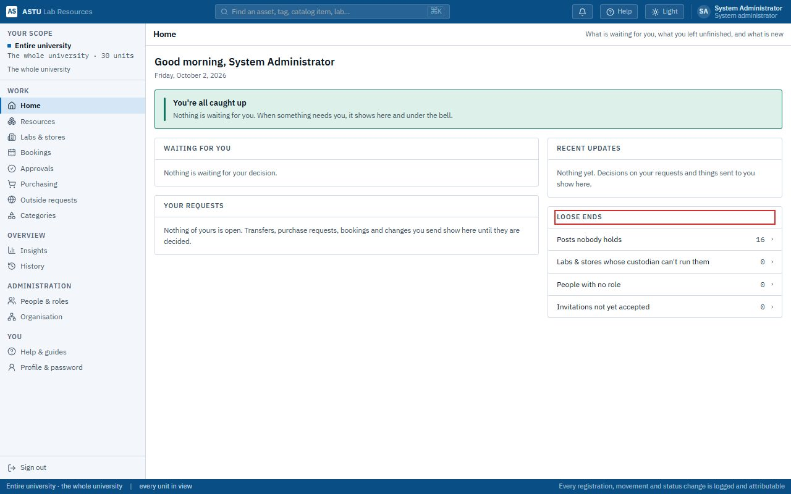
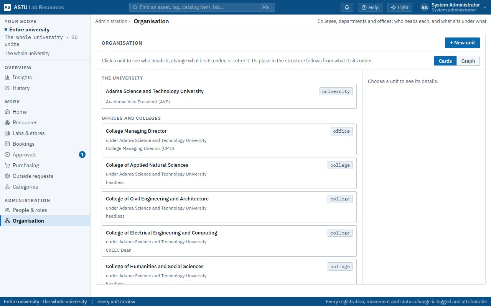
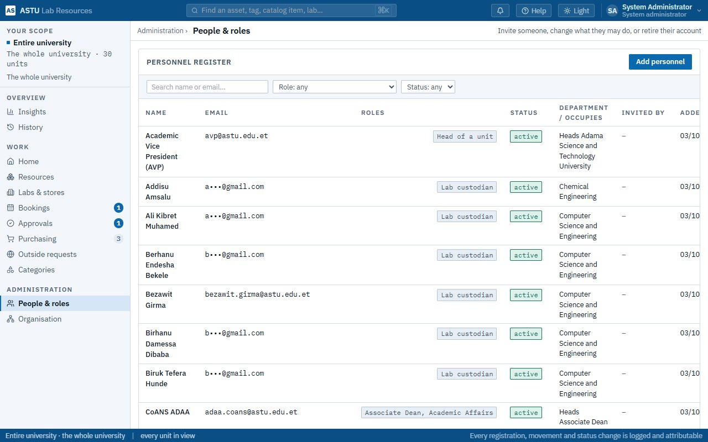
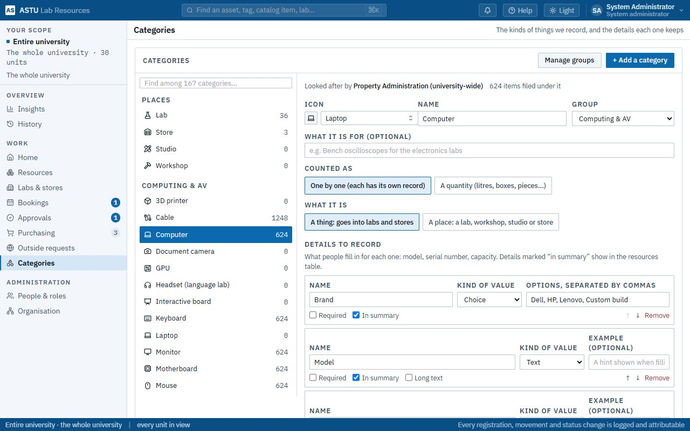

# System administrator

*You set LRMS up and keep it running: the organisation, the people and their roles, and the categories resources are filed under.* You can also correct any record directly; your edits apply at once.

Read [Getting started](00-getting-started.md) and [How LRMS thinks](01-concepts.md) first.

| Task | Section |
|---|---|
| Where to start; what's loose | [1. Home](#1-home) |
| Build the organisation | [2. Organisation](#2-organisation) |
| Invite people, set roles, help them sign in | [3. People & roles](#3-people--roles) |
| Define kinds of resources | [4. Categories](#4-categories) |
| Fix a record, audit a change | [5. Corrections and History](#5-corrections-and-history) |

---

## 1. Home

Your **Home** adds **Loose ends**: posts nobody holds (a department without a head), labs and stores whose custodian can't run them (their account is retired, or they no longer hold the custodian role), people with no role, and invitations not yet accepted. Each line opens the screen where you fix it.

## 2. Organisation

**Organisation** draws the structure: the university, its colleges and their departments, and offices such as Procurement, Property Administration, the College Managing Director, ICT and each college's ADAA office. It opens on **Cards**, one list per level; **Graph** draws the map.

> **Two offices the purchase chain looks for.** Purchase requests are routed to the **Procurement Office** (code `PROC`) and, before the AVP, the **College Managing Director** (code `CMD`). Keep those codes when you rename either office. If the CMD office is **vacant**, requests wait at its step, shown as *(vacant)*, until you assign someone. If it's **deactivated**, new requests skip it.

**Add a unit.** Click **+ New unit** and enter its **Name**, its **Kind** (University, College, Department or Office), an optional **Code**, and what it **Sits under**. A department can sit under two colleges; units it sits under must be side by side in the structure. Its place in the structure follows from what it sits under; you never type a level. Then click **Create unit**.

**A unit's details.** Click it on the map. You can:
- rename it, change its kind or code;
- assign or change its **head** from existing people, or **invite someone new and assign them here** in one step;
- change what it **Sits under**. A unit with nothing under it moves freely; one with units under it can only move to a place at the same depth (move its sub-units first otherwise);
- **Deactivate** or **Delete** it.

> **Good to know:** changes with real consequences (a new or removed head, a change of kind, deactivating or deleting) ask you to confirm first. Assigning a head emails them. Two active units can't share a name.

## 3. People & roles

**People & roles** lists everyone: roles, status (active, invited, disabled) and unit. Search it, or filter by role or status.

### Invite someone

1. Click **Add personnel**.
2. Enter their **full name** and **email**, optionally a phone, and their **home unit**.
3. Pick their **roles**. Roles stack: a head who also runs a lab is *Head of a unit + Lab custodian*.
4. Click **Send invitation**. They get an email with a registration link, and you get the link to copy in case the email doesn't arrive.

| Role | What it's for |
|---|---|
| **System administrator** | This chapter: setup and corrections |
| **Property Administration** | The Main Store, arrivals, movements in and out of the store, university-wide categories ([Property administrator](10-property-admin.md)) |
| **Procurement** | The Procurement Office ([Procurement](07-procurement.md)) |
| **Head of a unit** | Heads a unit: a department head, a dean, the AVP, the College Managing Director. What they head is the unit they **occupy** |
| **Associate Dean, Academic Affairs** | A college's ADAA: adds the college's stores and chooses their store keepers ([ADAA](04-adaa.md)). Home them in the college or its ADAA office |
| **Lab custodian** | Runs labs or stores ([Lab custodian](02-custodian.md)) |
| **Store keeper** | The Main Store ([Store keeper](08-store-keeper.md)) |
| **Outside requester** | An institution outside the university; they sign up themselves on the portal |

### Manage a person

**Manage** opens a person's record: their **roles**, the unit they **occupy** (to make them its head), their **home unit**, **email notifications**, **sign-in help** and **Deactivate**.

**Sign-in help:**
- **Copy invite link**, for someone who hasn't registered yet. It issues a fresh link and emails it too; the old link stops working.
- **Email reset link**: they get a reset email. You never see the link.
- **Set temporary password**: confirm first, then the password is shown **once**, for you to give them directly. They're signed out everywhere and must choose their own at the next sign-in.

Department heads get the same sign-in help for their own department's people.

## 4. Categories

A **category** is a kind of resource (Lab, Computer, Chair, Chemical or reagent…). **Categories** lists them by group; **Find a category** searches them. Click one to open it, or **+ Add a category**.

Each category sets:
- **What it is**: a **place** (a lab, workshop, studio or store, which sits at the top) or a **thing** (which goes inside a place, or inside a thing that *comes with* it);
- **Icon**, **Name**, **Group**, and **What it is for**;
- **Counted as**: one by one (a computer) or a quantity in a unit (a chemical in mL);
- **Details to record**: each detail's name, its **Kind of value** (Text, Number, Choice, Yes / no, or Date; text can be long), an **Example** shown as a hint ("e.g. 64-17-5"), and whether it is required. **+ A common detail…** adds Manufacturer, Model, Serial no., Asset tag, Year acquired, Calibration due, Expiry or CAS no. in one pick;
- **Comes with**: the parts a new one is created with (a Workstation Setup's computer, table and chair);
- under **More options**: **If a needed part fails** (whether a failed part puts it out of order), **Booking** (not bookable, a bookable room, or bookable equipment) and **On the public portal**.

**Review before saving.** **Review changes** says what happens to the items the change reaches before anything is saved: values that convert to a new kind, values that can't (kept on their item as an extra detail, unless you choose to erase them), options in use that need a new home, and what to fill in when a detail becomes required.

**Who decides.** Your changes, and Property Administration's, apply directly. Departments look after their own categories (custodians add, their head approves changes that alter existing items, see [Department head → Categories](03-department-head.md#8-categories)). A department's change that reaches **other departments' items** comes to you after their head, then goes to Property Administration: it appears in **Approvals** and at the top of **Categories**. Approve it, or say no with a note (often: make a separate category instead).

The kinds of **place** (Lab, Workshop, Studio, Store) are kept by you and Property Administration only.

## 5. Corrections and History

You can change any resource directly: its status, custody, ownership, position or details. Your edits apply at once and are logged under your name. Use this for setup and corrections; day-to-day changes belong to the custodians, so the head's approval stays meaningful.

**History** shows every applied change across the university: when, which item, what changed from and to, who, and why. Filter it to audit anything.
