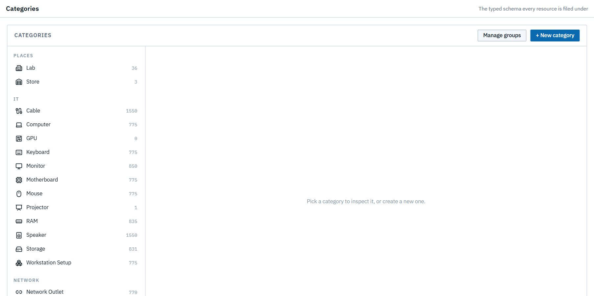
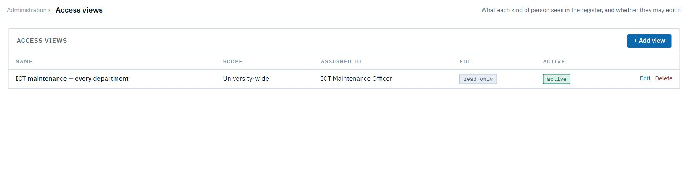

# Property administrator

*You work in the university's property office.* You see every unit's resources, and you look after the shared vocabulary the register runs on: the **categories** resources are filed under, and the **access views** that decide who sees what. Custodians keep the records themselves; your job is the structure around them.

Read [Getting started](00-getting-started.md) and [How LRMS thinks](01-concepts.md) first.

| Task | Section |
|---|---|
| See the whole university | [1. University-wide view](#1-university-wide-view) |
| Maintain categories | [2. Categories](#2-categories) |
| Maintain access views | [3. Access views](#3-access-views) |

---

## 1. University-wide view

Your scope is the **entire university**. The **Dashboard**, **Register**, **University resources** and **Change log** cover every department, office and store.

The register is **read-only** for you: no Add resources, no Change this…, no bulk bar. Resource records belong to their custodians. You can audit every change in **Change log**.

## 2. Categories

You edit categories just as the system administrator does. That covers icons and names, how items are counted, how a broken part affects its container, where items may be placed, whether a category is bookable (room or equipment) or listed on the public portal, its fields and its template. See [System admin → Categories](09-system-admin.md#4-categories) for each setting, with screenshots.

Every change goes through **Review changes** first. It tells you how many existing items it reaches before you **Apply changes**.

## 3. Access views

**Administration → Access views** lists the views, what they reach, who they're assigned to, and whether they're read-only. You can add, edit and deactivate them. See [System admin → Access views](09-system-admin.md#5-access-views) for how a view works, and the worked example of the ICT Maintenance Office's read-only, university-wide view.

> **Good to know:** a view widens what people **see**. It never lets them change something their role can't already change.
