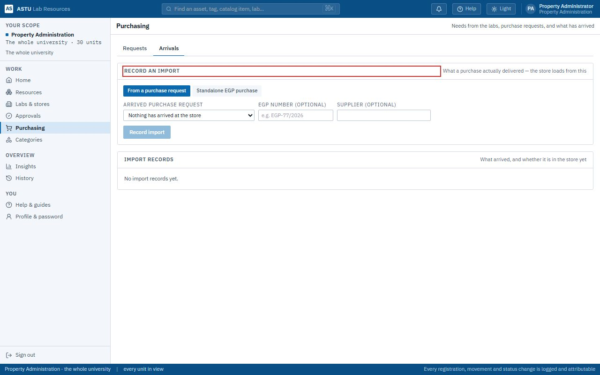
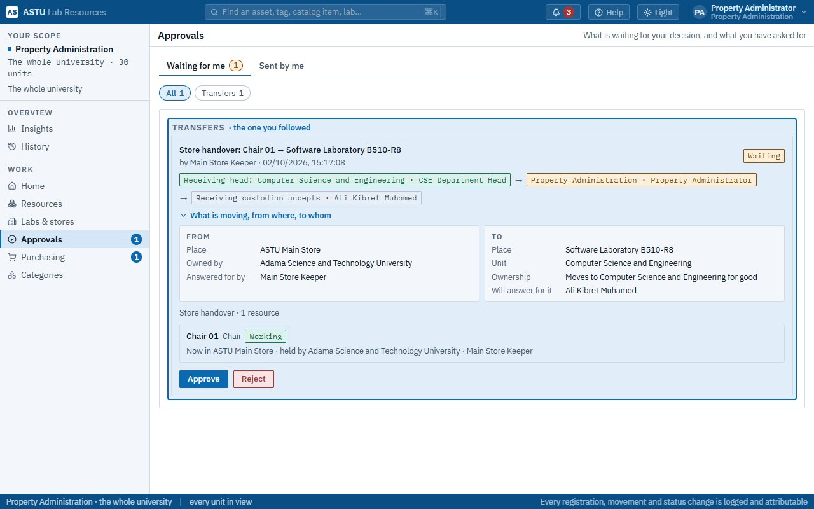

# Property administrator

*You work in the university's property office.* You see every unit's resources. You manage the **Main Store** and choose who runs it, record what bought goods arrived as (**import records**), approve every movement **in or out of the Main Store** and every permanent transfer that leaves its college, and look after the **university-wide categories** the register runs on.

Read [Getting started](00-getting-started.md) and [How LRMS thinks](01-concepts.md) first.

| Task | Section |
|---|---|
| See the whole university | [1. University-wide view](#1-university-wide-view) |
| The Main Store | [2. The Main Store](#2-the-main-store) |
| Record a delivery | [3. Import records](#3-import-records) |
| Approve store movements and transfers | [4. Approving movements](#4-approving-movements) |
| Maintain categories | [5. Categories](#5-categories) |

---

## 1. University-wide view

Your scope is the **entire university**: **Resources**, **Insights** and **History** cover every department, office and store. Records belong to their custodians; you audit them in **History**.

## 2. The Main Store

The university's Main Store is yours to manage in **Labs & stores**: its details, and **Change who runs it** to choose its store keeper. You can add another store at the university level with **+ Add a lab or store** (kind **Store**, level **Main**).

**Store changes.** A store keeper's changes to what a store holds (a status, a name, a detail, something added or removed) come to you in **Approvals**, the same way a lab's come to its head. Approving applies them; returning them sends them back with your reason.

**Custody and units.** Who answers for a resource, which unit owns it and which holds it are your records. Open any resource in **Resources** and click **Change custody or unit…**: choose the new custodian, owning unit or current unit, and say why (the reason is kept in its history). It applies at once.

**Store staff.** **People & roles** lets you invite store keepers, change their roles and help them sign in.

## 3. Import records

When procurement marks a purchase **Arrived at the main store**, you're told, and **Home** shows **Arrivals to record**. In **Purchasing → Arrivals**, **Record an import**:

- **From a purchase request**: choose the **Arrived purchase request** (opened from the "has arrived" notice, it is already chosen and marked). Its lines are filled in with what is still to come; correct them to what actually arrived: quantities, and the **model or serials** from the delivery documents. You can't record more than was ordered.
- **Standalone EGP purchase**: for goods bought through EGP that never had an LRMS request. Give the **EGP number** and the supplier, and list what arrived.

Click **Record import**. The store keeper is told and loads it into the store, line by line; **Import records** shows each line's progress. You can **cancel** a record nothing has been loaded from yet (with a reason) and record it again.

## 4. Approving movements

These come to you in **Approvals**, after the departments' own consent:

| Movement | The chain | You come |
|---|---|---|
| **From the store** to a lab | receiving head → **you** → receiving custodian accepts | before the custodian takes it on |
| **A lab's request** for something in the store | store keeper releases → receiving head → **you** → receipt | before it leaves the store |
| **Return to the store** | owning head → **you** → store keeper accepts | before it comes back in |
| **Permanent transfer** between colleges | … both heads → College Managing Director → **you** → receipt | last, before receipt |

Each card opens **What is moving, from where, to whom**: the place it leaves and the place it goes, who owns it now and whether ownership moves, who answers for it now and who will, and every resource with its kind, status, recorded details and the parts that travel with it.

**Approve** moves it on; **Reject** ends it with your reason. A permanent transfer inside one college, and a loan, never come to you.

## 5. Categories

You edit categories just as the system administrator does: what a category is, how it is counted, the details it records, what it comes with, whether it can be booked or is listed on the public portal. See [System administrator → Categories](09-system-admin.md#4-categories) for each setting.

- The **university-wide catalogue** (computing, furniture and safety, electrical, mechanical, materials testing, civil and surveying, architecture, analytical and life sciences, geology and physics) is looked after by you. Departments add their own on top.
- The kinds of **place** (Lab, Workshop, Studio, Store) are kept by you and the administrator only.
- A department's change that reaches **other departments' items** comes to you last, after their head and the administrator. Approve it, or say no with a note.
