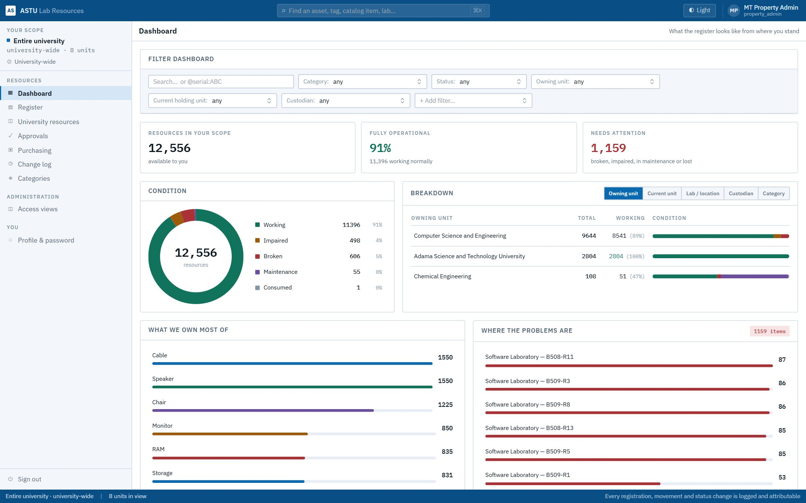
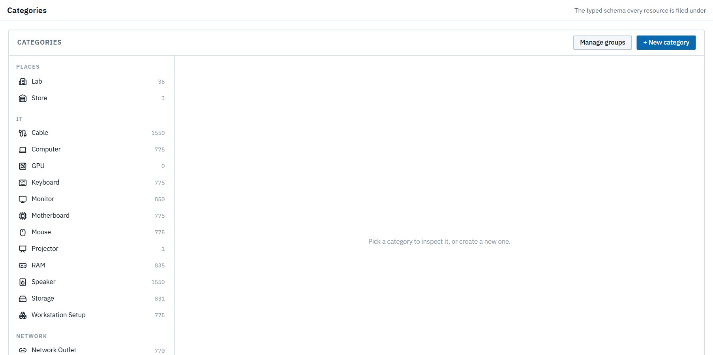
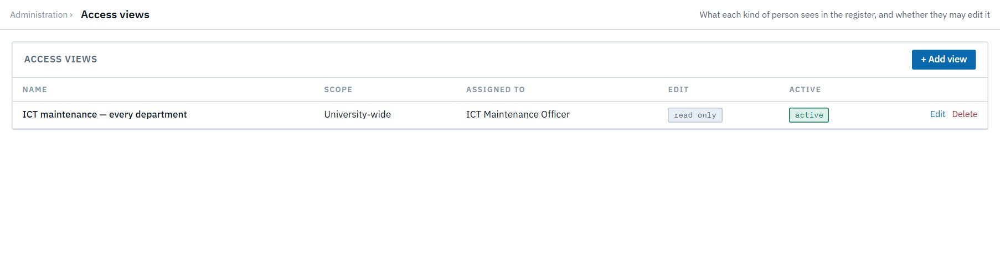

# Property administrator

*You work in the university's property office.* You see every unit's resources. You record what bought goods arrived as (**import records**), you approve every movement **in or out of the Main Store**, and every permanent transfer that leaves its college. You also look after the shared vocabulary the register runs on: the **categories** resources are filed under, and the **access views** that decide who sees what. Custodians keep the records themselves.

Read [Getting started](00-getting-started.md) and [How LRMS thinks](01-concepts.md) first.

| Task | Section |
|---|---|
| See the whole university | [1. University-wide view](#1-university-wide-view) |
| Record a delivery | [2. Import records](#2-import-records) |
| Approve store movements and transfers | [3. Approving movements](#3-approving-movements) |
| Maintain categories | [4. Categories](#4-categories) |
| Maintain access views | [5. Access views](#5-access-views) |

---

## 1. University-wide view

Your scope is the **entire university**. The **Dashboard**, **Register** and **Change log** cover every department, office and store.

The register is **read-only** for you: no Add resources, no Change this…, no bulk bar. Resource records belong to their custodians. You can audit every change in **Change log**.

## 2. Import records

When procurement marks a purchase **Arrived at the main store**, you are emailed. In **Purchasing → Record an import**:

- **From a purchase request**: choose the arrived request. Its lines are filled in with what is still to come; correct them to what actually arrived — quantities, and the **model or serials** from the delivery documents. You can't record more than was ordered.
- **Standalone EGP purchase**: for goods bought through EGP that never had an LRMS request. Give the **EGP number** and the supplier, and list what arrived.

Click **Record import**. The store keeper is emailed and loads it into the store, line by line; **Import records** shows each line's progress. You can **cancel** a record nothing has been loaded from yet (with a reason) and record it again.

## 3. Approving movements

These come to you in **Approvals → Transfers**, after the departments' own consent:

| Movement | The chain | You come |
|---|---|---|
| **Store handover** to a lab | receiving head → **you** → receiving custodian accepts | before the custodian takes it on |
| **Issue** to a member of staff | their head → **you** → the person accepts | before they take it on |
| **Request from the store** | store keeper releases → receiving head → **you** → receipt | before it leaves the store |
| **Return to the store** | owning head → **you** → store keeper accepts | before it comes back in |
| **Permanent transfer** between colleges | … both heads → College Managing Director → **you** → receipt | last, before receipt |

**Approve** moves it on; **Reject** ends it with your reason. A permanent transfer inside one college, and a loan, never come to you.

## 4. Categories

You edit categories just as the system administrator does. That covers icons and names, how items are counted, how a broken part affects its container, where items may be placed, whether a category is bookable (room or equipment) or listed on the public portal, its fields and its template. See [System admin → Categories](09-system-admin.md#4-categories) for each setting, with screenshots.

Every change goes through **Review changes** first. It tells you how many existing items it reaches before you **Apply changes**.

## 5. Access views

**Administration → Access views** lists the views, what they reach, who they're assigned to, and whether they're read-only. You can add, edit and deactivate them. See [System admin → Access views](09-system-admin.md#5-access-views) for how a view works, and the worked example of the ICT Maintenance Office's read-only, university-wide view.

> **Good to know:** a view widens what people **see**. It never lets them change something their role can't already change.
