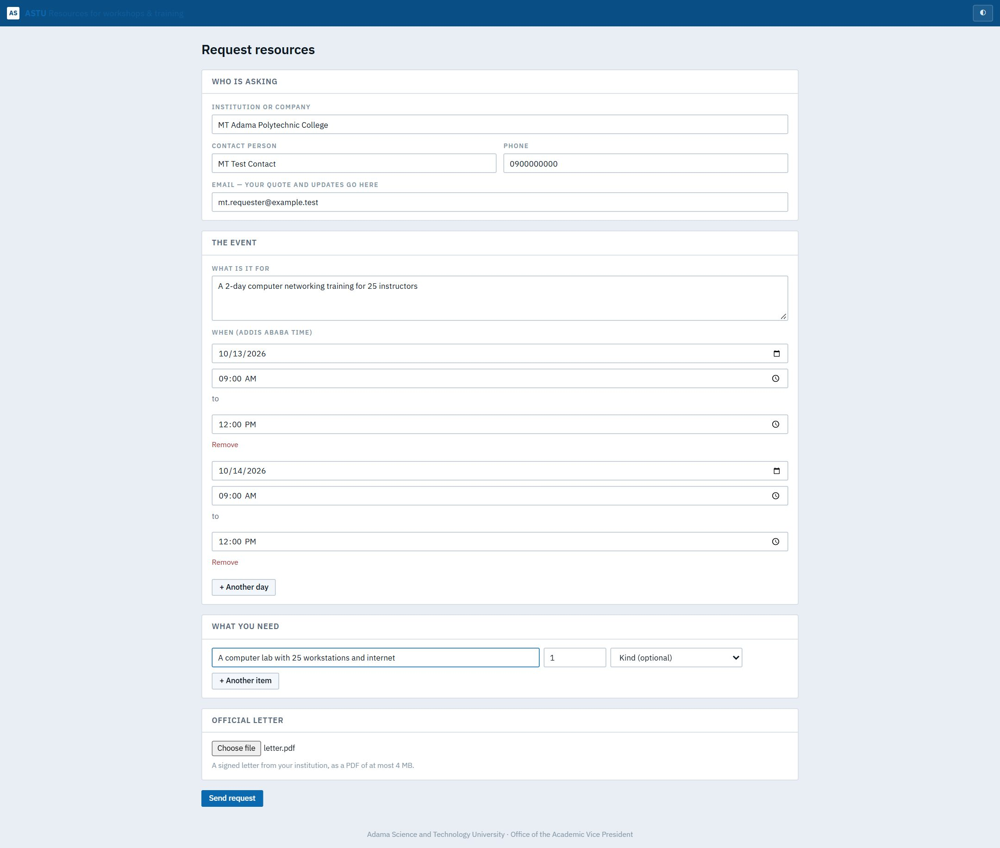
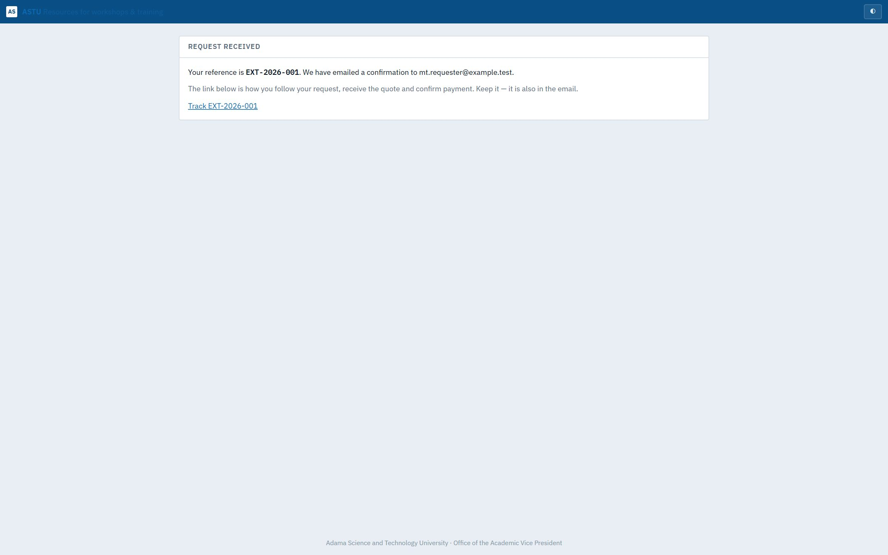
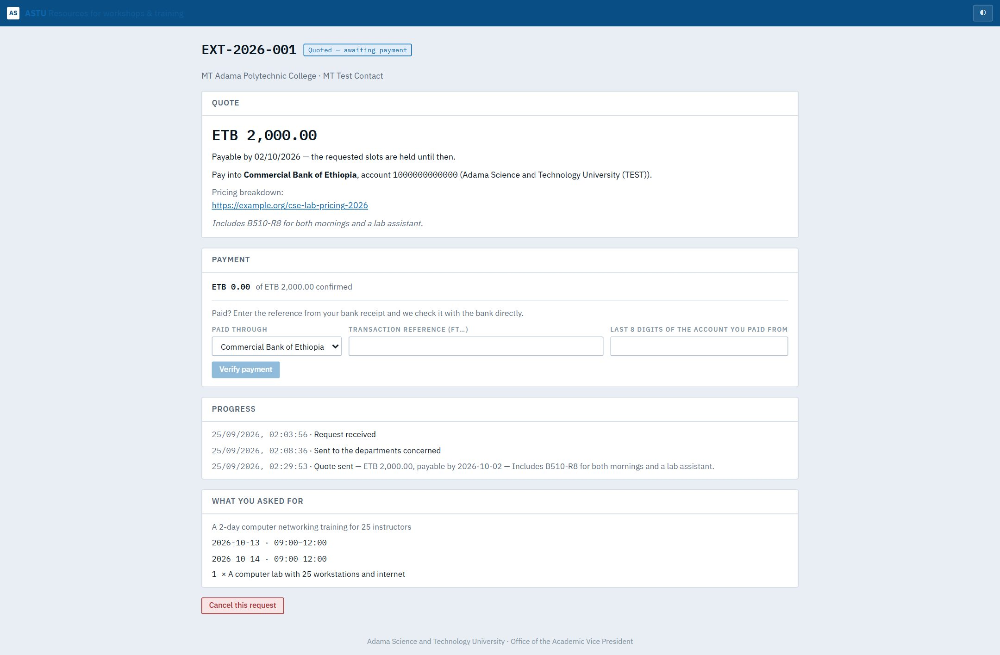
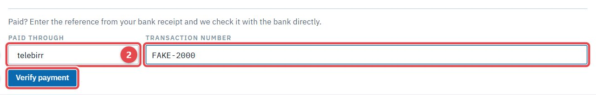
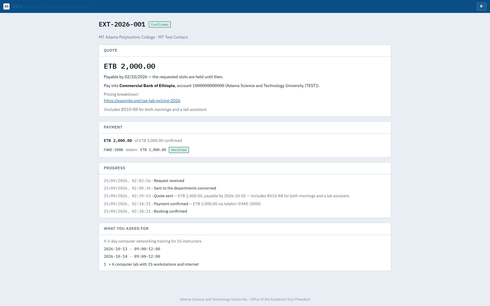

# Outside organisations: the public portal

*You represent an institution or company outside ASTU, and you'd like to hold a workshop or training using the university's laboratories and equipment.* You don't need an account: everything happens on the public portal and through the links it emails you.

## How it works, in short

1. **You ask** on the portal: who you are, what it's for, when, and what you need, with your official letter.
2. **The AVP's office** forwards your request to the departments that can host it. Their labs hold the dates for you.
3. **You get a quote** by email, with a payment deadline.
4. **You pay** at the bank or by telebirr, and enter the reference on your tracking page. It's checked with the bank directly.
5. **Paid in full → confirmed.** The labs are booked for you.

---

## 1. See what's available

Open the portal. It shows the kinds of resources the university can offer, with how many are available across campus. It shows counts only, never room numbers or who looks after them. Click **Request resources** (1) to start.

## 2. Send your request

Fill in:
- **Who is asking**: your institution or company, a contact person, a phone number, and an **email**. Your quote and updates go there.
- **The event**: what it's for, e.g. "A 2-day computer networking training for 25 instructors".
- **When**: each day with its start and end time, in Addis Ababa time. Use **+ Another day** for several days.
- **What you need**: e.g. "A computer lab with 25 workstations and internet", with quantities. Use **+ Another item** for more.
- **Official letter**: a signed letter from your institution, as a PDF of at most 4 MB.

Then click **Send request**.

You get a **reference** (EXT-2026-…) and a **tracking link**, also emailed to you. Keep the link: it's how you follow the request, receive the quote and confirm payment.

## 3. Follow your request

The tracking page shows where your request is:

| Status | Meaning |
|---|---|
| **Received** | The AVP's office has it |
| **Under review** | The departments are checking availability and price |
| **Quoted — awaiting payment** | Your quote is ready |
| **Payment being verified** | You entered a payment; it's being checked |
| **Confirmed** | Paid; your booking is set |
| **Declined / Cancelled / Expired** | It won't go ahead; the reason is shown |

You can **Cancel this request** from the tracking page at any time before it's confirmed.

## 4. Your quote

When the quote is ready, you get an email with a **new tracking link** (the old one stops working). The page shows:
- the **amount** and the date to **pay by**. Your dates are held until then;
- the account to pay into, and a link to the pricing breakdown;
- a note from the university.

## 5. Pay

1. Pay the amount at the bank or by telebirr.
2. On the tracking page, choose **Paid through**, then enter the **transaction reference** from your receipt. A bank payment also asks for the last 8 digits of the account you paid from.
3. Click **Verify payment**. The reference is checked with the bank directly.

You can pay in parts: the page shows what's confirmed so far ("ETB 1,500 of ETB 3,500"). Once the full amount is confirmed, your request becomes **Confirmed**, and the university's staff are told.

> **Good to know**
> - A reference that was already used, or a payment made to a different account, is refused.
> - If the check can't reach the bank at that moment, you can ask for **manual review**. The AVP's office then confirms your payment by hand.
> - If you don't pay by the deadline, the held dates are released and the request expires.
