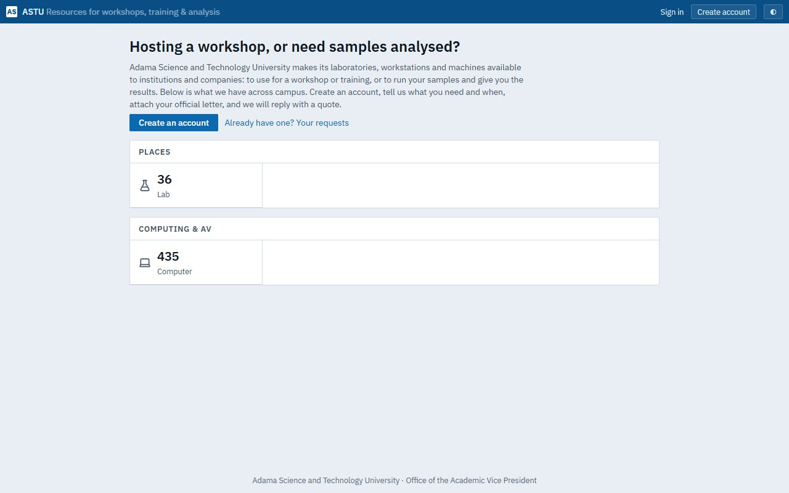

# Outside organisations: the portal

*You represent an institution or company outside ASTU.* You'd like to hold a workshop or training using the university's laboratories and equipment, or to have **samples analysed** on one of its machines and receive the results. You create an account on the portal, send your request with an official letter, and follow it there.

## How it works, in short

1. **You create an account** and confirm your email.
2. **You ask**: rooms or labs for an event, or a sample analysis: who you are, what it's for, when, and your official letter.
3. **The university's line of communication** takes it from there: the Academic Vice President's office sends it to the colleges concerned, each dean to their departments, and each department's lab custodians hold what you need on your dates. Their answers come back up the same way.
4. **You get a quote**: the total, each department's part, the university's bank account, and what is held for you and when.
5. **You pay** into the account and enter the payment reference. It's checked with the bank directly.
6. **The AVP's office confirms your payment.** Your rooms or machine are booked, and you see **who to contact** in each department. From then on, arrival, delivering samples and receiving results are arranged with them directly.

---

## 1. Create an account

Open the portal. It shows the kinds of resources the university can offer, with how many are available across campus: counts only, never room numbers or who looks after them. Click **Create an account**.

Give your institution or company, your name, a phone number, your email and a password (at least 8 characters). We email you a link: follow it to confirm your address, then **Sign in**. Until you have confirmed it, sign-in says so.

If you sent a request before accounts existed, sign up with the same email address and it appears among your requests.

## 2. Send your request

Signed in, click **New request** and choose what kind:

- **Rooms or labs**: you come and use the university's labs and equipment for a workshop, training or exam.
- **Sample analysis**: you send samples; the university runs them on one of its machines and gives you the results.

Then fill in:
- **Who is asking**: filled in from your account; change it if this request has a different contact.
- **The event** (or **The analysis**): what it's for. For a sample analysis, also the **machine** (or "not sure"), the number of **samples** and the **analysis needed**.
- **When** (or **Preferred dates**): each day with its start and end time, in Addis Ababa time. Use **+ Another day** for several days.
- **What you need**: e.g. "A computer lab with 25 workstations and internet", with quantities. Optional for a sample analysis.
- **Official letter**: a signed letter from your institution, as a PDF of at most 4 MB.

Click **Send request**. You get a **reference** (EXT-2026-…), also emailed to you.

## 3. Follow your request

**My requests** lists everything you've sent. Open one to see where it is:

| Status | Meaning |
|---|---|
| **Received** | The AVP's office has it |
| **Under review** | The colleges and departments are checking what they can hold, and the price |
| **Quoted: awaiting payment** | Your quote is ready |
| **Payment being checked** | You asked for a payment to be checked by hand |
| **Paid: awaiting confirmation** | The full amount is in; the AVP's office is confirming it |
| **Confirmed** | Booked; your contacts are shown |
| **Declined / Cancelled / Expired** | It won't go ahead; the reason is shown |

You can **Cancel this request** at any time before you've paid.

## 4. Your quote

When the quote is ready, you are emailed. The request's page shows:
- the **total** and the date to **pay by**. What is held for you stays held until then;
- each **department's part**, with a link to its cost breakdown;
- the university's **bank account** to pay into (use your reference as the payment reason);
- **Held for you**: each room or machine, with its date and time.

## 5. Pay

1. Pay the amount into the account, or by telebirr.
2. On the request's page, choose **Paid through**, then enter the **transaction reference** from your receipt. A bank payment also asks for the last 8 digits of the account you paid from.
3. Click **Verify payment**. The reference is checked with the bank directly.

You can pay in parts: the page shows what's confirmed so far ("ETB 1,500 of ETB 3,500"). When the full amount is in, the request is **Paid: awaiting confirmation**; the AVP's office checks it and confirms. You are then emailed, and the page shows:

- **Booked for you**: each room or machine and when;
- **Who to contact**: the people each department named, with their phone numbers, for arrival, samples, results and anything on the day.

> **Good to know**
> - A reference that was already used, or a payment made to a different account, is refused.
> - If the check can't reach the bank at that moment, you can ask for **manual review**. The AVP's office then checks your payment by hand.
> - If you don't pay by the deadline, what was held is released and the request expires.
