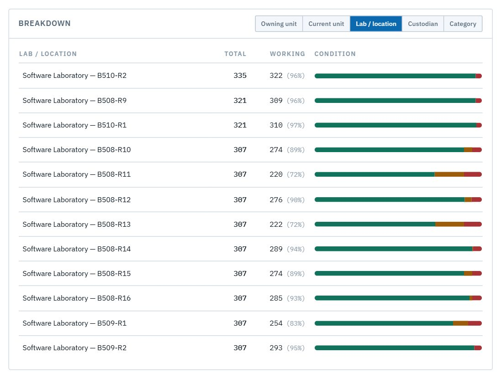

# ICT maintenance officer

*You work in the ICT Maintenance Office. You need to see which devices in **every** department need maintenance, so you can plan and schedule the work.* Your access is **read-only**. You see everything, but you change nothing. Each lab's custodian records repairs.

Read [Getting started](00-getting-started.md) and [How LRMS thinks](01-concepts.md) first.

| Task | Section |
|---|---|
| See the whole university's condition | [1. Your dashboard](#1-your-dashboard) |
| Find the labs with the most problems | [2. Where the problems are](#2-where-the-problems-are) |
| List the devices that need work, by department | [3. Build a maintenance list](#3-build-a-maintenance-list) |
| Check one device | [4. Look at a device](#4-look-at-a-device) |

---

## Your access

Your account comes with an **access view** called **"ICT maintenance — every department"**. It shows up in the sidebar as your scope: **◎ University-wide**, and the status bar reads **every unit in view**. It is **read only**, so the register gives you no Add, Change or bulk-edit controls.

If you only see your own office, check the **Access view** picker in the sidebar. If it's missing, ask the system administrator.

## 1. Your dashboard

**Dashboard** covers every department:

1. **Your scope** and your access view.
2. **Needs attention**: every broken, impaired, under-maintenance or lost resource in the university.

**Condition** splits everything by status. **Breakdown → Owning unit** gives each department's total and how many are working.

## 2. Where the problems are

- **Breakdown → Lab / location** ranks every lab and store by condition.

  

- **Where the problems are** lists the labs with the most items needing attention. It's the natural order to plan visits in.

  

Click a bar or a number to filter the dashboard to it.

## 3. Build a maintenance list

1. Open **Register** and choose **Grouped** at the top right. **Group by** starts at *Owning unit*, which nests the university, then colleges, then departments, then labs. Use **+ then by…** to add a second level, such as *Custodian*.
2. Set **Category**, for example *Computer* (or *Monitor*, *Network Switch*…).
3. Set **Status**:
   - **Impaired**: a device with a failed critical part, such as a computer with a dead RAM stick;
   - **Broken**: the part that itself failed;
   - **Maintenance**: already away for repair.

The summary line gives the total and breaks it down by department, custodian and lab: *189 × Computer match … Custodian: Haimanot Kiber Temesgen 24 · …*. That is your work list, and it tells you who to contact in each lab.

> **Good to know**
> - To find the **failed parts** rather than the computers they impair, filter **Status: Broken** with *Category: RAM*, *Storage* or *Monitor*.
> - `@` search works too: `@category:monitor` lists every monitor. See [Getting started → Search](00-getting-started.md#6-search-from-anywhere).
> - Filters live in the page address. Bookmark a filtered register to come back to the same list.

## 4. Look at a device

Click any name to open its details: where it sits (*Lab › Workstation › Computer*), its custodian, its properties and its history. There is no **Change this…** button, because your view is read-only.

When a repair is done, the lab's **custodian** records it (status back to **Working**). In a department that uses drafts, the change shows up once the department head approves it.
