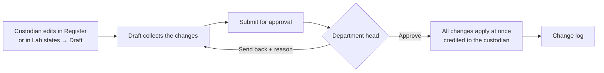
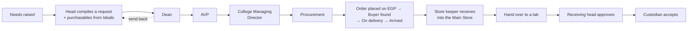
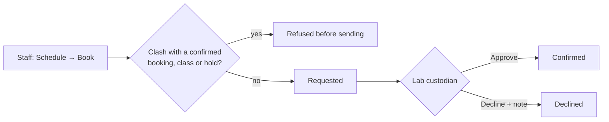
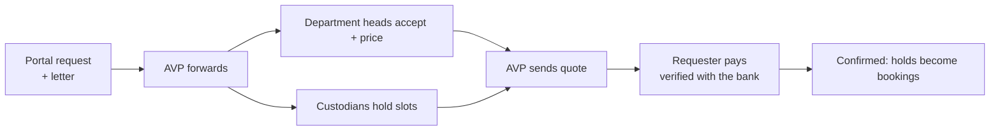

# Appendix

## Who approves what

| What | Raised by | Decided by, in order |
|---|---|---|
| A lab **Draft** (an update of the lab) | The lab's custodian | The lab's department head |
| A lab **Ideal** (what it should hold) | The lab's custodian | The lab's department head |
| A **need** | Any staff or custodian | Their department head: carry into a request, or decline |
| A **purchase request** | A department head | Dean → AVP → College Managing Director → Procurement Office (the head's own step is done by raising it) |
| A **handover** from the Main Store | The store keeper | Receiving department's head → receiving custodian accepts |
| A **transfer** into your lab from another unit | A custodian | Current custodian → their head → receiving head → you confirm receipt |
| A **staff booking** of a lab or machine | Staff | The lab's custodian (a custodian's booking of their own lab is confirmed at once) |
| An **outside institution's request** | The institution, on the portal | AVP forwards → department heads accept with a price (custodians hold slots) → AVP quotes → requester pays → confirmed |
| A **category** change | System admin or property admin | Applied after **Review changes** shows its consequences |

## The main flows

### Updating a lab (drafts department)

### From a need to stock in the lab

### Booking a lab

### An outside institution's request

## Statuses and badges

**A resource's status**

| Status | Meaning |
|---|---|
| **Working** | In service |
| **Impaired** | A critical part isn't working (worked out automatically, never set by hand) |
| **Broken** | Doesn't work |
| **Maintenance** | Away for repair or servicing |
| **Lost** | Can't be found |
| **Consumed** | Used up (chemicals, supplies) |

**Markers in the register**

| Marker | Meaning |
|---|---|
| `*` | A change to this item is waiting in its lab's Draft (hover to see it) |
| `⇄` / *⇄ 5 promised* | In a pending handover or transfer; it can't be promised twice |
| **CRITICAL** (in an item's details) | This part impairs its container when it fails |

**A lab in Lab states**

| Badge | Meaning |
|---|---|
| **draft · N** | A draft with N changes is being prepared |
| **draft submitted** | Waiting for the head |
| **ideal submitted** | An Ideal proposal is waiting for the head |
| **ideal set** / **no ideal** | Whether the lab has an approved Ideal |

**A purchase request**

| Stage | Meaning |
|---|---|
| **Awaiting approval** | In the chain; the card says who it's waiting on |
| **Sent back for revision** | Back with the head, with the approver's note |
| **Order placed on EGP → Buyer found → On delivery → Arrived at the main store** | Procurement's stages |
| **Registered and closed** | Everything received into the store |
| **Rejected / Withdrawn** | Stopped; carried needs reopen |

## Common messages, explained

| You see | Why | What to do |
|---|---|---|
| **"Staged in … 's draft"** | Your department uses drafts: the head approves changes first | Submit the draft from **Lab states → Draft** |
| **"… uses draft mode — custody, ownership and moves out of a lab go through a transfer"** | Those changes can't be staged | Use a transfer or handover instead |
| **"Couldn't be applied … changed in the register since this draft was copied"** (stale) | Someone changed an item after your draft was copied | **Refresh from Current**, redo your change, submit again |
| **"Already taken …"** when booking | A confirmed booking, class or hold covers that time | Pick another time |
| **"Only N pcs remain on this line"** | You tried to receive more than was ordered | Enter the remaining quantity |
| **"That area isn't part of your role"** | The screen belongs to another role | Ask your head or the administrator if you need access |
| **"This person hasn't registered yet — send their invite link instead"** | Sign-in help for someone who never set a password | Use **Copy invite link** |
| Forgot password sent an **invitation**, not a reset | The account was never set up | Open the invitation and set your password |
