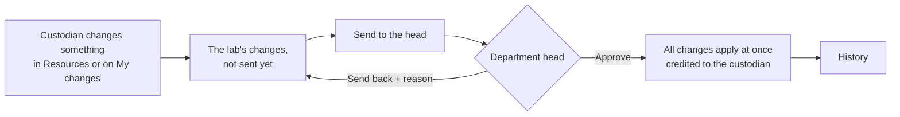
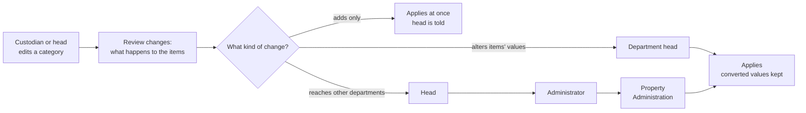
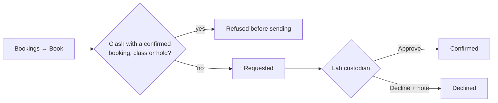

# Appendix

## Who approves what

| What | Raised by | Decided by, in order |
|---|---|---|
| A **lab's changes** (what broke, was mended, renamed, added or removed) | The lab's custodian | The lab's department head |
| A new **lab or store**, or a new custodian for one | The department's head (its labs and stores), the college's ADAA (the college's stores), or Property Administration (the Main Store) | Applies at once; the custodians are told |
| A new **category**, or an addition to one | A custodian or head (for their department), the ADAA (for the college) | Applies at once; the head is told |
| A **category change** that alters what items already hold | A custodian | The department head (a head's own change applies after its review) |
| …that reaches **other departments' items** | A custodian or head | Their head → the administrator → Property Administration |
| A **need** | A custodian, for a lab they run | Their department head: build it into a request, or decline |
| A **purchase request** | A department head | Dean → College Managing Director → AVP → Procurement Office (the head's own step is done by sending it) |
| An **import record** (what a purchase delivered) | Property Administration | The store keeper loads it into the Main Store |
| A **move from the Main Store** to a lab | The store keeper | Receiving head → Property Administration → receiving custodian accepts |
| A **request from the Main Store** | A custodian | Store keeper releases → your head → Property Administration → you confirm receipt |
| A **return to the Main Store** | A custodian | Owning head → Property Administration → store keeper accepts |
| A **loan** from another unit | A custodian | Current custodian → their head → receiving head → you confirm receipt |
| A **permanent transfer** from another unit | A custodian | Current custodian → their head → receiving head → College Managing Director → *(another college only)* Property Administration → you confirm receipt |
| A **booking** of a lab or machine | A custodian or head | The lab's custodian (a custodian's booking of their own lab is confirmed at once) |
| An **outside institution's request** (rooms, or a sample analysis) | The institution, signed in to the portal | AVP → deans → heads → custodians hold; heads answer (cost, contacts) → deans approve → AVP approves and quotes → requester pays → AVP confirms the payment |

## The main flows

### Changing a lab

```mermaid
flowchart LR
  A[Custodian changes something<br/>in Resources or on My changes] --> B[The lab's changes,<br/>not sent yet]
  B --> C[Send to the head]
  C --> D{Department head}
  D -- Send back + reason --> B
  D -- Approve --> E[All changes apply at once<br/>credited to the custodian]
  E --> F[History]
```

### From a need to stock in the lab

```mermaid
flowchart LR
  N[Custodians ask for<br/>what their labs need] --> H[Head builds a request<br/>from the chosen needs]
  H --> DN[Dean] --> CMD[College Managing<br/>Director] --> AVP[AVP] --> P[Procurement]
  DN -. send back .-> H
  P --> O[With procurement → Order placed on EGP → Supplier found<br/>→ On delivery → Arrived]
  O --> IR[Property Administration<br/>records the import]
  IR --> S[Store keeper loads it<br/>into the Main Store]
  S --> HO[Move to the lab]
  HO --> RH[Receiving head] --> PA[Property<br/>Administration] --> RC[Custodian accepts]
```

### Changing a category

```mermaid
flowchart LR
  E[Custodian or head<br/>edits a category] --> R[Review changes:<br/>what happens to the items]
  R --> K{What kind of change?}
  K -- adds only --> A[Applies at once<br/>head is told]
  K -- alters items' values --> HD[Department head]
  K -- reaches other departments --> HD2[Head] --> AD[Administrator] --> PR[Property<br/>Administration]
  HD --> AP[Applies<br/>converted values kept]
  PR --> AP
```

### Booking a lab

```mermaid
flowchart LR
  S[Bookings → Book] --> Q{Clash with a confirmed<br/>booking, class or hold?}
  Q -- yes --> X[Refused before sending]
  Q -- no --> R[Requested]
  R --> C{Lab custodian}
  C -- Approve --> OK[Confirmed]
  C -- Decline + note --> NO[Declined]
```

### An outside institution's request

```mermaid
flowchart LR
  R[Requester's account:<br/>request + letter] --> A[AVP → colleges]
  A --> DE[Dean → departments]
  DE --> HD[Head asks custodians]
  HD --> CU[Custodians hold<br/>rooms or a machine]
  CU --> HA[Head: cost + contacts]
  HA --> DA[Dean approves]
  DA --> AA[AVP approves, quotes]
  AA --> P[Requester pays<br/>verified with the bank]
  P --> C[AVP confirms payment:<br/>booked + contacts shown]
```

## Statuses and badges

**A resource's status**

| Status | Meaning |
|---|---|
| **Working** | In service |
| **Impaired** | A needed part isn't working (worked out automatically, never set by hand) |
| **Broken** | Doesn't work |
| **Maintenance** | Away for repair or servicing |
| **Lost** | Can't be found |
| **Consumed** | Used up (chemicals, supplies) |

**Markers in Resources**

| Marker | Meaning |
|---|---|
| `*` | A change to this item waits in its lab's changes (hover to see it) |
| `⇄` / *⇄ 5 promised* | In a pending move; it can't be promised twice |
| **CRITICAL** (in an item's details) | This part puts what holds it out of order when it fails |

**A lab in Labs & stores**

| Badge | Meaning |
|---|---|
| **Changes not sent yet** | Its custodian has made changes and not sent them |
| **Changes waiting for the head** | Sent; the head hasn't decided yet |

**A purchase request**

| Stage | Meaning |
|---|---|
| **Awaiting approval** | In the chain; the card says who it's waiting on |
| **Sent back for revision** | Back with the head, with the approver's note |
| **With procurement → Order placed on EGP → Supplier found → On delivery → Arrived at the main store** | Procurement's stages: a request follows the procurement that buys it |
| **Registered and closed** | Everything loaded into the store from its import record(s) |
| **Rejected / Withdrawn** | Stopped; carried needs reopen |

## Common messages, explained

| You see | Why | What to do |
|---|---|---|
| **"Added to … 's changes (not sent yet)"** | Changes in a lab go to its head first | Send them from the lab's **My changes** tab (or **Home**) |
| **"Custody, ownership and moves out of … go through a move (transfer)"** | Those can't be lab changes | Use **Move to another place…**, **Request to my lab…** or **Return to store…** |
| **"Couldn't be applied … changed in the register since you started these changes"** | Someone changed an item while yours waited | **Start again from the lab** on **My changes**, redo your change, send again |
| **"New labs and stores are created on Labs & stores by the unit's head"** | Places are managed from above | Ask your department head (labs), the college's ADAA (a college store), or Property Administration (the Main Store) |
| **"Labs, workshops, studios and stores are kept by Property Administration"** | The kinds of place are shared by everyone | Ask Property Administration for a change to what a place records |
| **"Already taken …"** when booking | A confirmed booking, class or hold covers that time | Pick another time |
| **"Only N pcs of … are left to load"** | You tried to load more than the import record says arrived | Enter the remaining quantity, or ask Property Administration to correct the record |
| **"The item you followed isn't waiting for you any more"** | A link to something already decided, withdrawn or moved on | Nothing to do; **Sent by me** shows your own requests |
| **"That area isn't part of your role"** | The screen belongs to another role | Ask your head or the administrator if you need access |
| **"This person hasn't registered yet. Send their invite link instead"** | Sign-in help for someone who never set a password | Use **Copy invite link** |
