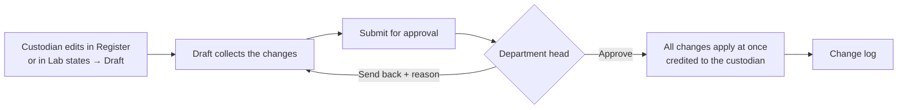
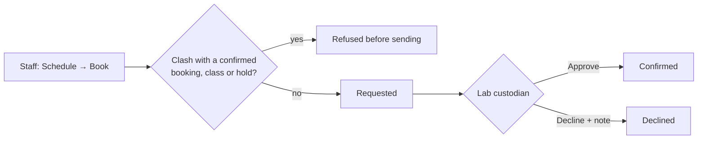

# Appendix

## Who approves what

| What | Raised by | Decided by, in order |
|---|---|---|
| A lab **Draft** (an update of the lab) | The lab's custodian | The lab's department head |
| A lab **Ideal** (what it should hold) | The lab's custodian | The lab's department head |
| A **need** | Any staff or custodian | Their department head: carry into a request, or decline |
| A **purchase request** | A department head | Dean → College Managing Director → AVP → Procurement Office (the head's own step is done by raising it) |
| An **import record** (what a purchase delivered) | Property Administration | — the store keeper loads it into the Main Store |
| A **handover** from the Main Store to a lab | The store keeper | Receiving head → Property Administration → receiving custodian accepts |
| An **issue** from the Main Store to a person | The store keeper | Their head → Property Administration → the person accepts (it lands in the department's Staff holdings) |
| A **request from the Main Store** | A custodian | Store keeper releases → your head → Property Administration → you confirm receipt |
| A **return to the Main Store** | A custodian (or a head, for Staff holdings) | Owning head → Property Administration → store keeper accepts |
| A **loan** from another unit | A custodian | Current custodian → their head → receiving head → you confirm receipt |
| A **permanent transfer** from another unit | A custodian | Current custodian → their head → receiving head → College Managing Director → *(another college only)* Property Administration → you confirm receipt |
| A **staff booking** of a lab or machine | Staff | The lab's custodian (a custodian's booking of their own lab is confirmed at once) |
| An **outside institution's request** (rooms, or a sample analysis) | The institution, signed in to the portal | AVP → deans → heads → custodians hold; heads answer (cost, contacts) → deans approve → AVP approves and quotes → requester pays → AVP confirms the payment |
| A **category** change | System admin or property admin | Applied after **Review changes** shows its consequences |

## The main flows

### Updating a lab (drafts department)

```mermaid
flowchart LR
  A[Custodian edits in Register<br/>or in Lab states → Draft] --> B[Draft collects the changes]
  B --> C[Submit for approval]
  C --> D{Department head}
  D -- Send back + reason --> B
  D -- Approve --> E[All changes apply at once<br/>credited to the custodian]
  E --> F[Change log]
```

### From a need to stock in the lab

```mermaid
flowchart LR
  N[Needs raised] --> H[Head compiles a request<br/>+ purchasables from Ideals]
  H --> DN[Dean] --> CMD[College Managing<br/>Director] --> AVP[AVP] --> P[Procurement]
  DN -. send back .-> H
  P --> O[Order placed on EGP → Buyer found<br/>→ On delivery → Arrived]
  O --> IR[Property Administration<br/>records the import]
  IR --> S[Store keeper loads it<br/>into the Main Store]
  S --> HO[Hand over to a lab<br/>or issue to a person]
  HO --> RH[Receiving head] --> PA[Property<br/>Administration] --> RC[Custodian accepts]
```

### Booking a lab

```mermaid
flowchart LR
  S[Staff: Schedule → Book] --> Q{Clash with a confirmed<br/>booking, class or hold?}
  Q -- yes --> X[Refused before sending]
  Q -- no --> R[Requested]
  R --> C{Lab custodian}
  C -- Approve --> OK[Confirmed]
  C -- Decline + note --> NO[Declined]
```

### An outside institution's request

```mermaid
flowchart LR
  R[Requester's account:<br/>request + letter] --> A[AVP → colleges]
  A --> DE[Dean → departments]
  DE --> HD[Head asks custodians]
  HD --> CU[Custodians hold<br/>rooms or a machine]
  CU --> HA[Head: cost + contacts]
  HA --> DA[Dean approves]
  DA --> AA[AVP approves, quotes]
  AA --> P[Requester pays<br/>verified with the bank]
  P --> C[AVP confirms payment:<br/>booked + contacts shown]
```

## Statuses and badges

**A resource's status**

| Status | Meaning |
|---|---|
| **Working** | In service |
| **Impaired** | A critical part isn't working (worked out automatically, never set by hand) |
| **Broken** | Doesn't work |
| **Maintenance** | Away for repair or servicing |
| **Lost** | Can't be found |
| **Consumed** | Used up (chemicals, supplies) |

**Markers in the register**

| Marker | Meaning |
|---|---|
| `*` | A change to this item is waiting in its lab's Draft (hover to see it) |
| `⇄` / *⇄ 5 promised* | In a pending handover or transfer; it can't be promised twice |
| **CRITICAL** (in an item's details) | This part impairs its container when it fails |

**A lab in Lab states**

| Badge | Meaning |
|---|---|
| **draft · N** | A draft with N changes is being prepared |
| **draft submitted** | Waiting for the head |
| **ideal submitted** | An Ideal proposal is waiting for the head |
| **ideal set** / **no ideal** | Whether the lab has an approved Ideal |

**A purchase request**

| Stage | Meaning |
|---|---|
| **Awaiting approval** | In the chain; the card says who it's waiting on |
| **Sent back for revision** | Back with the head, with the approver's note |
| **Order placed on EGP → Buyer found → On delivery → Arrived at the main store** | Procurement's stages |
| **Registered and closed** | Everything loaded into the store from its import record(s) |
| **Rejected / Withdrawn** | Stopped; carried needs reopen |

## Common messages, explained

| You see | Why | What to do |
|---|---|---|
| **"Staged in … 's draft"** | Your department uses drafts: the head approves changes first | Submit the draft from **Lab states → Draft** |
| **"… uses draft mode — custody, ownership and moves out of a lab go through a transfer"** | Those changes can't be staged | Use a transfer or handover instead |
| **"Couldn't be applied … changed in the register since this draft was copied"** (stale) | Someone changed an item after your draft was copied | **Refresh from Current**, redo your change, submit again |
| **"Already taken …"** when booking | A confirmed booking, class or hold covers that time | Pick another time |
| **"Only N pcs of … are left to load"** | You tried to load more than the import record says arrived | Enter the remaining quantity, or ask Property Administration to correct the record |
| **"That area isn't part of your role"** | The screen belongs to another role | Ask your head or the administrator if you need access |
| **"This person hasn't registered yet — send their invite link instead"** | Sign-in help for someone who never set a password | Use **Copy invite link** |
| Forgot password sent an **invitation**, not a reset | The account was never set up | Open the invitation and set your password |
