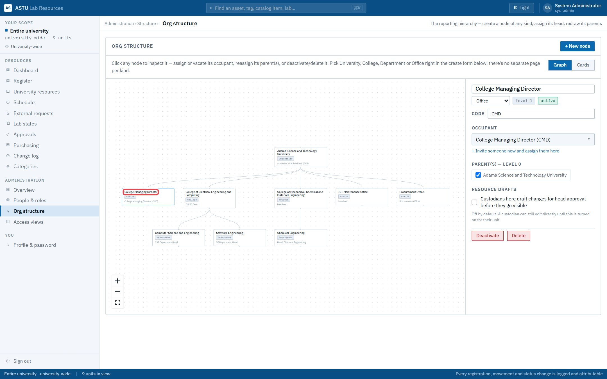
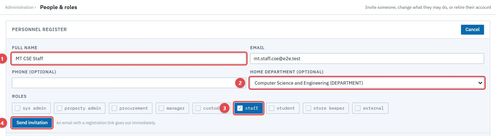
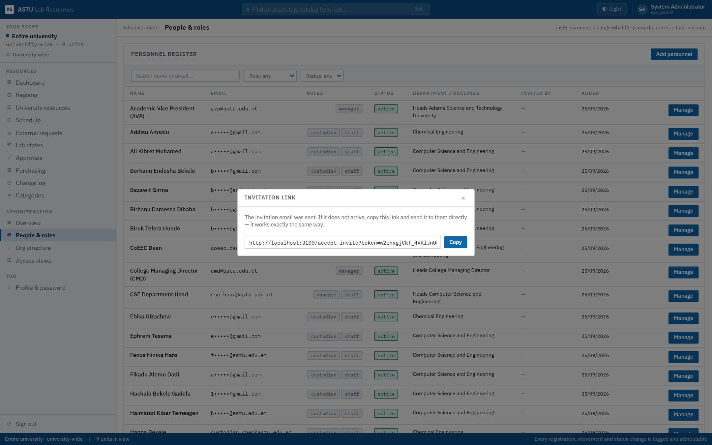
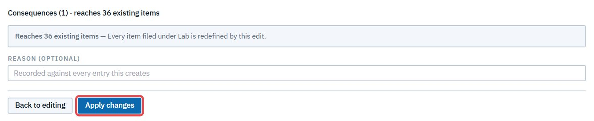
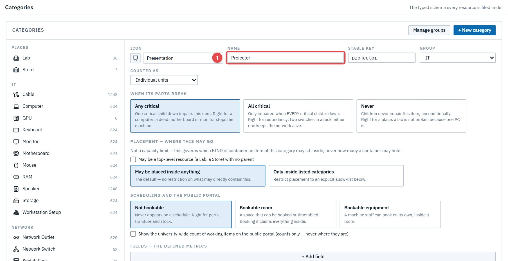

# Act 1 · System admin sets the stage

**Sign in as** `admin@astu.edu.et`. The admin prepares what the rest of the story needs. Nobody else can do these steps.

## 1. The College Managing Director office

Open **Administration → Org structure** and click **College Managing Director** (1).

It's an **Office** beside Procurement, with code **CMD** and its occupant. Purchase requests pass through it after the AVP and before Procurement. Keep the code `CMD` if you rename the office. If the post is vacant, requests wait at its step; if it's deactivated, requests skip it.

## 2. Invite the lecturer

Open **People & roles → Add personnel**. Fill in the name (1) and email, pick **Computer Science and Engineering** as the home department (2), tick **staff** (3), and **Send invitation** (4).

The invitation is emailed. A copyable link is also shown, in case the email doesn't arrive.

**Before Act 3:** as the lecturer, open the invitation (on the demo copy, the newest file in `e2e/mail/`), follow the link and choose a password.

## 3. Make labs bookable

Open **Categories**, choose **Lab**, and under *Scheduling and the public portal* pick **Bookable room** (1). Tick **Show the university-wide count…** (2) so outside institutions see that labs exist.

**Review changes** shows what the change affects. Then **Apply changes**.

Do the same for **Computer**, as **Bookable equipment**, so single machines can be booked too.

## 4. A category for the projector

The lab will order a projector, and the store has to register it under a category. **+ New category**: name it **Projector** (1), pick an icon by typing "projector", put it in the **IT** group, and **Create category** (2).

> **Good to know**
> - Every one of these changes is logged. Act 13 shows them in the Change log.
> - Categories are shared vocabulary. Changing one affects every resource filed under it, which is why the editor shows the consequences before it applies anything.
