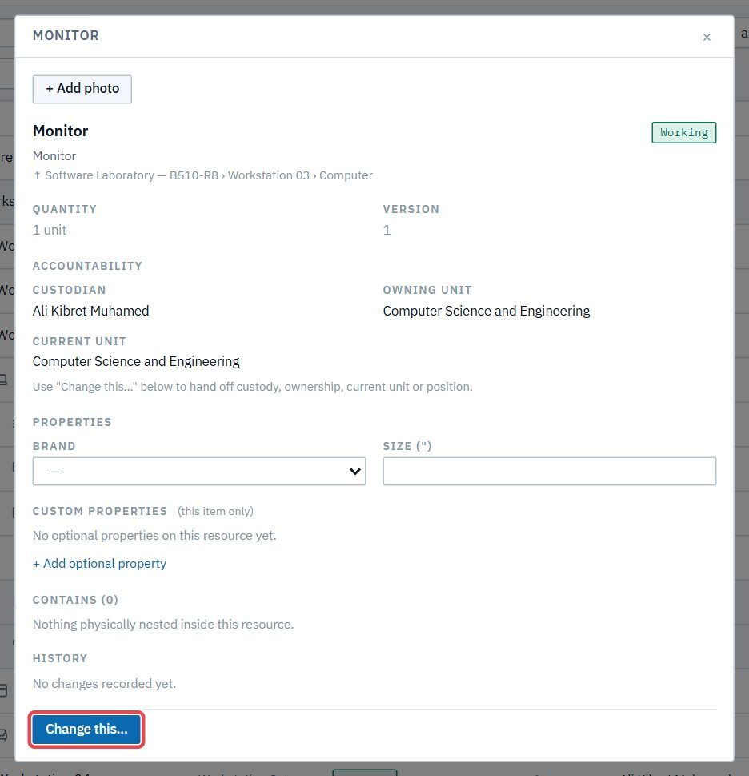
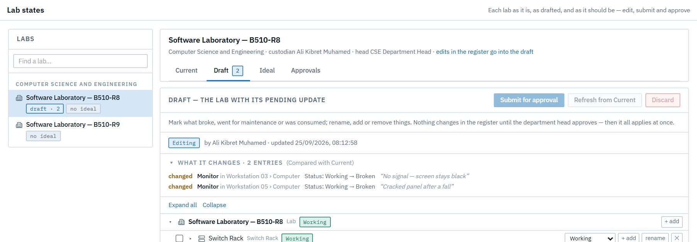

# Act 2 · The custodian updates the lab and plans it

**Sign in as** Ali Kibret Muhamed, custodian of *Software Laboratory — B510-R8*. CSE uses **drafts**: a custodian's edits wait in the lab's draft until the head approves them, so the register never shows an unapproved change.

## 1. Two monitors have failed

In **Register**, open B510-R8 → Workstation Setup → **Workstation 03** → Computer, and click its **Monitor**. Then **Change this…** (1).

Set **New status** to *Broken* (1), give the reason (2), and press **Stage in the lab's draft** (3). The dialog says CSE uses drafts.

The item says where the change went:

Do the same for the monitor in **Workstation 05**, with the reason "Cracked panel after a fall".

## 2. Review the draft and submit it

Open **Lab states** → **Draft**. *What it changes* lists both monitors, each with where it sits and the reason given.

Press **Submit for approval** (1). The draft now waits for the head.

## 3. Propose the lab's ideal

The lab has 20 workstations and should have 25. On **Lab states → Ideal → Proposal**, press **Start a proposal** (a copy of the lab as it is), then **+ add** at the lab's top level. Choose **Workstation Setup**, name it *Workstation*, count **5**, then **Preview…** and **Apply**.

The table compares the proposal with the lab as it is: five workstations short (1), and with them five of every part a workstation carries.

Press **Submit for approval**.

> **Good to know**
> - **Emails:** the CSE head is emailed twice ("a draft is waiting…", "an ideal proposal is waiting…").
> - Nothing changed in the register yet. Other people still see both monitors as *Working* until the head approves.
> - The ideal is what purchasing measures the lab against; it never changes the register itself.
