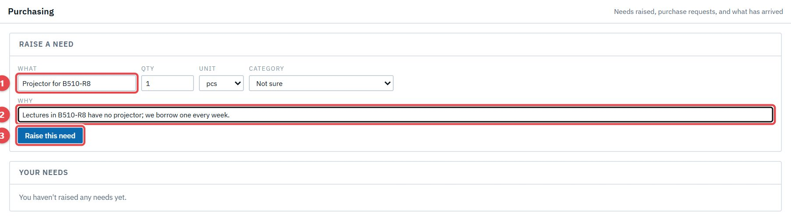
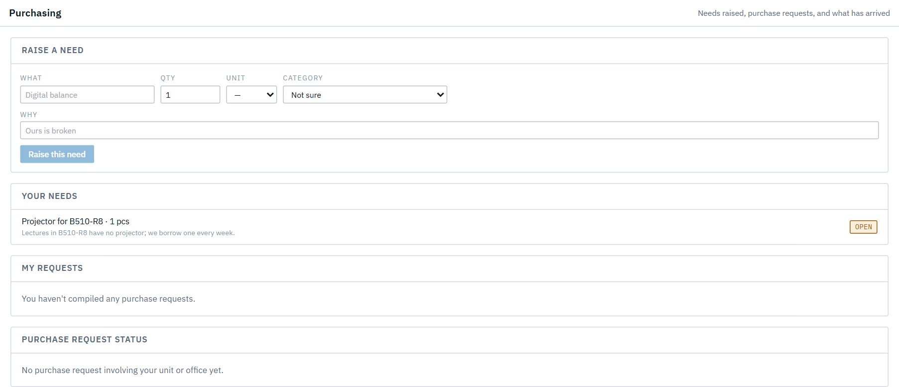
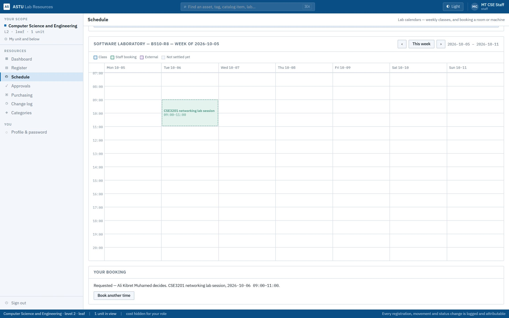

# Act 3 · A lecturer asks for things

**Sign in as** MT CSE Staff, the lecturer invited in Act 1. Staff can't edit resources, but they can ask for what they need.

## 1. Raise a need

Open **Purchasing**. Under *Raise a need*: **What** is "Projector for B510-R8" (1), quantity 1, and **Why** (2): lectures have no projector. Press **Raise this need** (3).

The need is now **open**, waiting for the head to carry it into a purchase request or decline it.

## 2. Ask to book the lab

Open **Schedule → Book**, search **B510-R8** and pick the lab. Choose **The whole room** (1), the date (2): 6 October 2026, 09:00–11:00. Add what it's for and the number of people. The form says who decides (3). Press **Request booking** (4).

> **Good to know**
> - **Emails:** the lab's custodian is emailed about the booking request, but Ali's emails are off (see Before you start), so it waits in his **Approvals** without an email.
> - A clash with anything already booked is shown *before* you ask, so you can pick another time.
