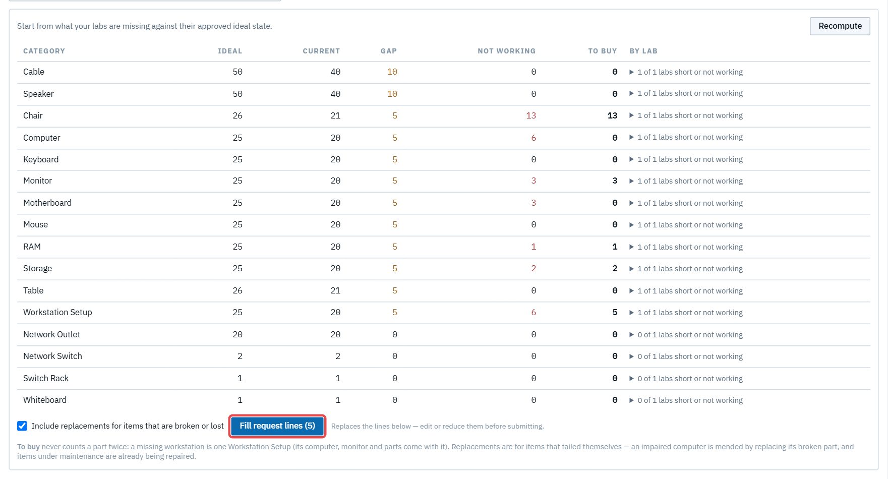
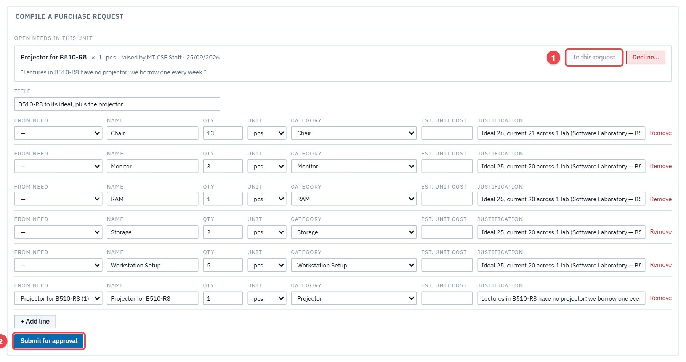

# Act 4 · The department head approves and compiles

**Sign in as** `cse.head@astu.edu.et`. The head decides the custodian's draft and ideal, then turns the lab's shortfall and the lecturer's need into one purchase request.

## 1. Approve the draft

Open **Approvals → Lab commits**. The card lists every change, with where it is and the custodian's reason. Press **Approve** (1), then confirm.

## 2. Approve the ideal

The ideal proposal is the next card: five more workstations. **Approve** (1), then confirm.

On **Lab states**, the monitors are now *Broken* in Current, and the lab has an approved Ideal.

## 3. Compile the purchase request

Open **Purchasing → Compile a purchase request**. Give it a title and press **Compute from labs' ideal vs current**. The table shows what the lab is short of, and **To buy** shows what *Fill request lines* will order: 5 Workstation Setups (each brings its own computer, monitor and parts), plus replacements for what is broken or lost.

Press **Fill request lines**. Under **Open needs in this unit**, the lecturer's projector: press **Add to request**. It turns to *In this request* (1). On its line, set **Category** to *Projector*, so the store can register it when it arrives. Then **Submit for approval** (2).

The request gets its reference, **PR-2026-001**, and starts its chain: dean → AVP → College Managing Director → Procurement Office. The head's own step is done by raising it.

> **Good to know**
> - **Emails:** Ali's are off, so he gets none for the two decisions. The **dean** is emailed "PR-2026-001 is waiting for your approval".
> - A head can also **Decline…** a need, with a reason the person who raised it sees and is emailed.
> - Nothing is bought yet. The request now climbs the approval chain.
