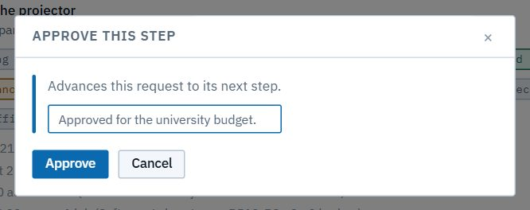

# Acts 6–7 · The AVP, then the College Managing Director

The same card, the same three buttons. Each approver only sees **Approve** when it's their turn.

## Act 6 · AVP

**Sign in as** `avp@astu.edu.et`. Open **Approvals → Purchasing**. The dean's step is done (green), and the AVP's is highlighted. Press **Approve** (1).

Add a note for the record, and confirm.

## Act 7 · College Managing Director

**Sign in as** `cmd@astu.edu.et`. The CMD's step is the last approval before Procurement. The card shows the costs the head added and the history so far. Press **Approve** (1).

> **Good to know**
> - **Emails:** the AVP's approval emails the CMD; the CMD's emails the Procurement officer.
> - Before the CMD's turn, the CMD can see the request but can't decide it. The same goes for Procurement before its turn.
