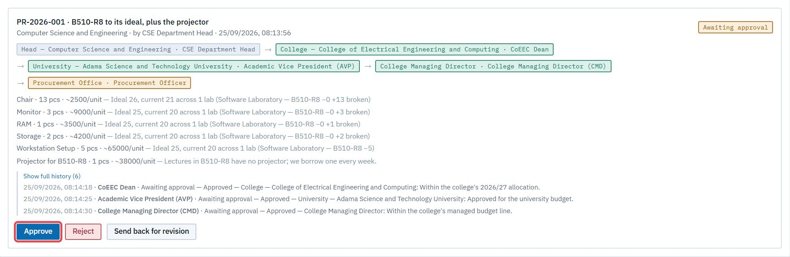

# Act 8 · Procurement approves and runs the order

**Sign in as** `procurement@astu.edu.et`. Procurement gives the last approval, then records the order's progress. Those later steps are reports, not decisions.

## 1. The final approval

Open **Approvals → Purchasing**. **Approve** (1), with a note.

The request is now **Order placed on EGP**.

## 2. Move the order along

Open **Purchasing → Pipeline**. Each **Advance** (1) records the next stage: *Buyer found* → *On delivery* → *Arrived at the main store*.

Add a note each time (the supplier, the delivery date), then **Advance**.

> **Good to know**
> - **Emails:** the head is emailed "PR-2026-001 is approved", then at every stage. At *Arrived at the main store*, the **store keeper** is emailed to receive it.
> - Only procurement can cancel a request once it's placed, and it needs a note. Any needs carried into it reopen.
