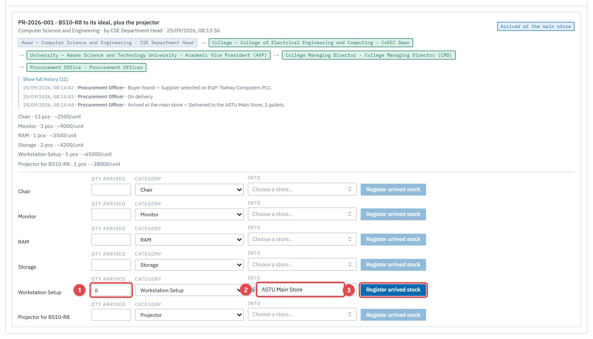
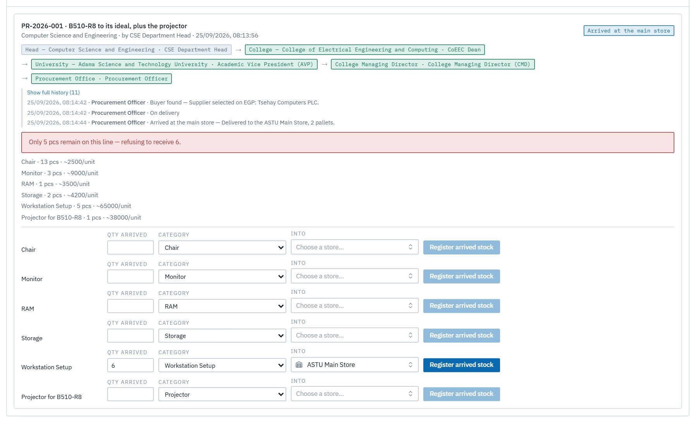
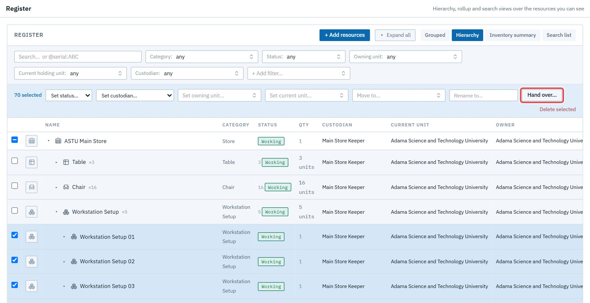
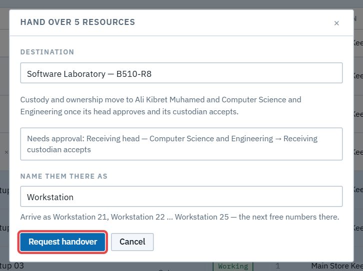
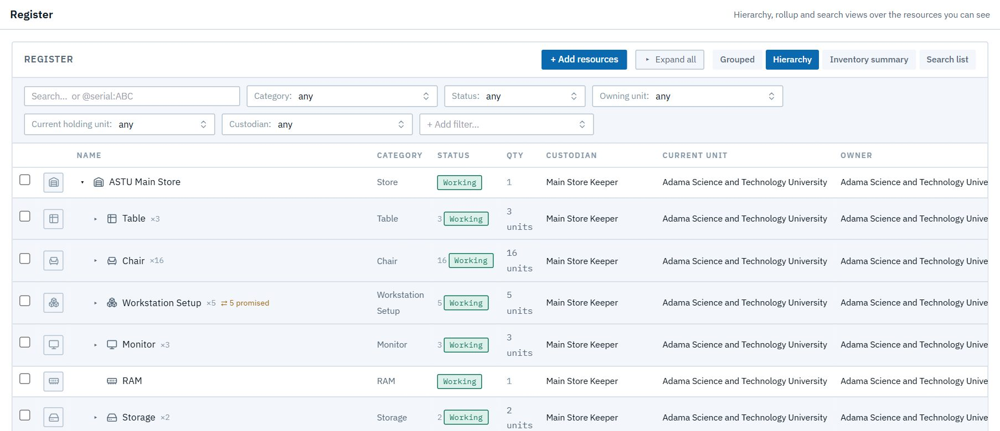

# Act 9 · The store keeper receives and hands over

**Sign in as** `store.keeper@astu.edu.et`. What arrives is registered into the **ASTU Main Store** first, then handed over to the lab that asked for it.

## 1. Receive the delivery

Open **Purchasing → Receive**. For each line, enter the quantity that arrived (1), choose **ASTU Main Store** under *Into* (2), and press **Register arrived stock** (3).

Try entering **6** for the 5 Workstation Setups. It's refused, because only 5 were ordered:

Enter 5, then receive every other line (chairs, monitors, RAM, storage, the projector). Deliveries can come in parts; each receipt adds up. When every line is in, the request closes by itself.

## 2. Hand over to B510-R8

Open **Register**, expand **ASTU Main Store** and its 5 new Workstation Setups, tick them all, and press **Hand over** (1).

Search **B510-R8** and pick **Software Laboratory — B510-R8** (not "Projector for B510-R8", which also matches). Because they're one kind of thing, LRMS offers to name them after the lab's own: **Workstation 21 … 25**. Press **Request handover** (1).

Then hand over the **projector** the same way, on its own.

In the store, items promised to a lab show ⇄ until the lab accepts them. Nobody can promise them twice.

> **Good to know**
> - **Emails:** the head is emailed "PR-2026-001 is in the store"; each handover emails the **CSE head** ("A transfer is waiting for you").
> - The replacement chairs, monitors, RAM and storage stay in the Main Store until the lab asks for them. Hand them over the same way when they're needed.
