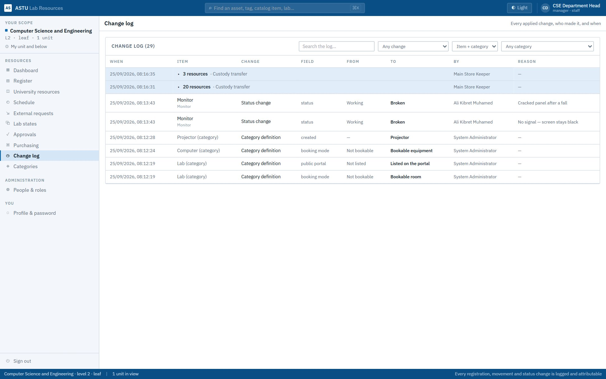
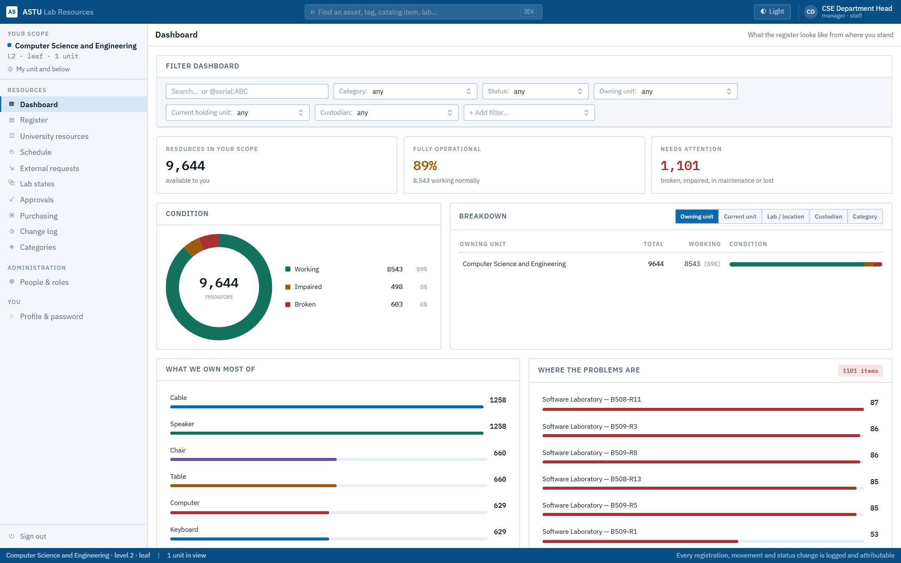
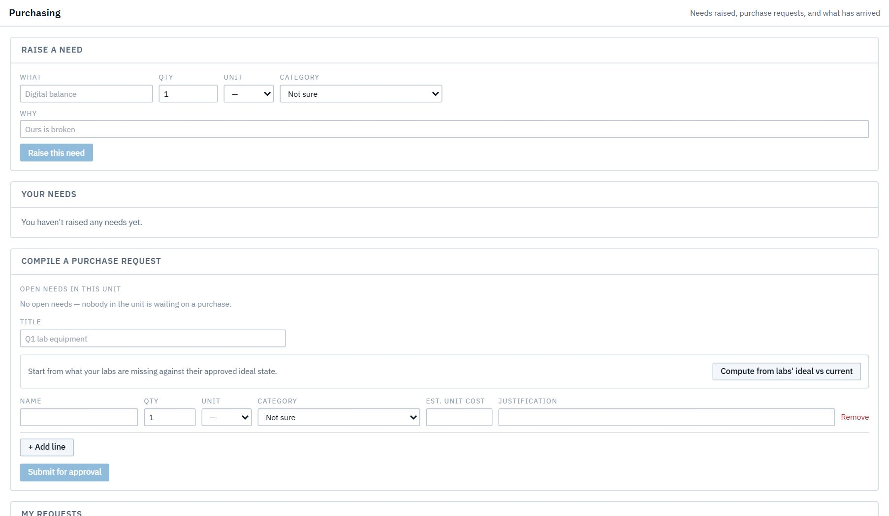

# Act 13 · The record

Everything in the story left a trace, and every entry names who made the change and when.

## 1. Change log (sign in as the CSE head)

**Change log** lists every applied change: the admin's category changes, Ali's two monitors (with his reasons, carried from the draft), and the handover into the lab.

## 2. Dashboard

**Dashboard** shows the department after the cycle: how many resources, which need attention, and where.

## 3. The order's history (sign in as procurement)

**Purchasing** keeps PR-2026-001's full history: the submission, the dean's send-back and its note, every approval, every pipeline stage, and the receipt.

> **Good to know**
> - Nothing in the Change log can be edited or deleted. A correction is itself a new, logged change.
> - To repeat the demo from the start, run `node e2e/reset-demo.mjs` again ([Before you start](README.md)).
