# Accounts and access

## A1. Join by invitation

**As** someone new to a department, **I want** to be invited and set my own password, **so that** I can sign in without anyone else knowing it.

**Flow:** Admin (anyone) or Head (their own department) invites → ✉ invitation → the person opens the link and sets a password → signed in.

1. The admin (or head) opens **People & roles → Add personnel**: name, email, home department, roles, then **Send invitation**.

   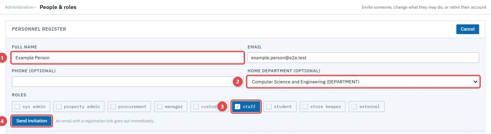

2. The invitation is emailed, and a copyable link is shown in case the email doesn't arrive.

   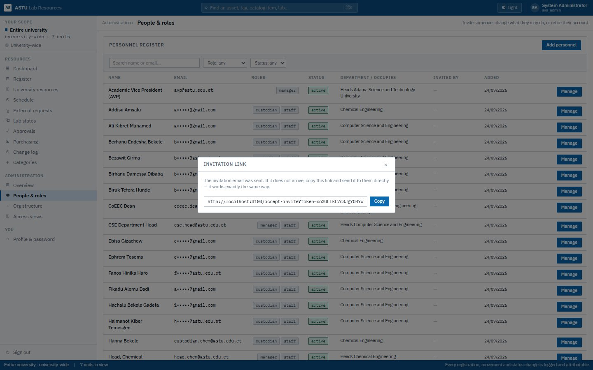

3. The person opens the link, chooses a password, and is signed in.

   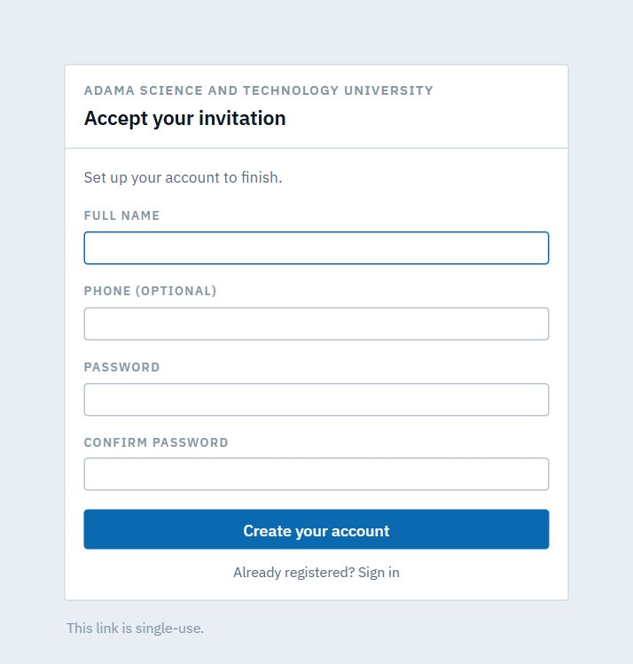

## A2. Sign in and find your way

**As** anyone with an account, **I want** one screen that shows my scope and my menu, **so that** I only see what my job needs.

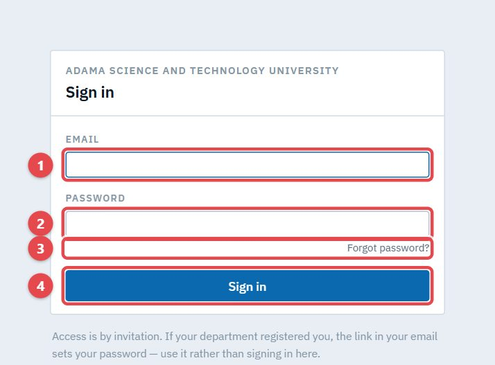

The menu, the scope panel (what you can see) and the status bar all follow your role and your access view.

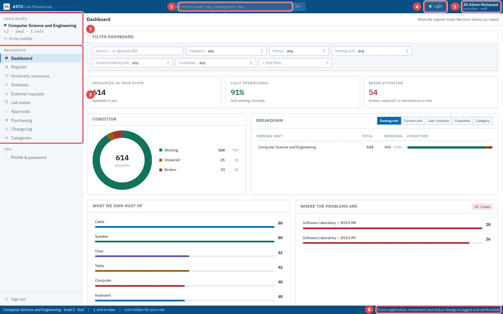

## A3. Reset a forgotten password

**As** someone who forgot their password, **I want** a reset link by email, **so that** I can get back in without calling anyone.

**Flow:** Person → ✉ reset link (expires in 2 hours) → person chooses a new password.

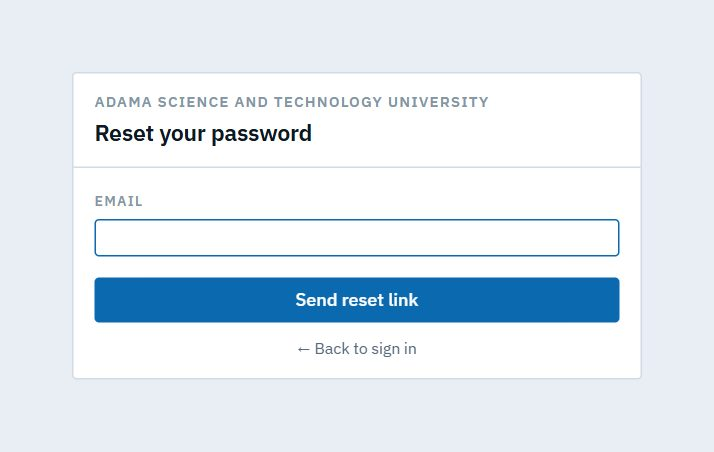

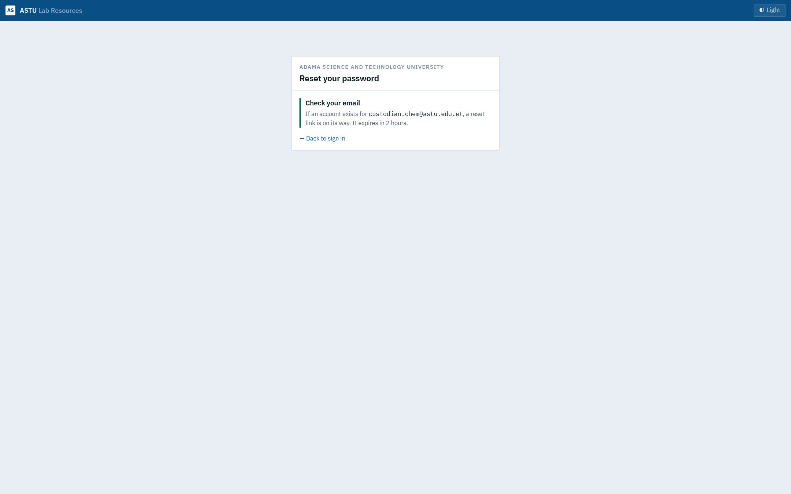

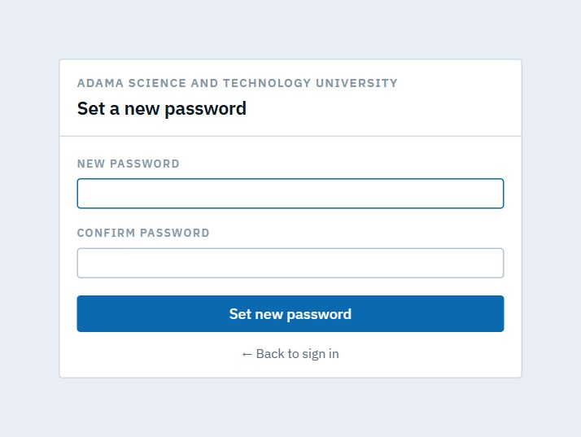

## A4. Get someone back in

**As** an admin, or a head for my staff, **I want** to set a temporary password, **so that** someone locked out can sign in today. **As** that person, I must then choose my own.

**Flow:** Admin/Head → **Manage → Set temporary password** (shown once) → person signs in → forced to choose a new password.

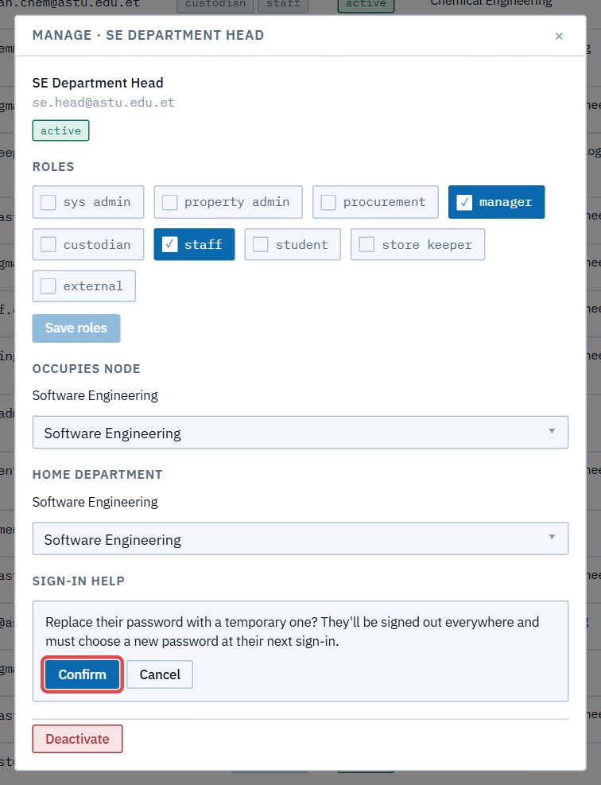

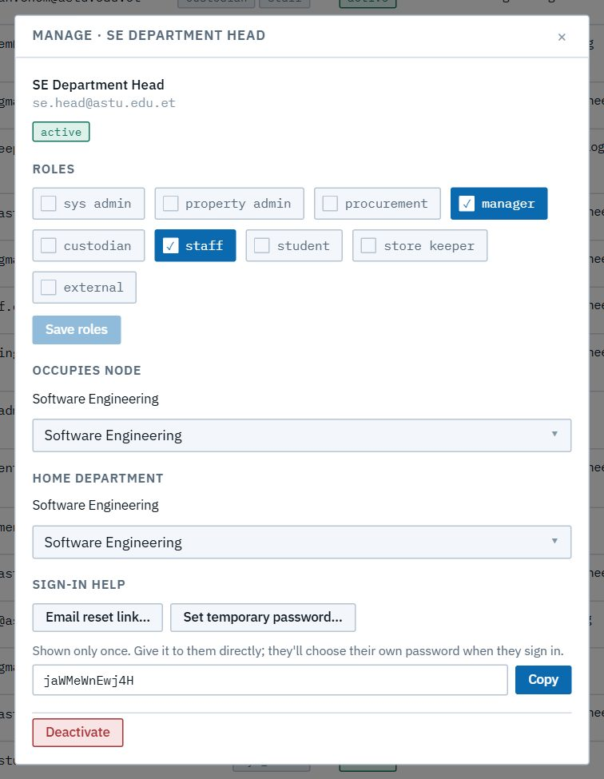

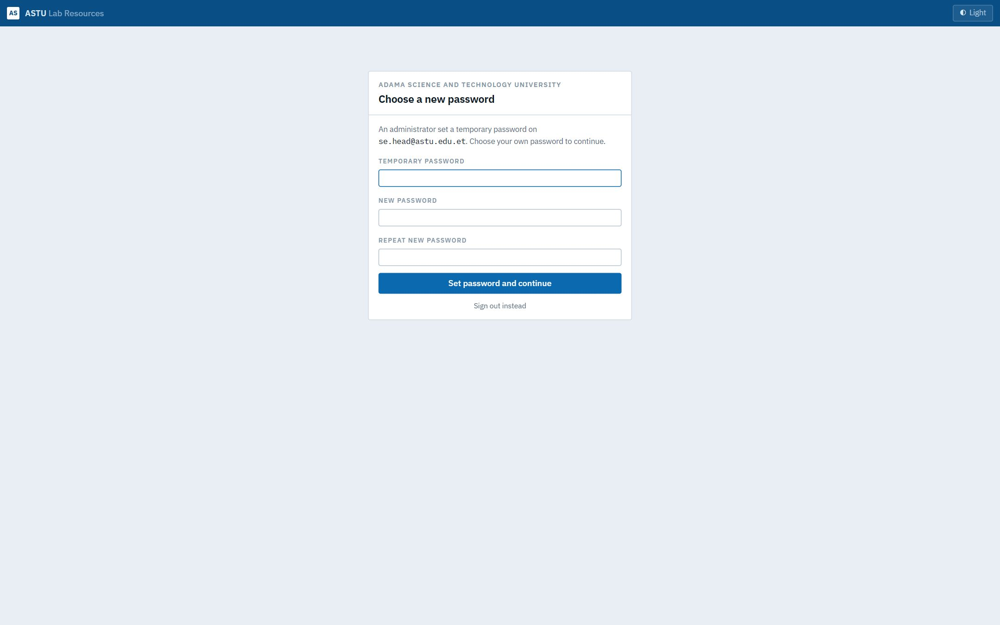

## A5. Search from anywhere

**As** anyone with the Register, **I want** to type a name, tag or `@key:value` in the top bar (Ctrl/⌘+K), **so that** I land on the matching resources from any screen.

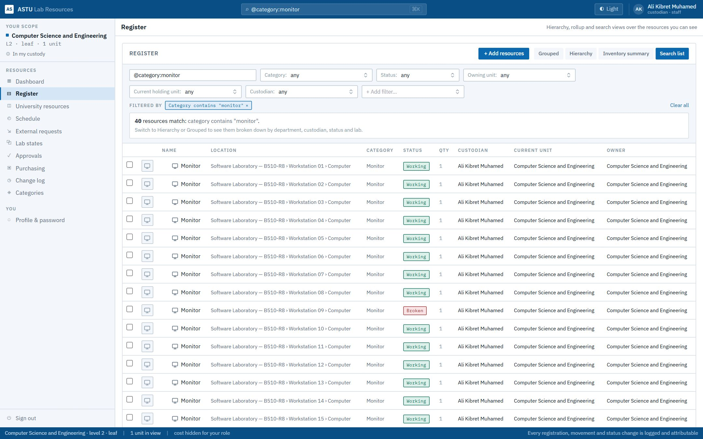

## A6. Choose which emails reach you

**As** anyone, **I want** to turn notification emails on or off, **so that** I'm told about what needs me, or not, as I prefer. **As** an admin, or a head for my staff, I can switch it for them. The CSE ARAs start with it off.

**Flow:** Person → **Profile → Email notifications**; or Admin/Head → **People & roles → Manage → Email notifications**. Invitations and password resets always arrive.

The full list of emails, and who gets each, is in the user guide's *Getting started §8*.

## A7. See only what your role allows

**As** a student, **I want** to see only what concerns me, **so that** the tools I can't use don't get in my way. Screens outside a role show a clear message, not an error.

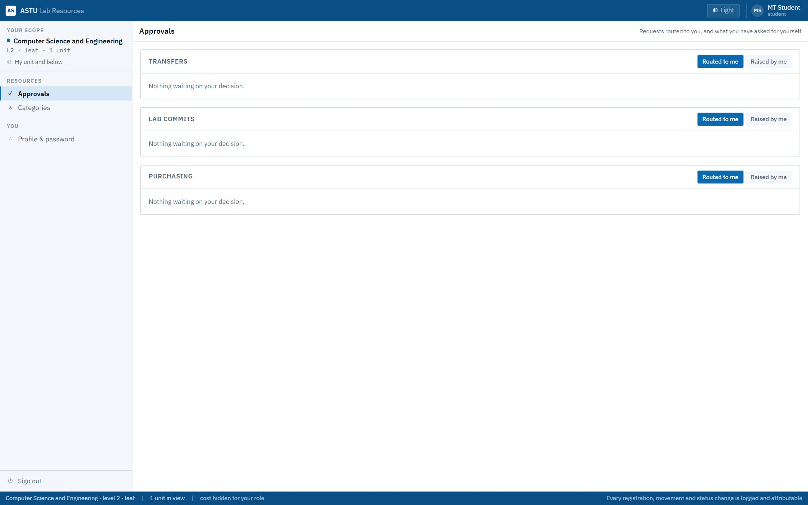

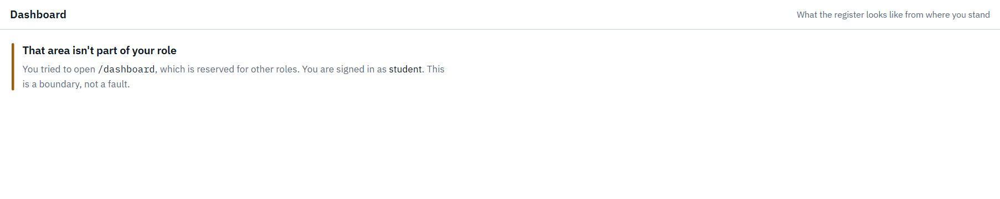
