# The register

## B1. See the condition at a glance

**As** a custodian, head, dean, AVP or ICT officer, **I want** a dashboard of what I'm responsible for, **so that** I see what's working, what needs attention and where.

The same dashboard adapts to each person's scope: a custodian's labs, a head's department, the whole university for the AVP.

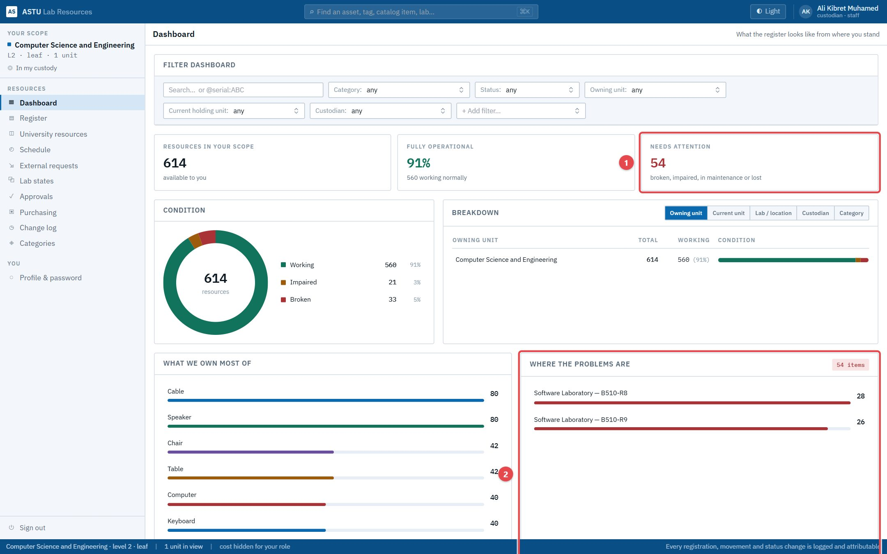

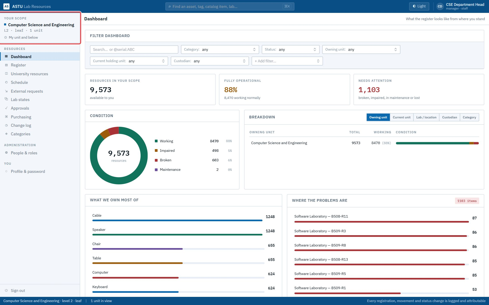

## B2. Browse a lab and inspect an item

**As** anyone with the Register, **I want** to open a lab and drill into any item, **so that** I know what's there, its status, custody and history.

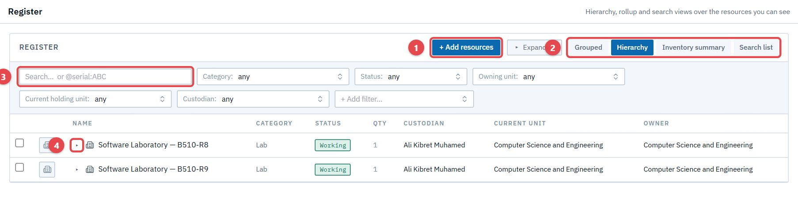

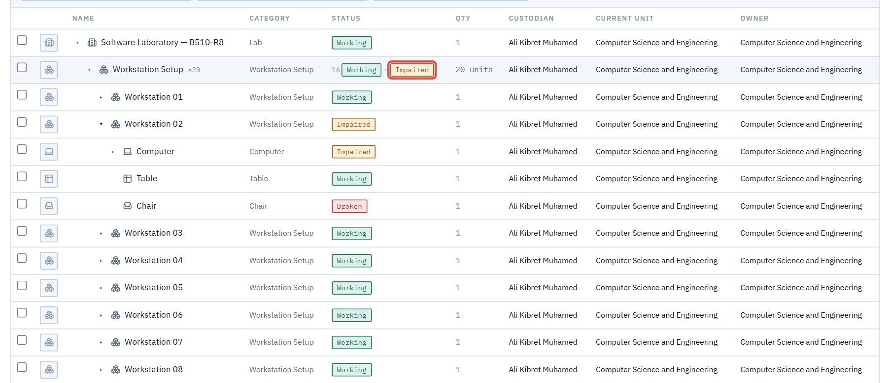

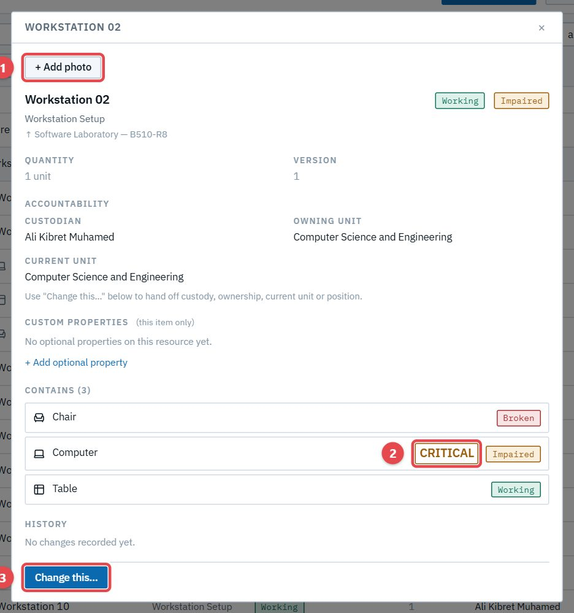

Heads and staff see the same register, but read-only. Only custodians (and the admin) change resources.

## B3. Find exactly what you need

**As** anyone with the Register, **I want** filters, field search and summaries, **so that** questions like "how many impaired computers, and where?" take seconds.

Each filter is a removable chip, and a sentence says what matches:

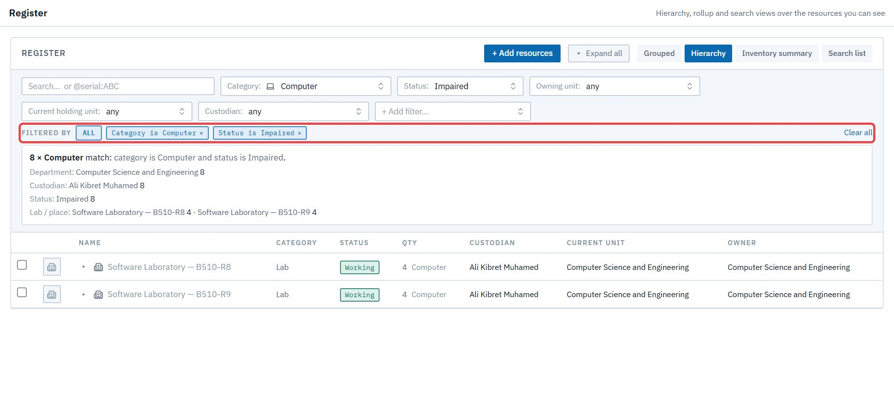

`@key:value` searches a field (`@hazard:Flammable`, `@category:monitor`), with suggestions as you type:

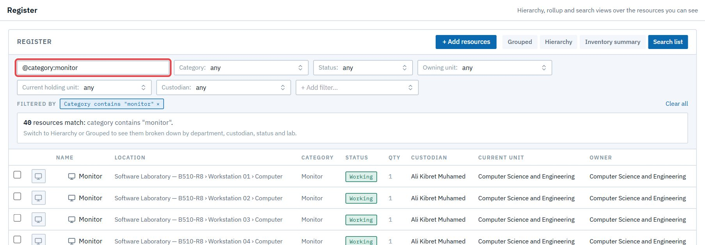

The inventory summary counts everything by category:

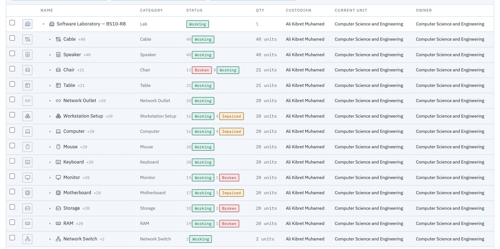

## B4. Report that something broke, or was mended

**As** a custodian in a **direct-mode** department (Chemical Engineering), **I want** to set an item's status with a reason, **so that** the register is true today. In a drafts department (CSE), the same action goes into the lab's draft instead; see [C1](s03-lab-states.md#c1-update-a-lab-through-its-draft).

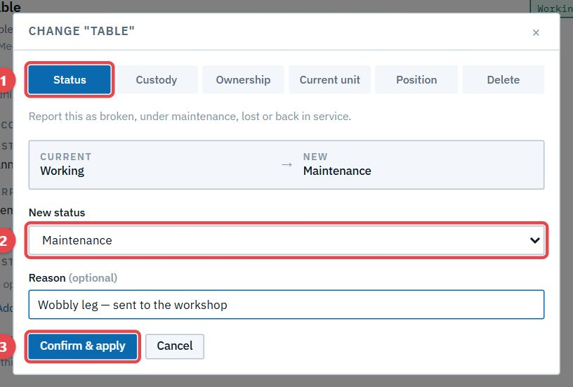

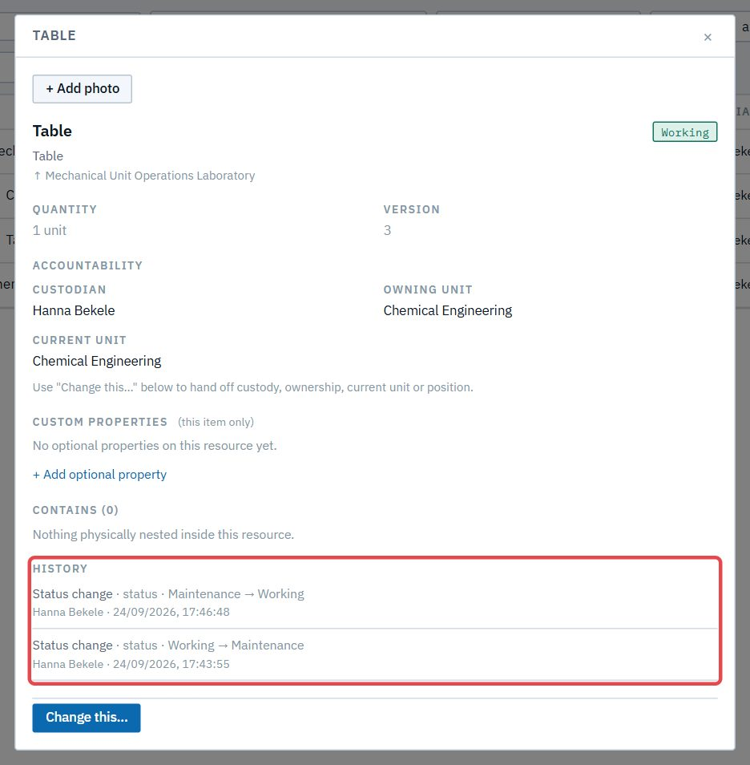

## B5. Record new resources

**As** a custodian, **I want** to add resources by category and count, with numbering previewed, **so that** new equipment is registered consistently.

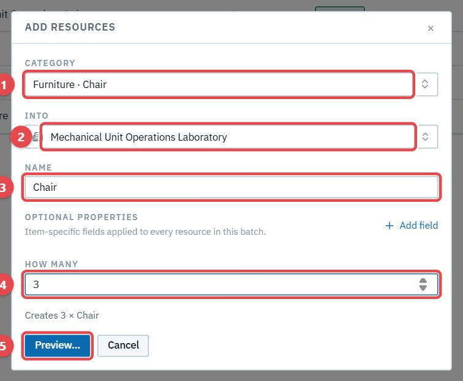

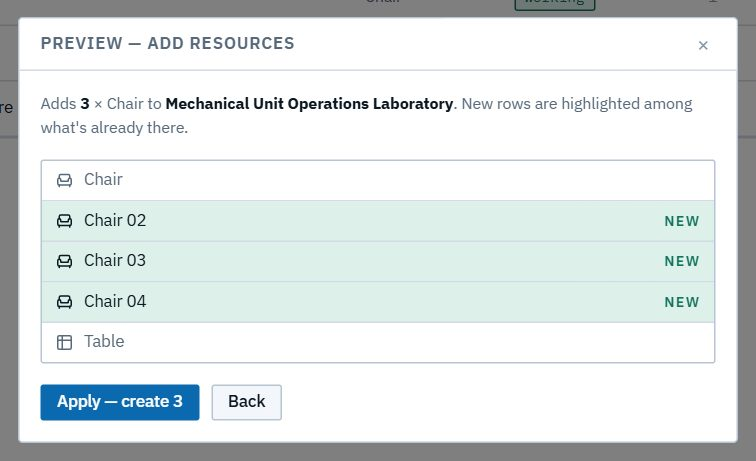

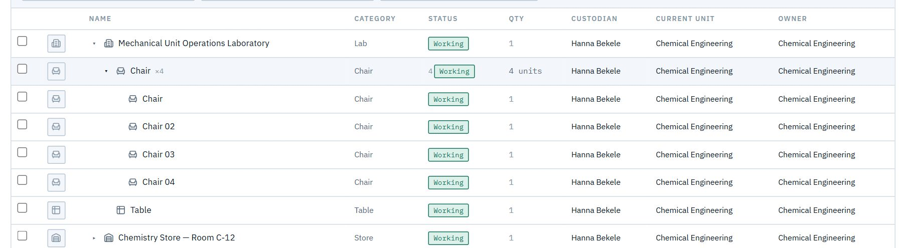

## B6. Change many at once

**As** a custodian, **I want** to tick several items and change them together, **so that** a room's worth of chairs is one action. The confirmation names the change and the count.

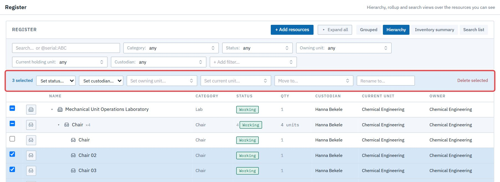

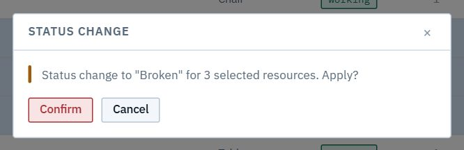

## B7. See who changed what

**As** a head, admin or custodian, **I want** every applied change listed with who, when and why, **so that** the register is accountable. Changes approved from a draft are credited to the custodian who made them, with their reason.

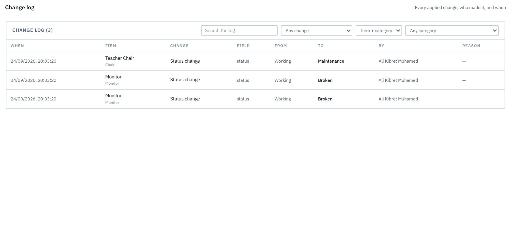

