# Lab states: drafts and ideals

Each lab has three states side by side on **Lab states**: **Current** (the register), **Draft** (changes waiting for the head) and **Ideal** (what the lab should hold).

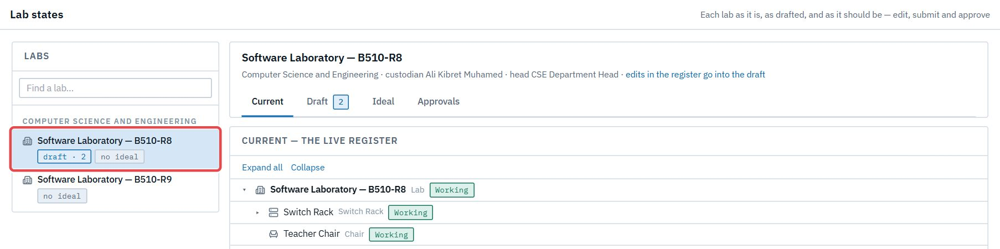

## C1. Update a lab through its draft

**As** a custodian in a drafts department, **I want** my changes collected in the lab's draft and approved together, **so that** the register only ever shows approved changes. **As** the head, I want to see each change with its reason before it goes live.

**Flow:** Cust. stages changes (from the Register, or by editing the draft) → submits ✉ Head → Head approves ✉ Cust. → changes apply to the register, credited to the custodian.

1. Change an item as usual. In CSE the dialog says the change is staged, and the item shows where it went.

   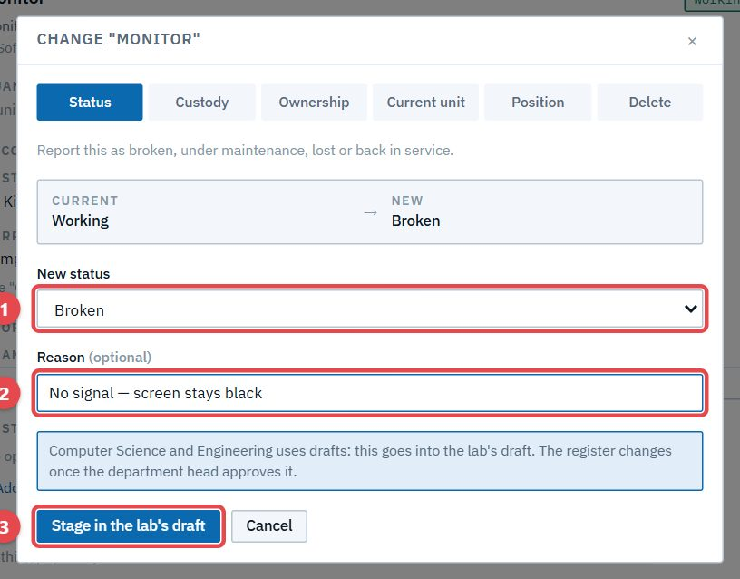

   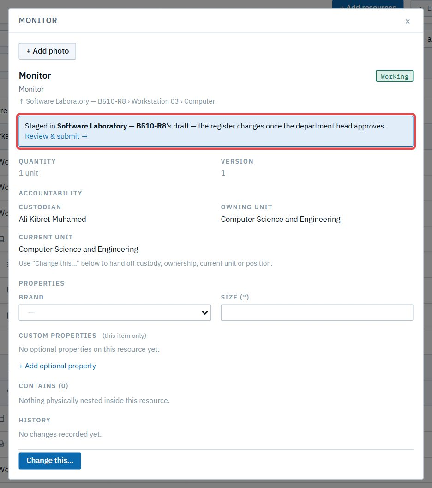

2. Or edit the draft's tree directly: statuses, names, additions, removals.

   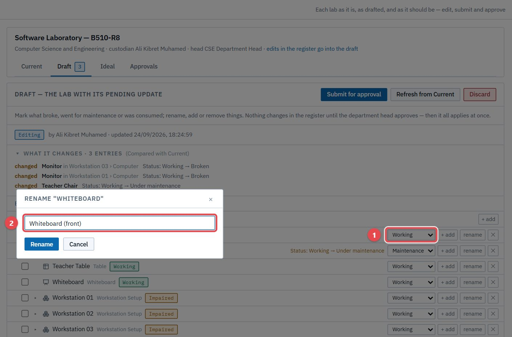

3. *What it changes* lists every entry, where it sits and its reason. Then **Submit for approval**.

   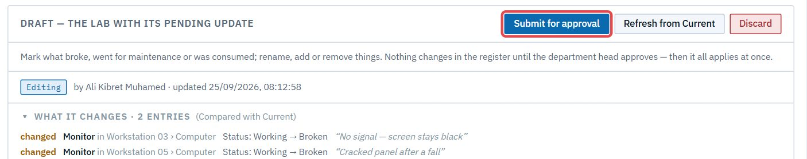

4. The head approves from **Approvals → Lab commits**.

   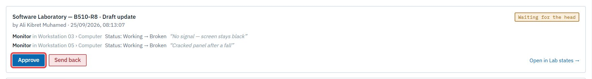

5. The changes are applied, and the lab's badges show it.

   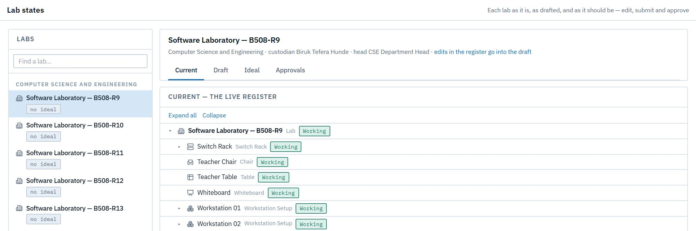

## C2. Send a draft back

**As** a head, **I want** to return a draft with a reason, **so that** the custodian fixes it before it goes live.

**Flow:** Head sends back ✉ Cust. → Cust. revises and resubmits ✉ Head → Head approves.

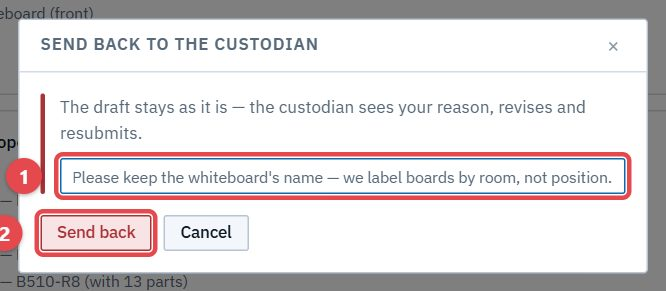

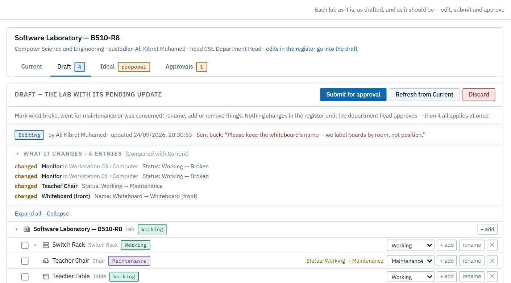

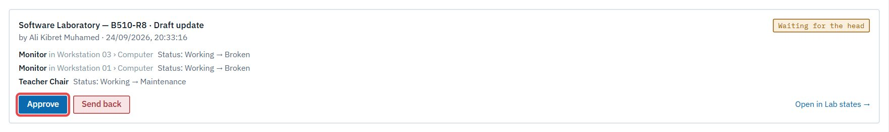

## C3. Set what a lab should hold

**As** a custodian, **I want** to propose my lab's ideal contents, **so that** purchasing knows exactly what the lab is short of. **As** the head, I approve it.

**Flow:** Cust. starts a proposal (a copy of the lab), adds or removes → submits ✉ Head → Head approves ✉ Cust. → it becomes the lab's Ideal, which purchasing measures against.

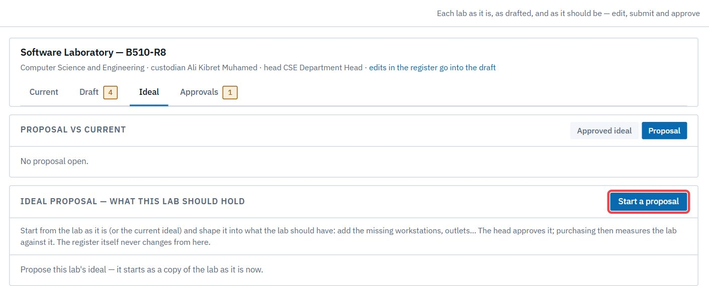

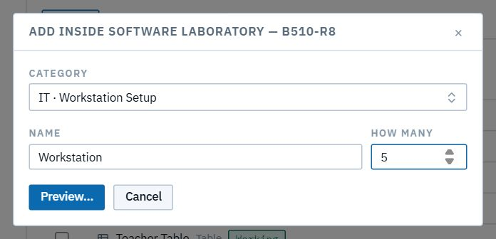

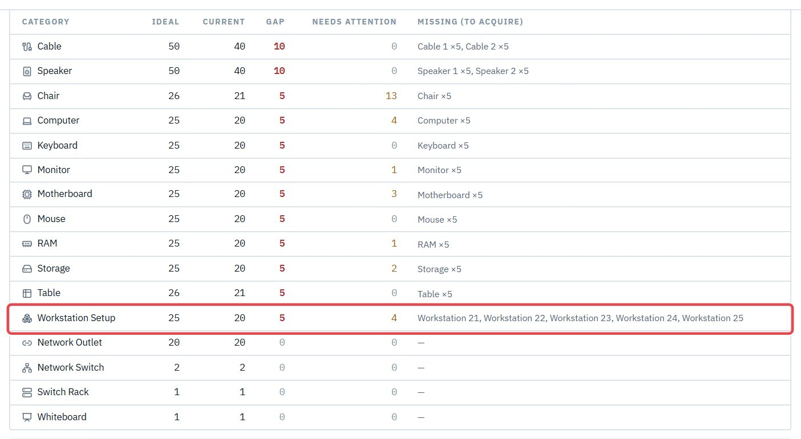

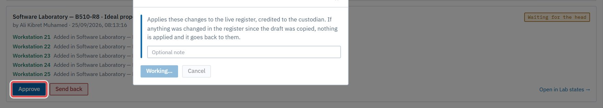

Once new stock arrives and is accepted, the gap closes and nothing is left *Missing*:

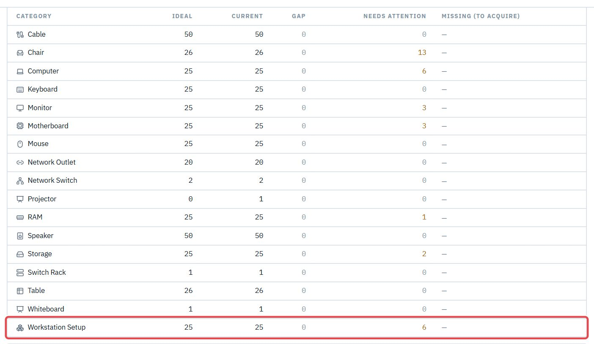
