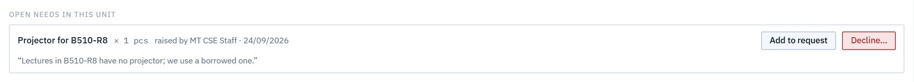
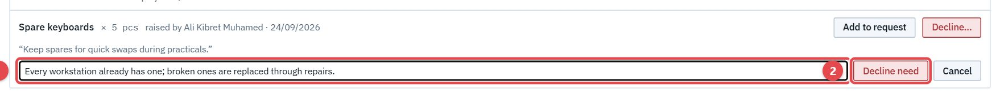
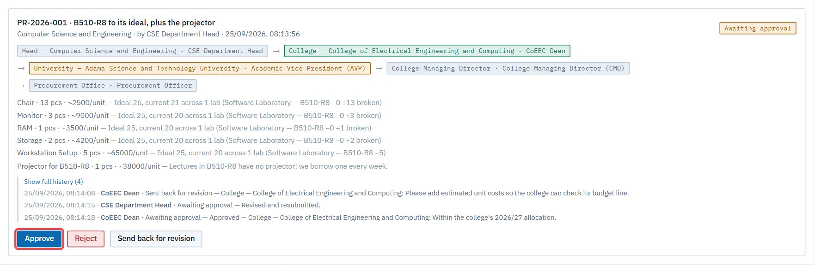
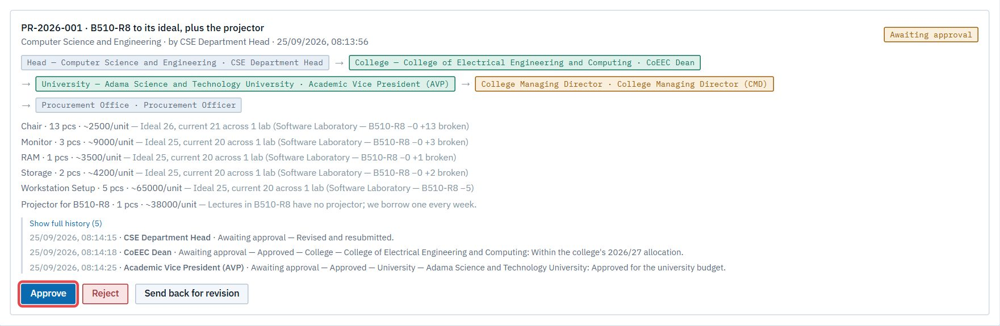
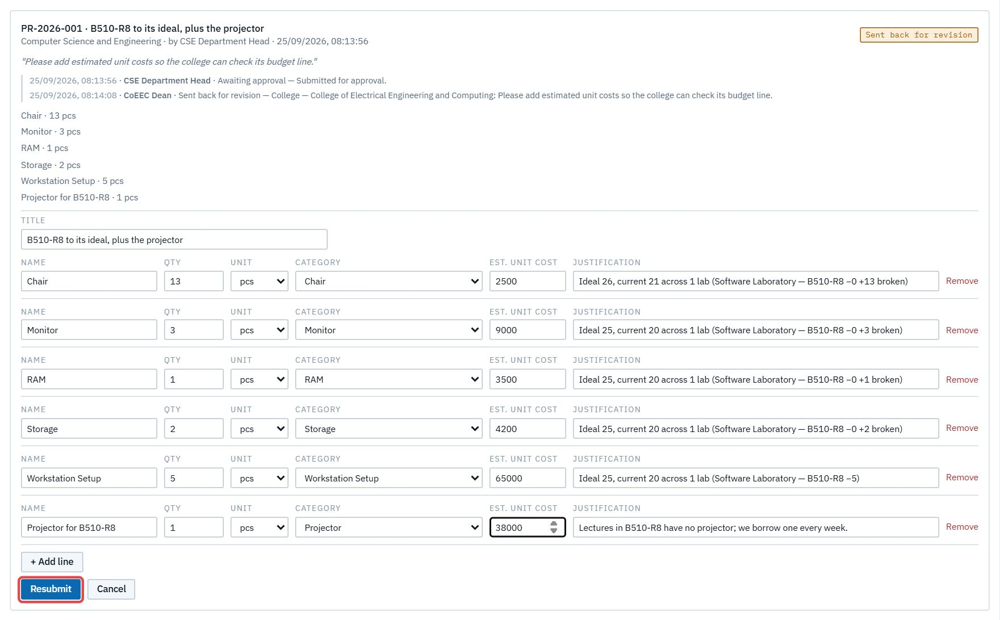
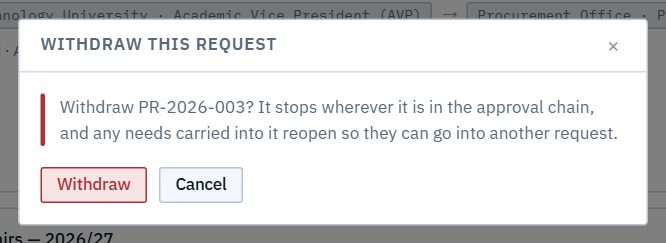

# Purchasing

The chain every purchase request climbs: **Head → Dean → AVP → College Managing Director → Procurement Office**, then procurement's pipeline: **Order placed on EGP → Buyer found → On delivery → Arrived at the main store → Registered and closed**.

## D1. Ask for something to be bought

**As** staff or a custodian, **I want** to raise a need with a reason, **so that** my head knows and can act on it. **As** the head, I carry it into a request or decline it with a reason.

**Flow:** Staff/Cust. raises → Head sees it under *Open needs* → **Add to request** (carried) or **Decline…** ✉ the person who raised it.

The person who raised it follows where it went:

## D2. Compile a purchase request

**As** a head, **I want** the request's lines worked out from my labs' ideals, **so that** I order what's missing and replace what failed, without counting parts twice.

**Flow:** Head computes purchasables → **Fill request lines** → adds carried needs, edits → **Submit for approval** ✉ Dean.

## D3. Approve a purchase request

**As** a dean, the AVP, the College Managing Director or the procurement officer, **I want** each request to reach me in turn, with its lines, costs, justifications and history, **so that** I can approve, reject or send it back.

**Flow:** ✉ Dean → approves ✉ AVP → approves ✉ CMD → approves ✉ Procurement → approves ✉ Head ("is approved"). Each approver only gets the buttons at their own step.

## D4. Send back, and revise

**As** an approver, **I want** to send a request back with a note, **so that** the head fixes it rather than starting over. **As** the head, I edit and resubmit, and the chain starts again.

**Flow:** Approver sends back ✉ Head → Head edits and resubmits ✉ Dean → the chain restarts; the history keeps every note.

## D5. Withdraw, reject or cancel

- **Withdraw** (the head, while it's still in the chain): confirm first. It stops, the waiting approver is ✉ told, and carried needs reopen.
- **Reject** (any approver): it ends, the head is ✉ told, and carried needs reopen.
- **Cancel** (procurement, once placed, with a note): the head is ✉ told.

## D6. Run the order

**As** the procurement officer, **I want** to record each stage as it happens, **so that** everyone following the order knows where it is.

**Flow:** Proc. advances each stage ✉ Head; at *Arrived at the main store* ✉ Store keeper.

## D7. Follow a request

**As** anyone involved (the raiser, whoever's need was carried, the approvers, the unit), **I want** to see a request's stage and history, **so that** I don't have to ask.

