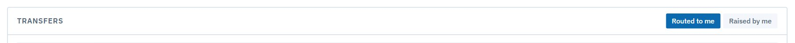
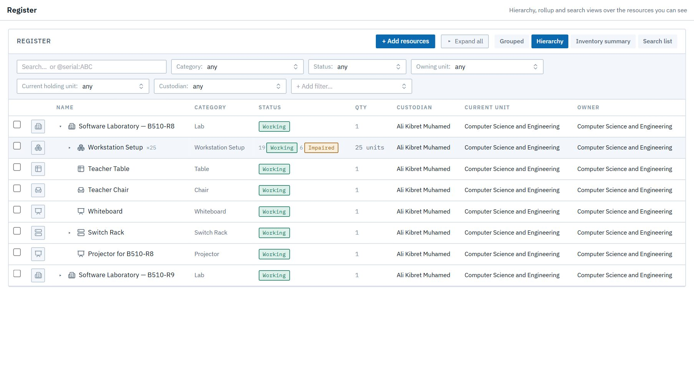

# Store and handovers

## E1. Receive a delivery

**As** the store keeper, **I want** to register what arrived against the order's lines, **so that** the stock exists in the register and the order closes when it's complete.

**Flow:** ✉ Store keeper (order arrived) → registers each line into the ASTU Main Store (partial deliveries add up; over-receipts are refused) → when complete, the request closes ✉ Head.

## E2. Hand new stock over to a lab

**As** the store keeper, **I want** to hand stock over to the lab that needs it, named the way the lab names its own. **As** the receiving head and custodian, I approve and accept it.

**Flow:** Store requests a handover ✉ receiving Head → approves ✉ Cust. → accepts into custody ✉ Store ("done"). Custody and ownership move on acceptance; until then the items show ⇄ (promised) and can't be promised twice.

