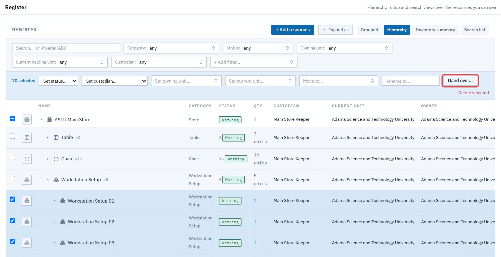
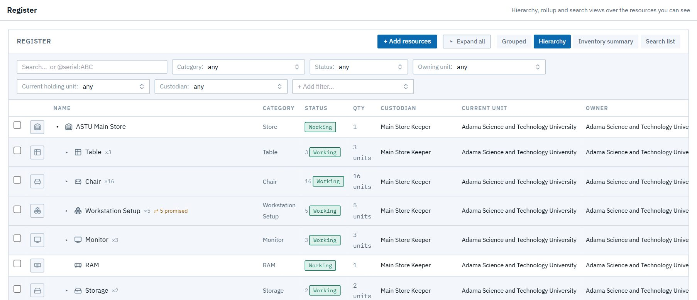
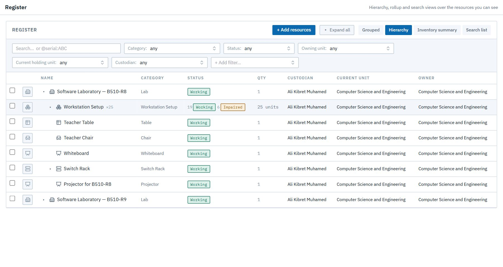

# Store and handovers

## E1. Record and load a delivery

**As** Property Administration, **I want** to record what a purchase actually delivered — from an LRMS purchase request, or from an EGP purchase that never went through LRMS — **so that** the store is loaded from the delivery documents, not from what was ordered. **As** the store keeper, I load it into the Main Store.

**Flow:** Procurement marks **Arrived at the main store** ✉ Property Admin → **Record an import** (from the request, lines adjusted to what arrived, models or serials added; or standalone with the EGP number) ✉ Store keeper → **Load into store**, line by line (partial loads add up; more than arrived is refused) → the record is **Loaded**; when everything ordered is in, the purchase request closes ✉ Head.

## E2. Hand new stock over to a lab

**As** the store keeper, **I want** to hand stock over to the lab that needs it, named the way the lab names its own. **As** the receiving head, Property Administration and the custodian, we approve and accept it.

**Flow:** Store requests a handover ✉ receiving Head and ✉ the custodian ("coming to you") → Head approves ✉ Property Admin → approves ✉ Cust. → accepts into custody ✉ Store ("done"). Custody and ownership move on acceptance; until then the items show ⇄ (promised) and can't be promised twice.

## E3. Issue something to a member of staff

**As** the store keeper, **I want** to issue a laptop to a lecturer, **so that** the register says who has it. **As** the lecturer, I accept it.

**Flow:** Store → **Hand over… → To a person** ✉ the lecturer → their Head approves ✉ Property Admin → approves ✉ the lecturer → accepts. It lands in the department's **Staff holdings** (created on first use; the head answers for the place), in the lecturer's custody. The lecturer can't edit its record; the head can send it back with **Return to store…**

## E4. Take from, and return to, the store

- **Request from the store** (a custodian, from the Register's *Whole university* view): ✉ Store keeper releases → the requester's Head → Property Admin → the requester confirms receipt. Stock from the store is given, never lent.
- **Return to the store** (a custodian, or a head for Staff holdings): the owning Head → Property Admin → ✉ Store keeper accepts. It belongs to the university again.
