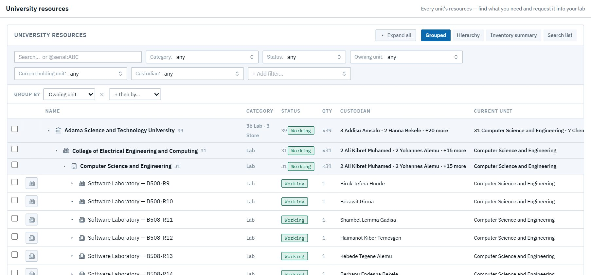
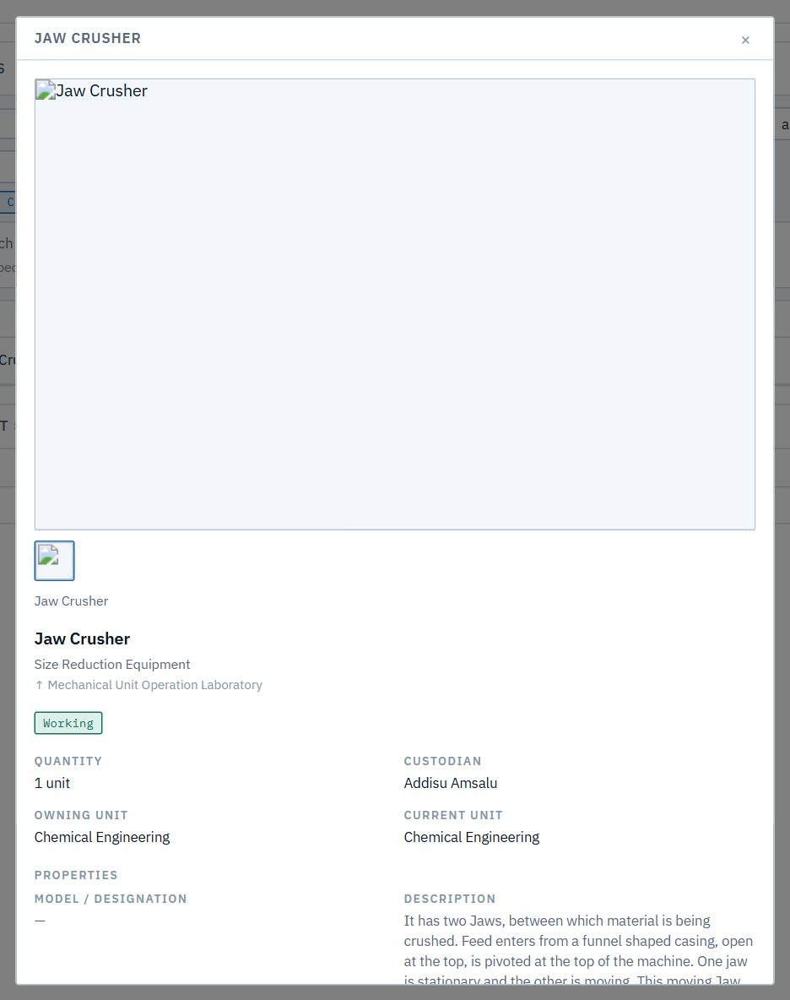
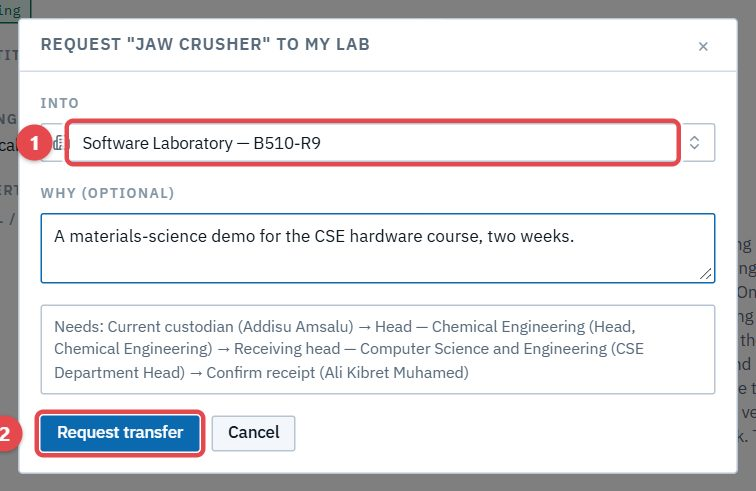
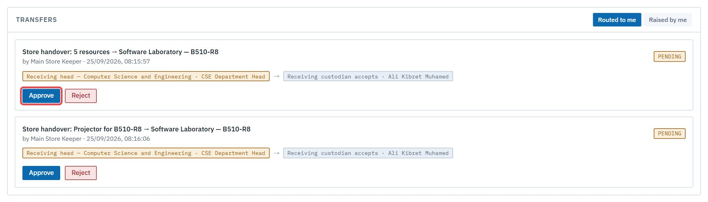

# Transfers between units

## F1. Borrow or take over another unit's resource

**As** a custodian, **I want** to find what another unit holds and request it into my lab, **so that** equipment moves where it's needed, with everyone responsible agreeing.

**Flow:** Cust. requests ✉ the lending custodian → approves ✉ the owning unit's head → approves ✉ the receiving head → approves ✉ the requesting custodian → confirms receipt → it moves ✉ requester ("done"). A rejection at any step ends it ✉ requester.

1. **University resources** shows every unit's resources, read-only.

   

2. Open another unit's item and ask for it.

   

3. Pick your lab. The request shows exactly who has to agree, in order.

   

4. Each person decides it in **Approvals → Transfers**, the same card used for handovers ([E2](s05-store.md#e2-hand-new-stock-over-to-a-lab)).

   

> **Good to know**
> - An item already in a pending transfer or handover is marked ⇄, and can't be requested again until that one ends.
> - If the item moves or changes custodian while the request waits, the request stops as *couldn't be applied*, rather than moving the wrong thing.
