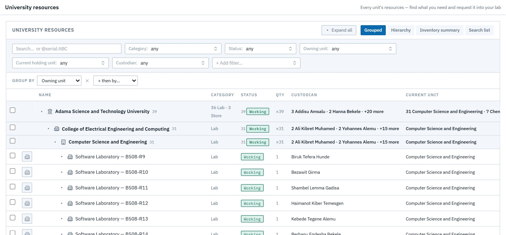
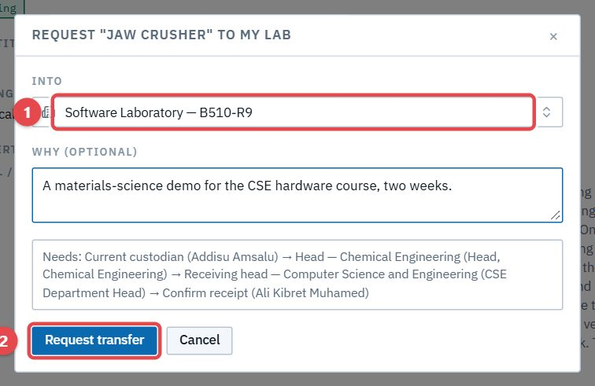

# Transfers between units

## F1. Borrow, or take over, another unit's resource

**As** a custodian, **I want** to find what another unit holds and request it into my lab — borrowed, or for good — **so that** equipment moves where it's needed, with everyone responsible agreeing.

**Flow — a loan:** Cust. requests ✉ the lending custodian → approves ✉ the owning unit's head → approves ✉ the receiving head → approves ✉ the requesting custodian → confirms receipt → it moves; it stays the owning unit's ✉ requester ("done").

**Flow — a permanent transfer:** the same, then ✉ the **College Managing Director** approves (and ✉ **Property Administration** when it comes from another college) → the requester confirms receipt → it becomes their unit's, in their custody.

A rejection at any step ends it ✉ requester. When one head is both the owning and the receiving head, they're asked once.

1. The **Register → Whole university** view shows every unit's resources, read-only.

   

2. Tick what you need and click **Request for my lab…** Choose where it goes and **Loan** or **Permanent transfer**. The request shows exactly who has to agree, in order.

   

3. Each person decides it in **Approvals → Transfers**.

> **Good to know**
> - An item already in a pending transfer or handover is marked ⇄, and can't be requested again until that one ends.
> - If the item moves or changes custodian while the request waits, the request stops as *couldn't be applied*, rather than moving the wrong thing.
