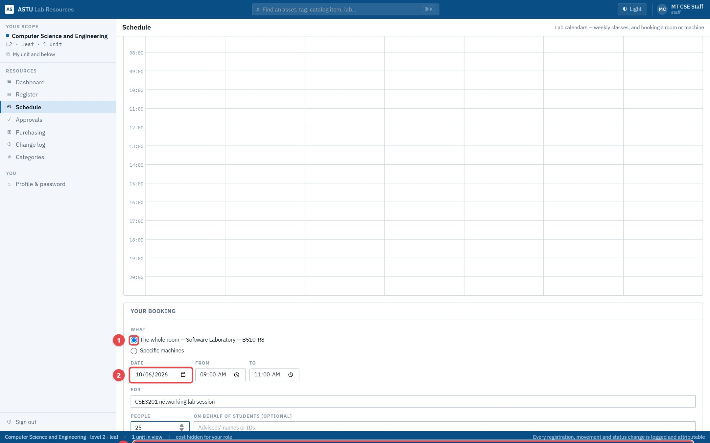
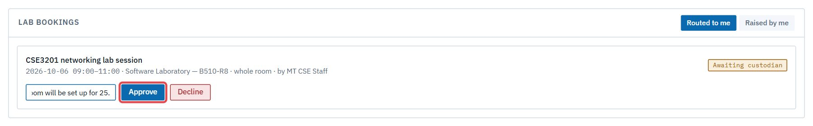
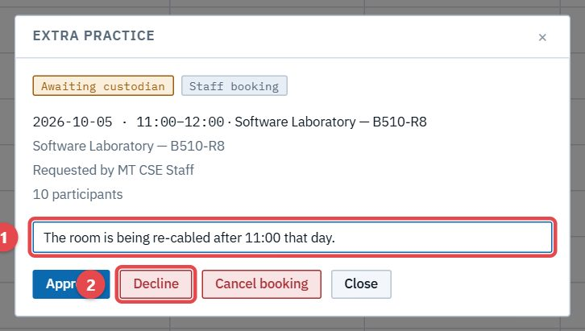
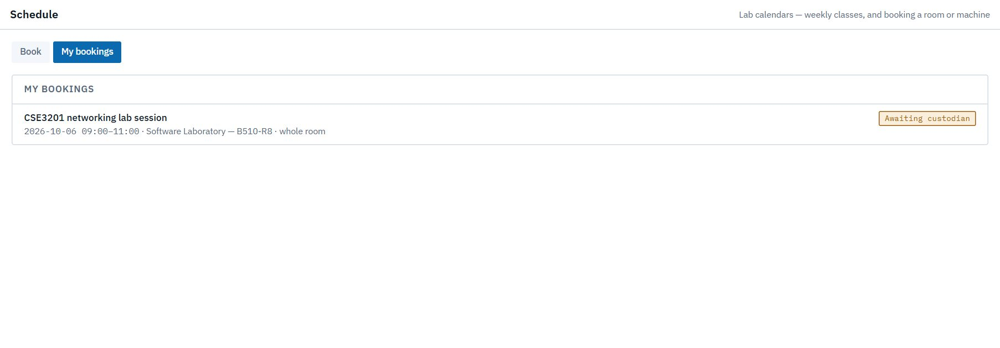
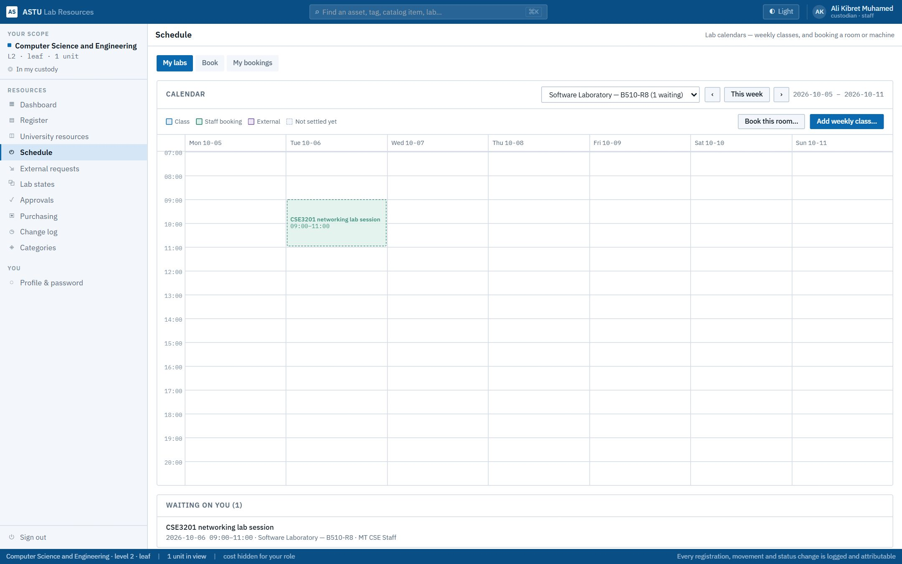
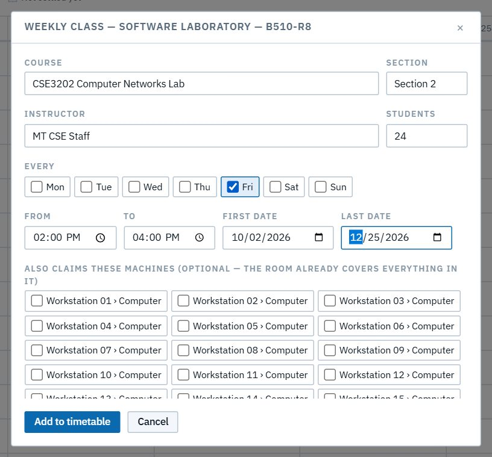

# Bookings

## G1. Book a lab

**As** staff, **I want** to book a lab for a session and see who decides, **so that** I know the room is mine. **As** the custodian, I approve or decline with a note.

**Flow:** Staff requests ✉ Cust. → approves or declines ✉ Staff. A custodian booking their own lab is confirmed at once.

1. Find the room and fill in the booking. The form says who decides, and shows clashes before you ask.

   

   

2. The custodian decides in **Approvals → Lab bookings**, or **Schedule → My labs**.

   

   

3. Staff see the outcome in **My bookings**, and it's on the lab's calendar.

   

   

   

## G2. Book specific machines

**As** staff, **I want** to book particular computers rather than the whole room, **so that** others can still use the rest. Machines are named by where they sit (Workstation 01 › Computer).

## G3. Timetable a weekly class

**As** a custodian, **I want** to put a recurring class on the lab's calendar, **so that** the slot is blocked every week without anyone booking it.

## G4. Change your mind

**As** staff, **I want** to cancel my booking, **so that** the room is free again; the custodian is ✉ told. **As** a custodian, I can cancel a booking on my lab with a note; the person who booked is ✉ told.

