# Outside institutions

## H1. Host an outside training

**As** an outside institution, **I want** to ask ASTU to host a workshop, get one quote and pay online, **so that** the booking is confirmed without an account or paperwork. **As** the AVP, departments and custodians, we each do our part.

**Flow:** Portal request ✉ AVP → AVP forwards ✉ department heads → custodians hold slots; each head accepts with a price ✉ AVP → AVP sends one quote ✉ requester → requester pays → verified → **Confirmed**: holds become bookings ✉ requester, custodians and heads.

1. The public portal and the request form, with the official letter.

   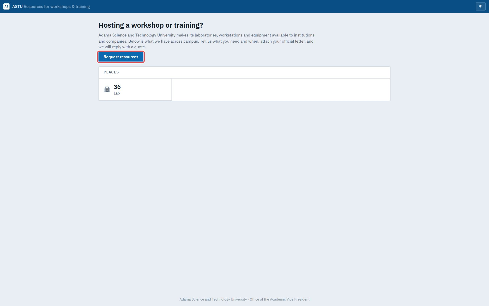

   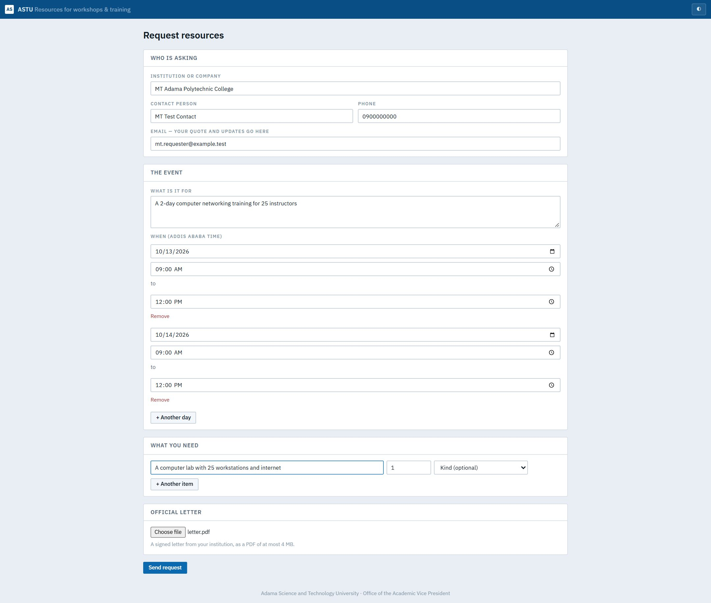

2. The AVP forwards it to the departments that can host it.

   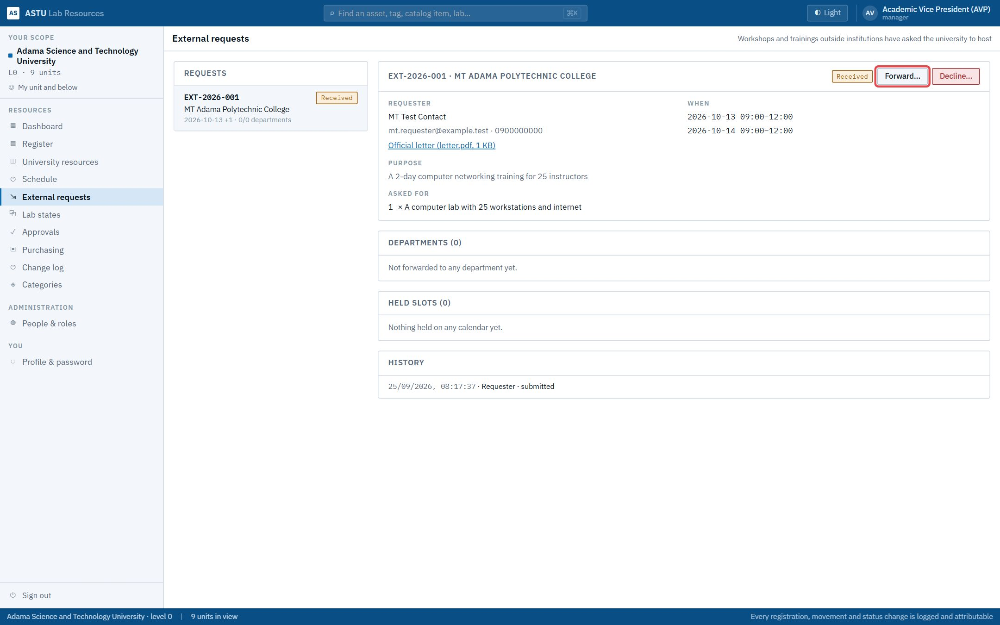

   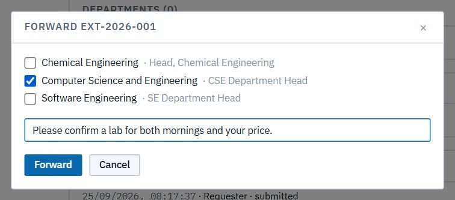

3. The custodian holds the lab; the head accepts with the department's price.

   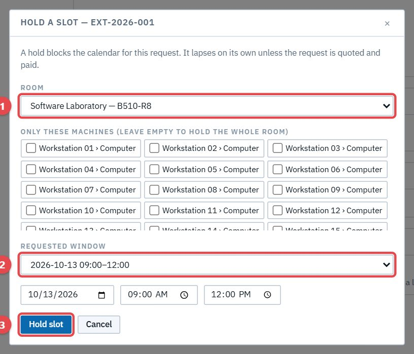

   

4. The AVP sends the quote; the requester pays; it's confirmed.

   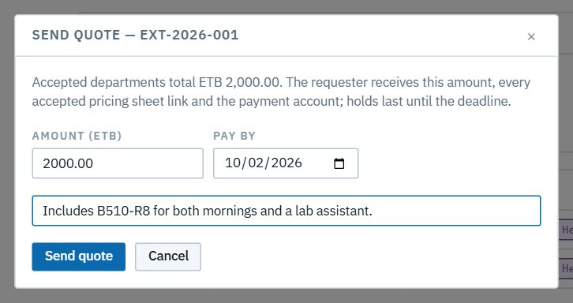

   

   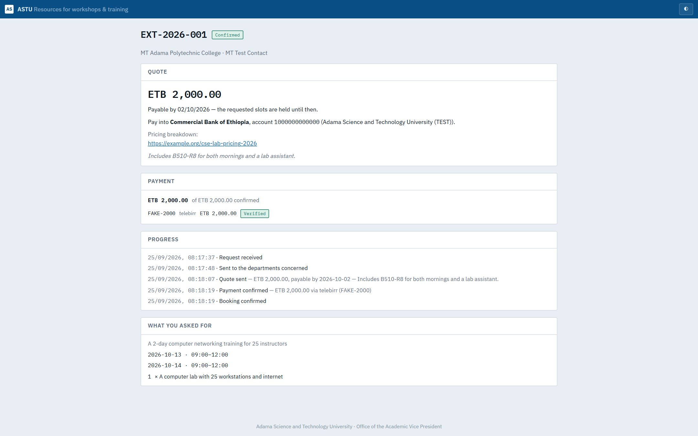

   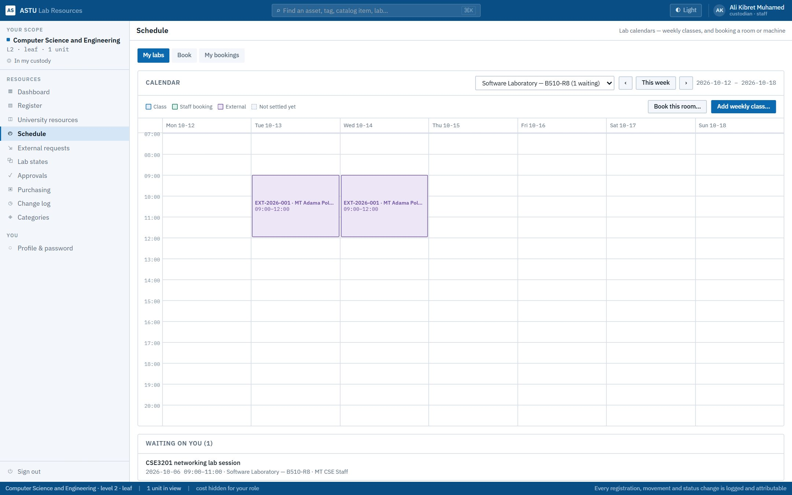

## H2. Track a request without an account

**As** an outside requester, **I want** a private tracking link, **so that** I can follow my request, see the quote and pay, without signing up.

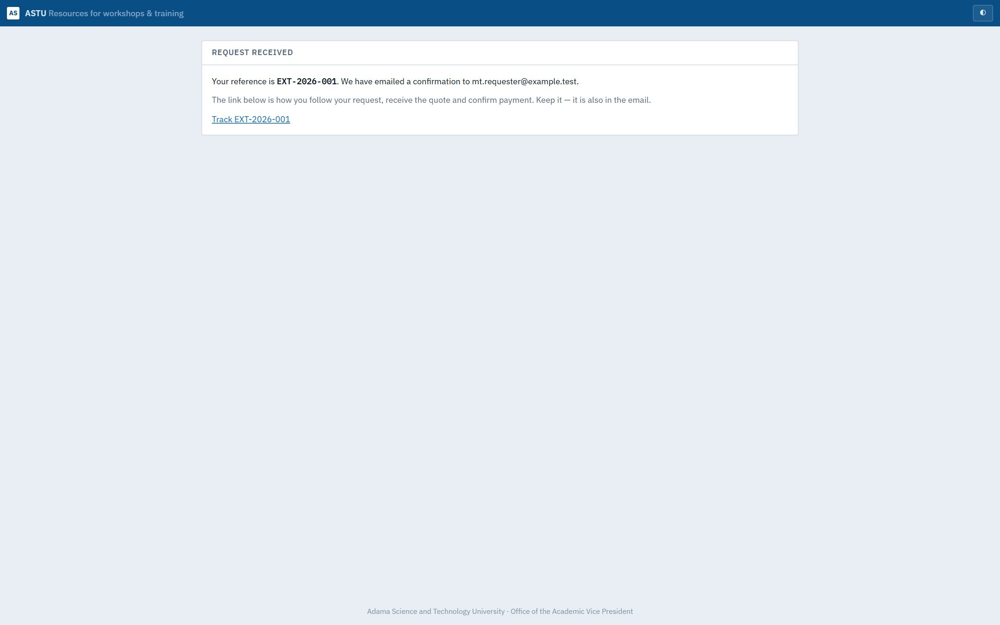

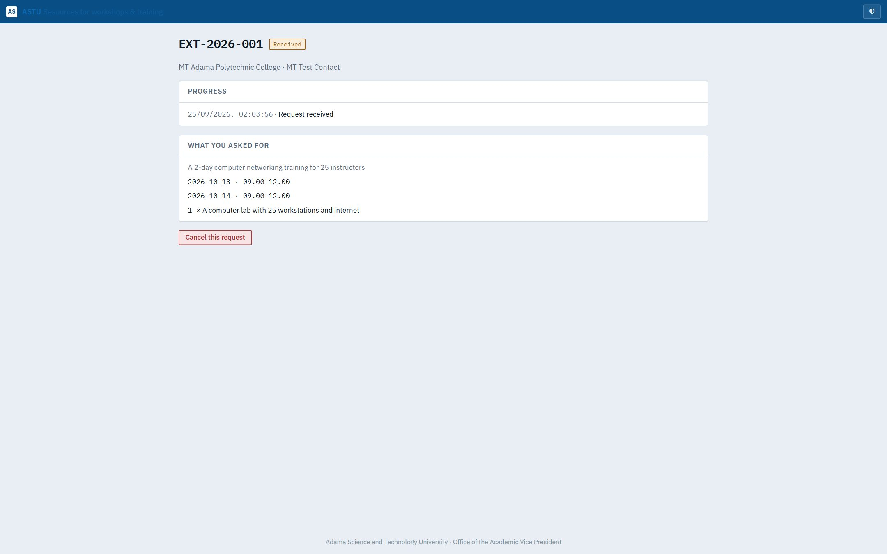

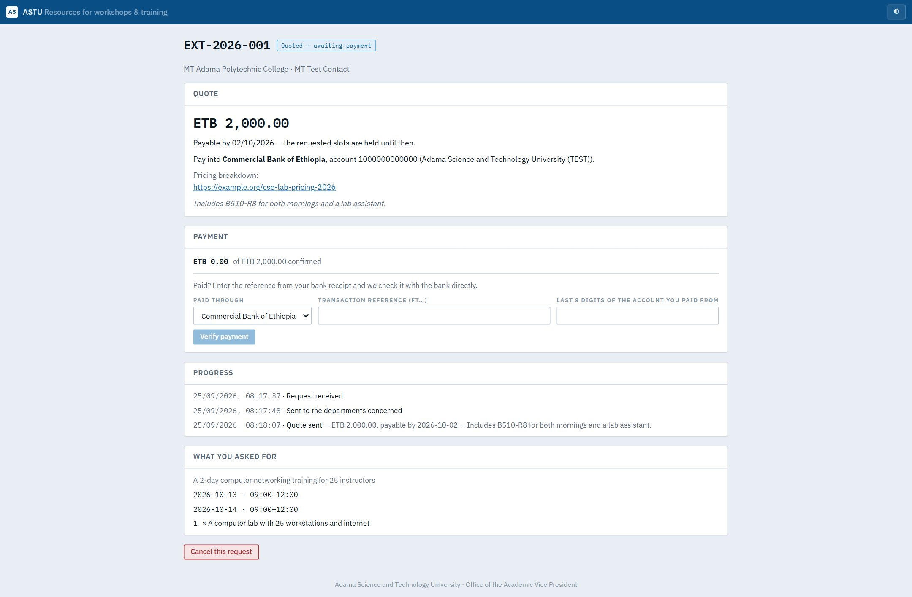

## H3. Decline, or review a payment by hand

- **Decline** (the AVP, with a reason): the whole request ends, and the requester is ✉ told on their tracking page. A department head can also decline their department's part.
- **Manual review:** if the payment check can't reach the bank or telebirr, the requester asks for a review, and the AVP confirms the payment by hand.

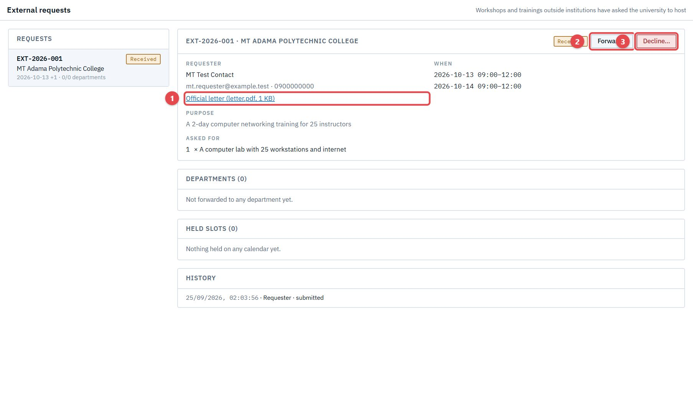
