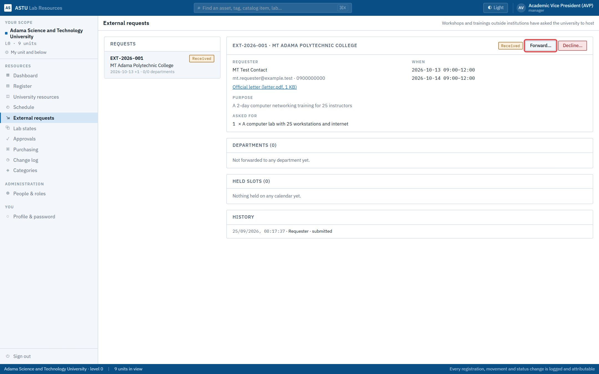
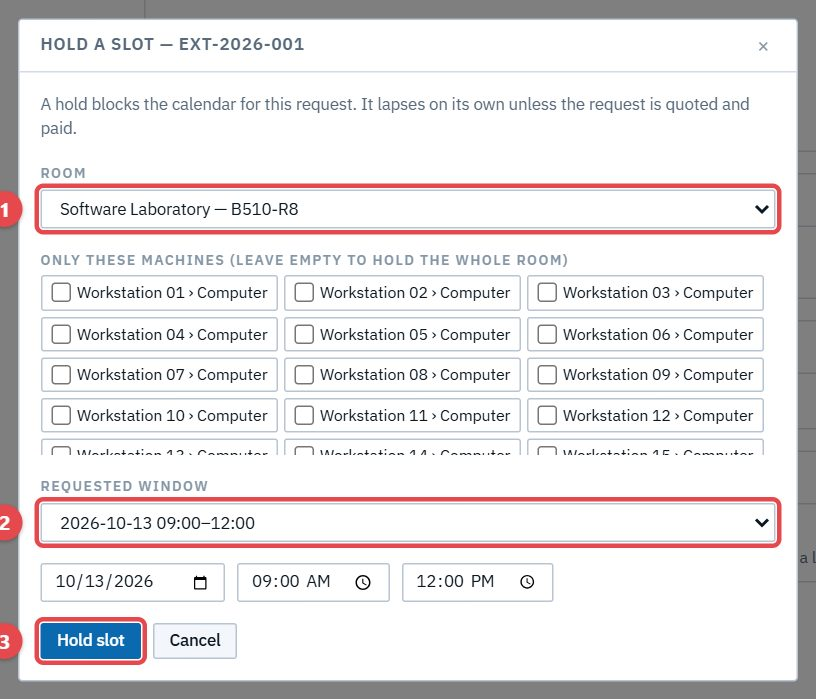
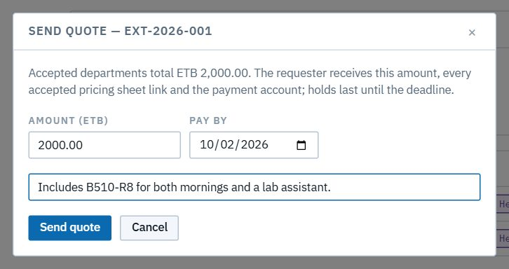
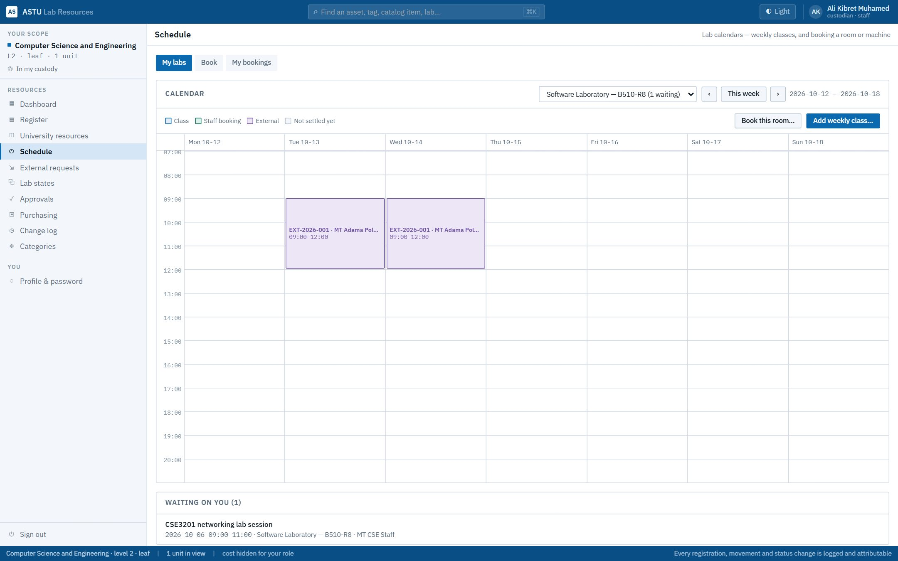

# Outside institutions

## H1. Host an outside training, or run their samples

**As** an outside institution, **I want** to ask ASTU for rooms or labs (a workshop, a training) or for samples to be analysed on a machine, get one quote and pay, **so that** it's booked and I know whom to call. **As** the AVP, deans, heads and custodians, we each do our part, along the university's line of communication.

**Flow:** Requester signs up and confirms their email → sends the request with a letter ✉ AVP → **forwards to colleges** ✉ Deans → **forward to departments** ✉ Heads → **ask custodians** ✉ Custodians → hold rooms (or a machine) and report back ✉ Head → **sends the dean** the cost breakdown and contact persons ✉ Dean → approves each department (or sends it back) and **sends the AVP** the college's answer ✉ AVP → approves each college (or sends it back) and **quotes** ✉ requester → pays (checked with the bank) ✉ AVP → **Confirm payment**: holds become bookings, the requester sees the contact persons ✉ requester, custodians and heads. Everything after that is arranged offline, with those contacts.

*(Screenshots from before 2026-09-28; the flow above is current.)*

## H2. Follow a request in my account

**As** an outside requester, **I want** my own account, **so that** I can follow every request, see the quote with each department's part and the bank account, pay, and — once the payment is confirmed — see what is booked for me and whom to call.

## H3. Decline, send back, or check a payment by hand

- **Decline** — the AVP (the whole request), a dean (the college's part, with its departments), or a head (their department's part), each with a reason; anything held is released.
- **Send back** — a dean returns a department's answer to its head, the AVP a college's to its dean, each with a note; they answer again.
- **Manual review** — if the payment check can't reach the bank or telebirr, the requester asks for a review, and the AVP accepts or rejects the payment by hand before confirming it.
