# Administration

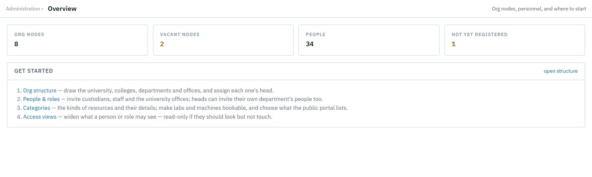

## I1. Build the org chart

**As** the system admin, **I want** to draw the university's structure and assign who heads each part, **so that** approvals route to the right people automatically.

**Flow:** Admin creates nodes (college, department, office), assigns occupants ✉ the new occupant. Every approval chain is read from this chart live.

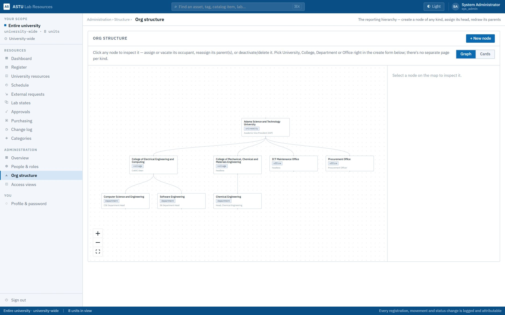

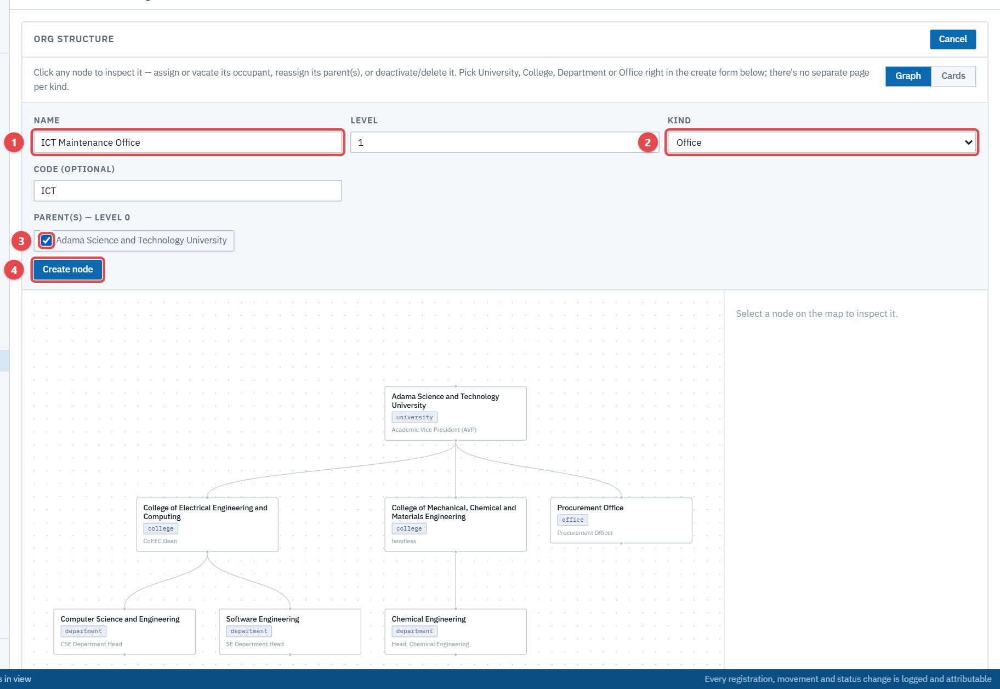

## I2. Manage people and roles

**As** the admin (anyone) or a head (their department's custodians and staff), **I want** to invite people, set roles, move them between departments and help them sign in, **so that** access matches their job.

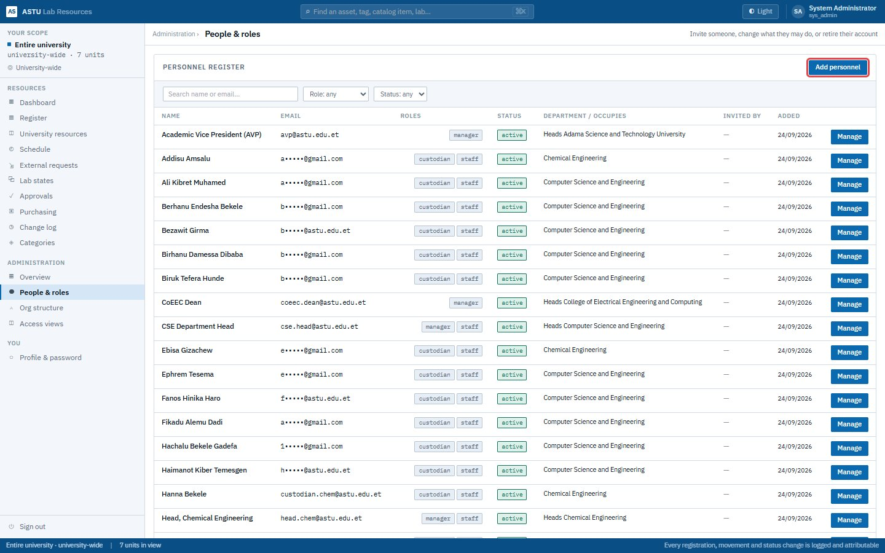

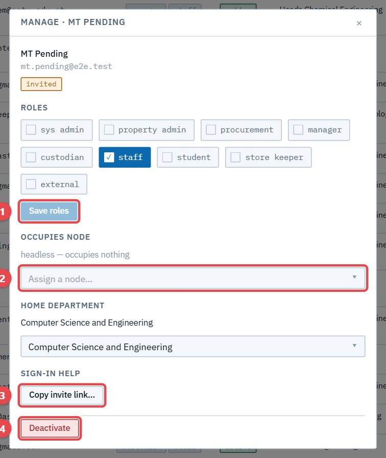

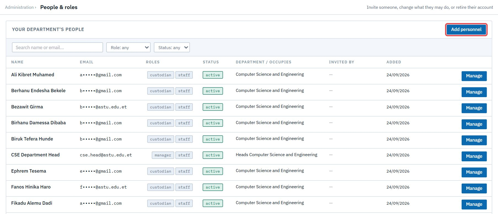

## I3. Define kinds of resources

**As** the admin or property admin, **I want** categories with fields, parts, an impairment rule and booking settings, **so that** every resource is recorded the same way and status rolls up correctly.

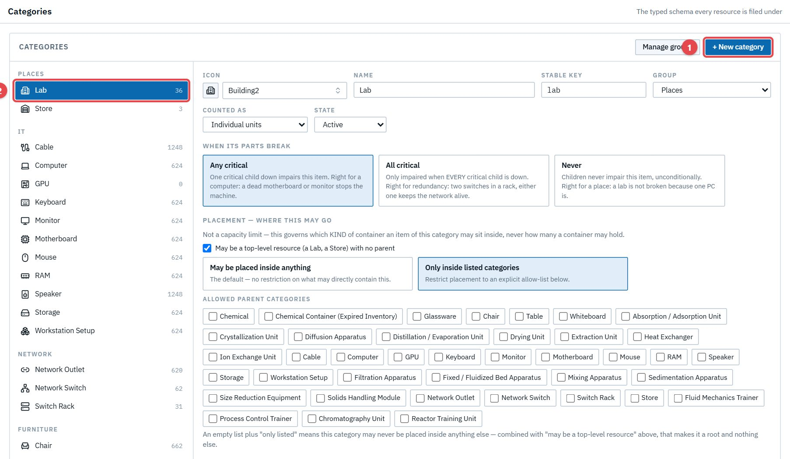

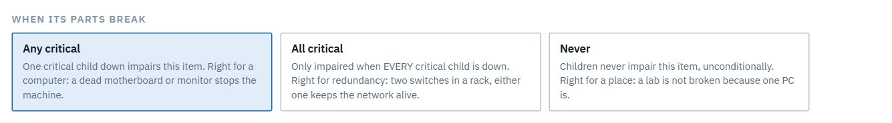

## I4. Decide who sees what

**As** the admin or property admin, **I want** access views (university-wide, a unit's subtree, own custody, or chosen units; read-only or editable) for a role or a person, **so that** people see beyond their unit only when their job needs it.

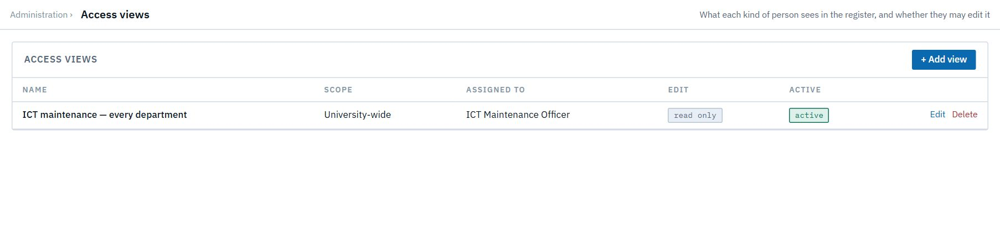

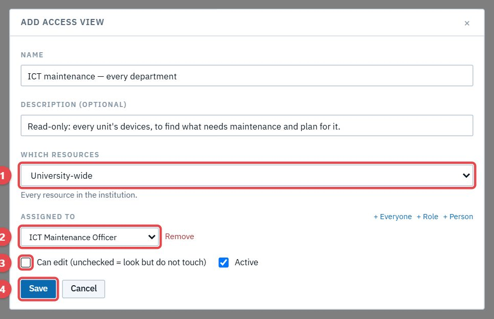

## I5. Turn drafts on for a department

**As** the admin, **I want** to choose per department whether custodians' edits go live directly or through a draft the head approves, **so that** each department works at the level of control it needs. CSE uses drafts; Chemical Engineering edits directly.

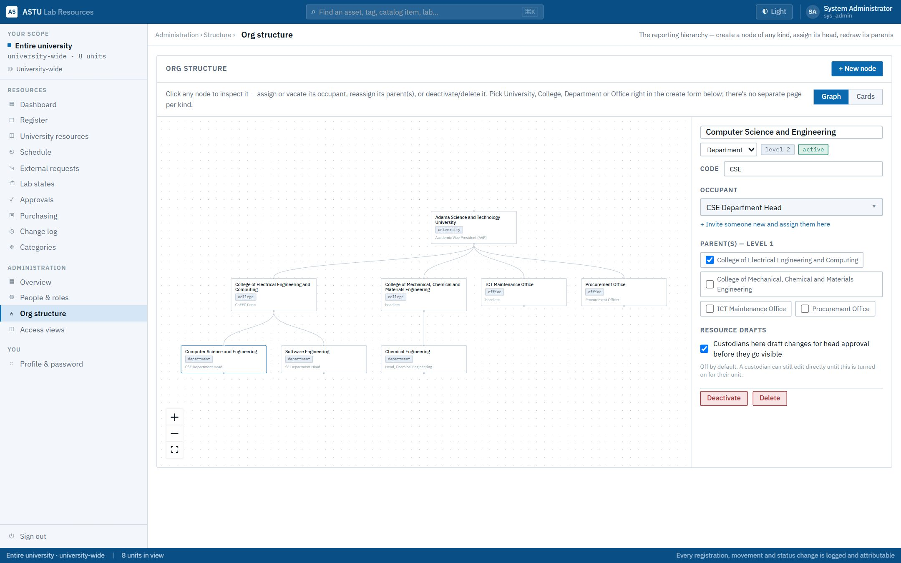
