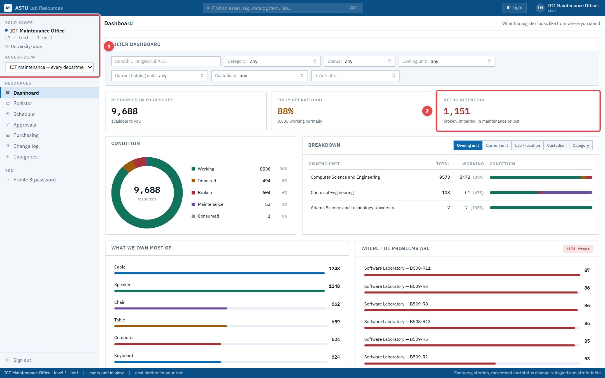
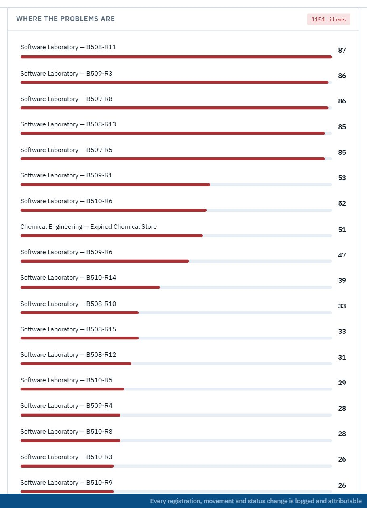
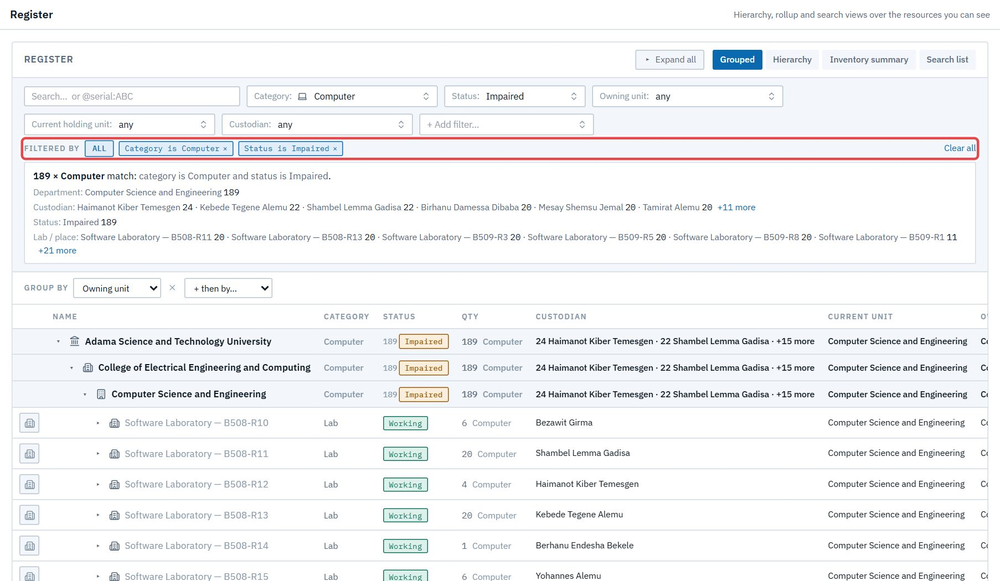
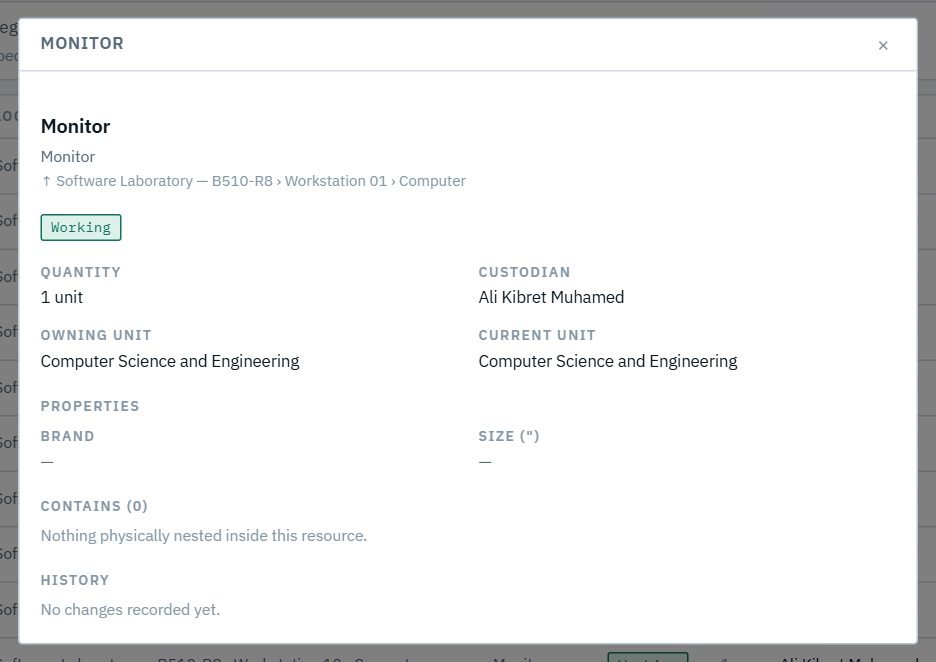
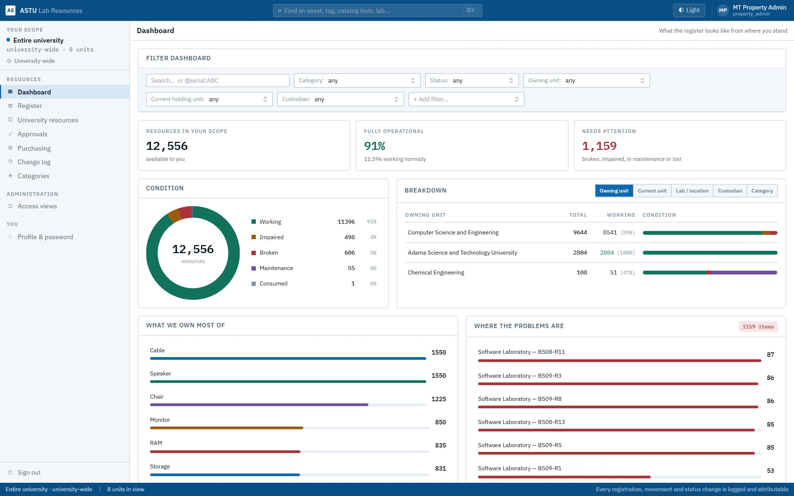
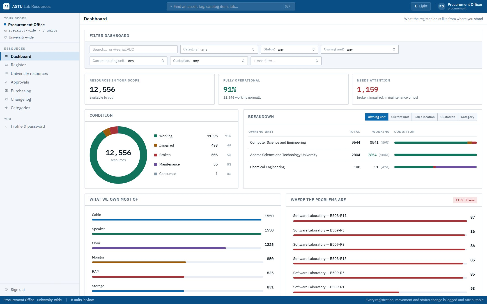

# Oversight

## J1. Plan maintenance across the university

**As** the ICT maintenance officer, **I want** to see every department's devices, read-only, **so that** I can plan repairs where the problems are, without being able to change anyone's records.

## J2. Watch the whole university

**As** the property admin, procurement officer or AVP, **I want** a university-wide picture, **so that** I see the state of every unit's resources in one place.

## J3. Keep an eye on the store

**As** the store keeper, **I want** the Main Store's own dashboard, **so that** I know what's in stock and what's promised to labs.

